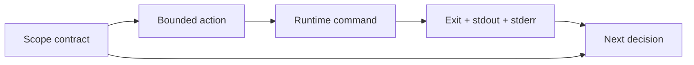

# Runtime Feedback and Scope

> Capture what the runtime actually said and reject work outside the task boundary.

**Type:** Build
**Languages:** Python
**Prerequisites:** Phase 14 · 36 (Scope Contracts and Task Boundaries), Phase 14 · 37 (Runtime Feedback Loops)
**Time:** ~50 minutes

## Learning Objectives

- Represent allowed and forbidden paths as a scope contract.
- Run a command without a shell and capture its exit evidence.
- Distinguish command failure, timeout, and scope violation.
- Feed bounded runtime feedback into the next decision.

## Feedback is evidence

An agent's plan is feed-forward; the runtime is feedback. A command that exits
non-zero, times out, or writes to an unauthorized path must remain visible to the
next turn. A green-looking sentence cannot replace the exit code and captured
output.

## Build It

`ScopeContract` validates paths before a command's result is considered useful.
It accepts only POSIX-relative paths, rejects absolute paths and `..`
traversal, and gives forbidden patterns priority over broad allowed patterns.
`run_command` uses an argv list with `shell=False`, captures both output streams,
and turns a timeout into an explicit receipt instead of hanging the lesson.

The feedback runner returns receipts even for failed commands. That is the
important boundary: failure is data for repair, not an exception that erases the
context needed to repair it.

## Use It

Put the contract next to the active task. Run one command at a time, cap output
length before placing it in model context, and make timeout and scope failures
separate categories in your state file. A retry policy belongs outside the
receipt so the same evidence can be reviewed later.

## Exercises

- Add an output truncation limit and record whether truncation occurred.
- Add a command budget and stop after the first budget breach.
- Add a path-diff receipt after a command that edits a temporary workspace.

## Further reading

- [Phase 14 · 37 — Runtime Feedback Loops](../../37-runtime-feedback-loops/docs/en.md)
- [Phase 14 · 38 — Verification Gates](../../38-verification-gates/docs/en.md)

## Reference Solution

Use the canonical [main.py](../code/main.py) as the executable baseline. A complete solution records a successful run, identifies the invariant tied to “Represent allowed and forbidden paths as a scope contract,” and changes only one variable for the comparison. The edge-case result must distinguish the prediction from the observation, explain the cause using “Distinguish command failure, timeout, and scope violation,” and cite a repeatable check rather than relying on visual inspection alone.
