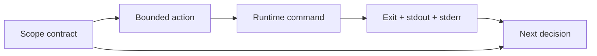

# Runtime Feedback and Scope

> Capture what the runtime actually said and reject work outside the task boundary.

**Type:** Build
**Languages:** Python
**Prerequisites:** Phase 14 · 36 (Scope Contracts and Task Boundaries), Phase 14 · 37 (Runtime Feedback Loops)
**Time:** ~50 minutes

## Learning Objectives

- Represent allowed and forbidden paths as a scope contract.
- Run a command without a shell and capture its exit evidence.
- Distinguish command failure, timeout, and scope violation.
- Feed bounded runtime feedback into the next decision.

## Feedback is evidence

An agent's plan is feed-forward; the runtime is feedback. A command that exits
non-zero, times out, or writes to an unauthorized path must remain visible to the
next turn. A green-looking sentence cannot replace the exit code and captured
output.

## Build It

`ScopeContract` validates paths before a command's result is considered useful.
It accepts only POSIX-relative paths, rejects absolute paths and `..`
traversal, and gives forbidden patterns priority over broad allowed patterns.
`run_command` uses an argv list with `shell=False`, captures both output streams,
and turns a timeout into an explicit receipt instead of hanging the lesson.

The feedback runner returns receipts even for failed commands. That is the
important boundary: failure is data for repair, not an exception that erases the
context needed to repair it.

## Use It

Put the contract next to the active task. Run one command at a time, cap output
length before placing it in model context, and make timeout and scope failures
separate categories in your state file. A retry policy belongs outside the
receipt so the same evidence can be reviewed later.

## Practice notes

The artifact is intentionally deterministic, so the useful question is what evidence a change produces. Before editing it, write down which part of “Represent allowed and forbidden paths as a scope contract” should be visible in the result. Then inspect _normalize_relative, validate, passed rather than treating the final sentence as an explanation.

For “Run a command without a shell and capture its exit evidence”, keep the task and acceptance condition fixed while changing one input. A useful receipt has the input, the predicted result, the observed result, and one sentence about the mechanism. For “Distinguish command failure, timeout, and scope violation”, choose a boundary the implementation can actually reach and record whether it rejects, pauses, reports, or continues. Finally, use skill-runtime-feedback.md to capture “Feed bounded runtime feedback into the next decision” as a reusable decision aid: include an owner and a next action, not only a summary.

Keep command output bounded and retain the return code, timeout flag, and stderr separately. A truncated receipt is still useful when its truncation limit is explicit; an unbounded log can become a second reliability problem.
## Ship It

Hand off `outputs/skill-runtime-feedback.md` with the command `python3 main.py`, the accepted input shape (the demo’s smallest built-in fixture), the expected observable result, and a failure note for malformed inputs.

## Exercises

- Add an output truncation limit and record whether truncation occurred.
- Add a command budget and stop after the first budget breach.
- Add a path-diff receipt after a command that edits a temporary workspace.

## Further reading

- [Phase 14 · 37 — Runtime Feedback Loops](../../37-runtime-feedback-loops/docs/en.md)
- [Phase 14 · 38 — Verification Gates](../../38-verification-gates/docs/en.md)

## Reference Solution

For Runtime Feedback and Scope, run python3 main.py from code/ and keep the output beside the input that produced it. A defensible submission contains:

1. Evidence for “Represent allowed and forbidden paths as a scope contract”: identify the exact field, trace entry, or report line that proves it; a successful process exit alone is not enough.
2. A one-variable comparison for “Run a command without a shell and capture its exit evidence”. State the prediction first and explain why the observed change follows from _normalize_relative, validate, passed.
3. A boundary or failure result for “Distinguish command failure, timeout, and scope violation”. Include the input, the expected guard or refusal, and the observed behavior. If the demo has no guard, record that gap instead of calling a crash a pass.
4. A practical update to outputs/skill-runtime-feedback.md that applies “Feed bounded runtime feedback into the next decision” and names the person or system responsible for the next decision.

Run the relevant tests after the experiment. Keep any mismatch between prediction and observation in the receipt; the purpose of this lesson is to make the reasoning inspectable, not to make every run look successful.
