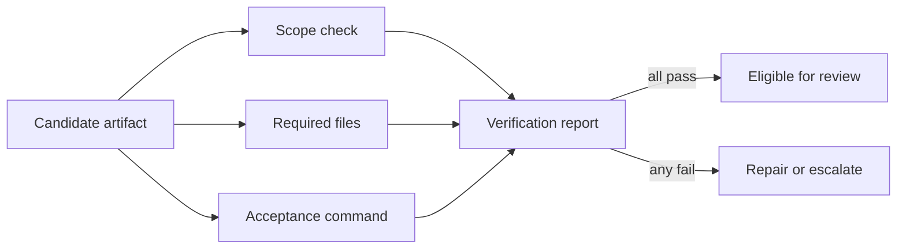

# Self-Verification

> Make “done” a set of independent checks with evidence, not a confidence claim.

**Type:** Build
**Languages:** Python
**Prerequisites:** Phase 14 · 37 (Runtime Feedback Loops), Phase 14 · 38 (Verification Gates)
**Time:** ~55 minutes

## Learning Objectives

- Define a verification check with a name, boolean result, and evidence detail.
- Aggregate independent checks into a fail-closed report.
- Keep exceptions and missing checks visible instead of treating them as passes.
- Distinguish artifact presence from end-to-end acceptance evidence.

## The verification boundary

An agent can produce a convincing artifact and still miss the requirement that
matters. Verification moves the completion decision outside the maker. Each
check owns one question, returns structured evidence, and is recorded in a
stable order.

## Build It

The reference verifier treats an empty check list as failure, catches exceptions
as failed evidence, and requires every named check to pass. Its `file_exists`
check accepts only root-relative paths, rejects `..` traversal, and refuses
symlinked components so a presence check cannot inspect outside the workspace.
It does not let one successful command hide an absent check. The report is small
enough to save in a handoff or feed back into a bounded loop.

Use deterministic checks where possible: file existence, schema validation,
test commands, and scope diffs. A model reviewer can add context, but it should
not replace the checks that can be run directly.

## Use It

Give each task an acceptance checklist before implementation. Keep checks
orthogonal: one should not silently perform three unrelated validations. When a
check fails, include the actionable detail and route the artifact back to the
owner of that condition.

## Practice notes

The artifact is intentionally deterministic, so the useful question is what evidence a change produces. Before editing it, write down which part of “Define a verification check with a name, boolean result, and evidence detail” should be visible in the result. Then inspect _normalize_relative, _contains_symlink, verify rather than treating the final sentence as an explanation.

For “Aggregate independent checks into a fail-closed report”, keep the task and acceptance condition fixed while changing one input. A useful receipt has the input, the predicted result, the observed result, and one sentence about the mechanism. For “Keep exceptions and missing checks visible instead of treating them as passes”, choose a boundary the implementation can actually reach and record whether it rejects, pauses, reports, or continues. Finally, use skill-verification-report.md to capture “Distinguish artifact presence from end-to-end acceptance evidence” as a reusable decision aid: include an owner and a next action, not only a summary.
## Ship It

Hand off `outputs/skill-verification-report.md` with the command `python3 main.py`, the accepted input shape (the demo’s smallest built-in fixture), the expected observable result, and a failure note for malformed inputs.

## Exercises

- Add a check for a maximum diff size and explain its threshold.
- Add a command-backed check that records a truncated output excerpt.
- Require two consecutive passing reports before an unattended loop stops.

## Further reading

- [Phase 14 · 30 — Eval-Driven Agent Development](../../30-eval-driven-agent-development/docs/en.md)
- [Phase 14 · 43 — Loop Engineering](../../43-loop-engineering/docs/en.md)

## Reference Solution

For Self-Verification, run python3 main.py from code/ and keep the output beside the input that produced it. A defensible submission contains:

1. Evidence for “Define a verification check with a name, boolean result, and evidence detail”: identify the exact field, trace entry, or report line that proves it; a successful process exit alone is not enough.
2. A one-variable comparison for “Aggregate independent checks into a fail-closed report”. State the prediction first and explain why the observed change follows from _normalize_relative, _contains_symlink, verify.
3. A boundary or failure result for “Keep exceptions and missing checks visible instead of treating them as passes”. Include the input, the expected guard or refusal, and the observed behavior. If the demo has no guard, record that gap instead of calling a crash a pass.
4. A practical update to outputs/skill-verification-report.md that applies “Distinguish artifact presence from end-to-end acceptance evidence” and names the person or system responsible for the next decision.

Run the relevant tests after the experiment. Keep any mismatch between prediction and observation in the receipt; the purpose of this lesson is to make the reasoning inspectable, not to make every run look successful.
