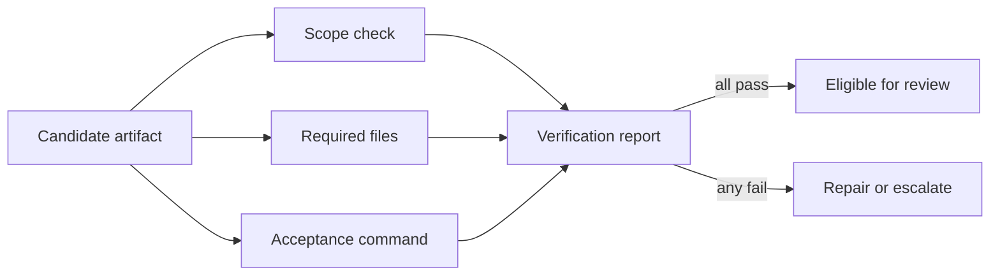

# Self-Verification

> Make “done” a set of independent checks with evidence, not a confidence claim.

**Type:** Build
**Languages:** Python
**Prerequisites:** Phase 14 · 37 (Runtime Feedback Loops), Phase 14 · 38 (Verification Gates)
**Time:** ~55 minutes

## Learning Objectives

- Define a verification check with a name, boolean result, and evidence detail.
- Aggregate independent checks into a fail-closed report.
- Keep exceptions and missing checks visible instead of treating them as passes.
- Distinguish artifact presence from end-to-end acceptance evidence.

## The verification boundary

An agent can produce a convincing artifact and still miss the requirement that
matters. Verification moves the completion decision outside the maker. Each
check owns one question, returns structured evidence, and is recorded in a
stable order.

## Build It

The reference verifier treats an empty check list as failure, catches exceptions
as failed evidence, and requires every named check to pass. Its `file_exists`
check accepts only root-relative paths, rejects `..` traversal, and refuses
symlinked components so a presence check cannot inspect outside the workspace.
It does not let one successful command hide an absent check. The report is small
enough to save in a handoff or feed back into a bounded loop.

Use deterministic checks where possible: file existence, schema validation,
test commands, and scope diffs. A model reviewer can add context, but it should
not replace the checks that can be run directly.

## Use It

Give each task an acceptance checklist before implementation. Keep checks
orthogonal: one should not silently perform three unrelated validations. When a
check fails, include the actionable detail and route the artifact back to the
owner of that condition.

## Exercises

- Add a check for a maximum diff size and explain its threshold.
- Add a command-backed check that records a truncated output excerpt.
- Require two consecutive passing reports before an unattended loop stops.

## Further reading

- [Phase 14 · 30 — Eval-Driven Agent Development](../../30-eval-driven-agent-development/docs/en.md)
- [Phase 14 · 43 — Loop Engineering](../../43-loop-engineering/docs/en.md)

## Reference Solution

Use the canonical [main.py](../code/main.py) as the executable baseline. A complete solution records a successful run, identifies the invariant tied to “Define a verification check with a name, boolean result, and evidence detail,” and changes only one variable for the comparison. The edge-case result must distinguish the prediction from the observation, explain the cause using “Keep exceptions and missing checks visible instead of treating them as passes,” and cite a repeatable check rather than relying on visual inspection alone.
