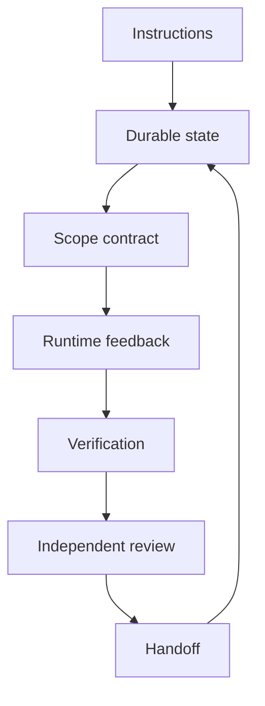

# Complete Harness

> Wire instructions, state, scope, feedback, verification, review, and handoff into one small runner.

**Type:** Build
**Languages:** Python
**Prerequisites:** Phase 14 · 45 (Prompt-Only vs Rules-First), Phase 14 · 47 (Multi-Session Continuity), Phase 14 · 49 (Self-Verification)
**Time:** ~75 minutes

## Learning Objectives

- Assemble the seven workbench surfaces into one explicit report.
- Keep each surface's responsibility visible instead of hiding it in prompts.
- Block readiness when scope, feedback, verification, or review is incomplete.
- Emit a handoff that a human or the next session can act on.

## The integration project

The earlier projects isolated individual mechanisms. This capstone composes them
without introducing a framework. The runner receives a candidate change and
returns one report containing the instructions it followed, the state it
updated, scope violations, runtime feedback, verification evidence, an
independent review, and the next handoff action.

## Build It

The `Harness` class is a control plane, not a model. It never writes a source
file and never treats a maker's note as proof. It evaluates every required
check, preserves failed feedback, and lets the reviewer see the same evidence
without granting the reviewer write access to the candidate.

The demo runs one intentionally incomplete candidate and one complete candidate
against the same contract. The successful report is eligible for human
approval, not an automatic production side effect.

## Use It

Start with this framework-free report in a real repository. Replace the fixture
feedback and checks with the command receipts from Projects 04 and 05. Keep the
seven surfaces as separate fields even if a production runtime stores them in a
database or event stream.

## Exercises

- Add a reviewer score with a hard zero rule for scope violations.
- Persist the report and reload it in a fresh process.
- Add an explicit approval state and make the handoff pause until a human signs.

## Further reading

- [Phase 14 · 42 — Agent Workbench Capstone](../../42-agent-workbench-capstone/docs/en.md)
- [Phase 14 · 47 — Multi-Session Continuity](../../47-multi-session-continuity/docs/en.md)
