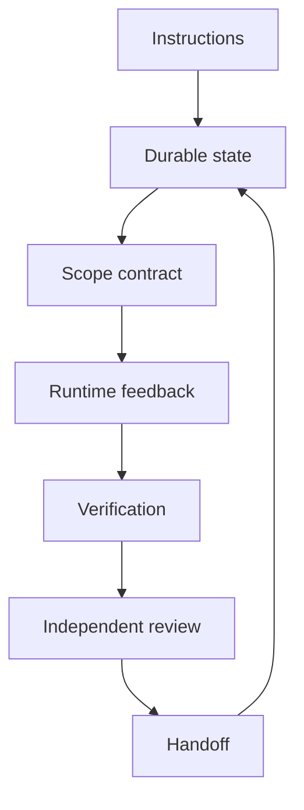

# Complete Harness

> Wire instructions, state, scope, feedback, verification, review, and handoff into one small runner.

**Type:** Build
**Languages:** Python
**Prerequisites:** Phase 14 · 45 (Prompt-Only vs Rules-First), Phase 14 · 47 (Multi-Session Continuity), Phase 14 · 49 (Self-Verification)
**Time:** ~20 minutes

## Learning Objectives

- Assemble the seven workbench surfaces into one explicit report.
- Keep each surface's responsibility visible instead of hiding it in prompts.
- Block readiness when scope, feedback, verification, or review is incomplete.
- Emit a handoff that a human or the next session can act on.

## The integration project

The earlier projects isolated individual mechanisms. This capstone composes them
without introducing a framework. The runner receives a candidate change and
returns one report containing the instructions it followed, the state it
updated, scope violations, runtime feedback, verification evidence, an
independent review, and the next handoff action.

## Build It

The `Harness` class is a control plane, not a model. It never writes a source
file and never treats a maker's note as proof. It evaluates every required
check, preserves failed feedback, and lets the reviewer see the same evidence
without granting the reviewer write access to the candidate.

The demo runs one intentionally incomplete candidate and one complete candidate
against the same contract. The successful report is eligible for human
approval, not an automatic production side effect.

## Use It

Start with this framework-free report in a real repository. Replace the fixture
feedback and checks with the command receipts from Projects 04 and 05. Keep the
seven surfaces as separate fields even if a production runtime stores them in a
database or event stream.

## Practice notes

The artifact is intentionally deterministic, so the useful question is what evidence a change produces. Before editing it, write down which part of “Assemble the seven workbench surfaces into one explicit report” should be visible in the result. Then inspect violations, match, as_dict rather than treating the final sentence as an explanation.

For “Keep each surface's responsibility visible instead of hiding it in prompts”, keep the task and acceptance condition fixed while changing one input. A useful receipt has the input, the predicted result, the observed result, and one sentence about the mechanism. For “Block readiness when scope, feedback, verification, or review is incomplete”, choose a boundary the implementation can actually reach and record whether it rejects, pauses, reports, or continues. Finally, use skill-complete-harness.md to capture “Emit a handoff that a human or the next session can act on” as a reusable decision aid: include an owner and a next action, not only a summary.
## Ship It

Hand off `outputs/skill-complete-harness.md` with the command `python3 main.py`, the accepted input shape (the text "red fox"), the expected observable result, and a failure note for malformed inputs.

## Exercises

- Add a reviewer score with a hard zero rule for scope violations.
- Persist the report and reload it in a fresh process.
- Add an explicit approval state and make the handoff pause until a human signs.

## Further reading

- [Phase 14 · 42 — Agent Workbench Capstone](../../42-agent-workbench-capstone/docs/en.md)
- [Phase 14 · 47 — Multi-Session Continuity](../../47-multi-session-continuity/docs/en.md)

## Reference Solution

For Complete Harness, run python3 main.py from code/ and keep the output beside the input that produced it. A defensible submission contains:

1. Evidence for “Assemble the seven workbench surfaces into one explicit report”: identify the exact field, trace entry, or report line that proves it; a successful process exit alone is not enough.
2. A one-variable comparison for “Keep each surface's responsibility visible instead of hiding it in prompts”. State the prediction first and explain why the observed change follows from violations, match, as_dict.
3. A boundary or failure result for “Block readiness when scope, feedback, verification, or review is incomplete”. Include the input, the expected guard or refusal, and the observed behavior. If the demo has no guard, record that gap instead of calling a crash a pass.
4. A practical update to outputs/skill-complete-harness.md that applies “Emit a handoff that a human or the next session can act on” and names the person or system responsible for the next decision.

Run the relevant tests after the experiment. Keep any mismatch between prediction and observation in the receipt; the purpose of this lesson is to make the reasoning inspectable, not to make every run look successful.
