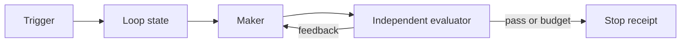

# Automated Loop

> Replace repeated manual prompting with a trigger, a maker/evaluator boundary, and a hard stop.

**Type:** Build
**Languages:** Python
**Prerequisites:** Phase 14 · 43 (Loop Engineering: From Prompts to Bounded Autonomy), Phase 14 · 50 (Complete Harness)
**Time:** ~60 minutes

## Learning Objectives

- Distinguish manual, goal, timer, and event triggers.
- Run a bounded maker/evaluator loop with structured feedback.
- Compare human interventions with an automated run on the same fixture task.
- Stop on success, exhaustion, or stalled progress instead of looping forever.

## The project

The workbench makes one session reliable. This project makes the next session
scheduled. A trigger decides when the loop may wake; a maker proposes the next
artifact; an evaluator decides whether the goal is met; and a policy decides
when the runtime must stop.

## Build It

The reference runner is offline and deterministic. Its demo maker adds one
missing acceptance item per round. The evaluator returns an `Evaluation` with a
verdict, feedback, and an optional intervention request. If a human handler is
provided, the request is recorded in the round receipt and its answer reaches
the next maker round. A stable failed artifact stops after the stall threshold;
a task that never passes stops at the round budget.

`LoopPolicy.max_interventions` is a hard budget: an excess request produces an
`intervention_budget_exhausted` result and a receipt instead of silently
continuing. `LoopResult.interventions` is the measured request count, so
`compare_manual_and_automated` compares recorded values from the same fixture.
Do not compare only elapsed time: count failed checks, interventions, and
receipts.

## Use It

Start with a goal that has a machine-checkable finish line. Use timer or event
triggers for repeatable observation work, not for tasks pretending to have a
single completion state. Keep approval and rollback outside the loop until the
evaluator and scope contract have independent tests.

## Exercises

- Add a command-backed evaluator with a bounded output excerpt.
- Add a wall-clock budget and record it in each stop receipt.
- Add an event deduplication key and a retry limit.

## Further reading

- [Phase 14 · 43 — Loop Engineering](../../43-loop-engineering/docs/en.md)
- [Phase 14 · 52 — Workflow Graph](../../52-workflow-graph/docs/en.md)
