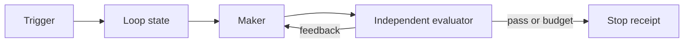

# Automated Loop

> Replace repeated manual prompting with a trigger, a maker/evaluator boundary, and a hard stop.

**Type:** Build
**Languages:** Python
**Prerequisites:** Phase 14 · 43 (Loop Engineering: From Prompts to Bounded Autonomy), Phase 14 · 50 (Complete Harness)
**Time:** ~60 minutes

## Learning Objectives

- Distinguish manual, goal, timer, and event triggers.
- Run a bounded maker/evaluator loop with structured feedback.
- Compare human interventions with an automated run on the same fixture task.
- Stop on success, exhaustion, or stalled progress instead of looping forever.

## The project

The workbench makes one session reliable. This project makes the next session
scheduled. A trigger decides when the loop may wake; a maker proposes the next
artifact; an evaluator decides whether the goal is met; and a policy decides
when the runtime must stop.

## Build It

The reference runner is offline and deterministic. Its demo maker adds one
missing acceptance item per round. The evaluator returns an `Evaluation` with a
verdict, feedback, and an optional intervention request. If a human handler is
provided, the request is recorded in the round receipt and its answer reaches
the next maker round. A stable failed artifact stops after the stall threshold;
a task that never passes stops at the round budget.

`LoopPolicy.max_interventions` is a hard budget: an excess request produces an
`intervention_budget_exhausted` result and a receipt instead of silently
continuing. `LoopResult.interventions` is the measured request count, so
`compare_manual_and_automated` compares recorded values from the same fixture.
Do not compare only elapsed time: count failed checks, interventions, and
receipts.

## Use It

Start with a goal that has a machine-checkable finish line. Use timer or event
triggers for repeatable observation work, not for tasks pretending to have a
single completion state. Keep approval and rollback outside the loop until the
evaluator and scope contract have independent tests.

## Practice notes

The artifact is intentionally deterministic, so the useful question is what evidence a change produces. Before editing it, write down which part of “Distinguish manual, goal, timer, and event triggers” should be visible in the result. Then inspect __post_init__, trigger_due, _coerce_evaluation rather than treating the final sentence as an explanation.

For “Run a bounded maker/evaluator loop with structured feedback”, keep the task and acceptance condition fixed while changing one input. A useful receipt has the input, the predicted result, the observed result, and one sentence about the mechanism. For “Compare human interventions with an automated run on the same fixture task”, choose a boundary the implementation can actually reach and record whether it rejects, pauses, reports, or continues. Finally, use skill-automated-loop.md to capture “Stop on success, exhaustion, or stalled progress instead of looping forever” as a reusable decision aid: include an owner and a next action, not only a summary.
## Ship It

Hand off `outputs/skill-automated-loop.md` with the command `python3 main.py`, the accepted input shape (the demo’s smallest built-in fixture), the expected observable result, and a failure note for malformed inputs.

## Exercises

- Add a command-backed evaluator with a bounded output excerpt.
- Add a wall-clock budget and record it in each stop receipt.
- Add an event deduplication key and a retry limit.

## Further reading

- [Phase 14 · 43 — Loop Engineering](../../43-loop-engineering/docs/en.md)
- [Phase 14 · 52 — Workflow Graph](../../52-workflow-graph/docs/en.md)

## Reference Solution

For Automated Loop, run python3 main.py from code/ and keep the output beside the input that produced it. A defensible submission contains:

1. Evidence for “Distinguish manual, goal, timer, and event triggers”: identify the exact field, trace entry, or report line that proves it; a successful process exit alone is not enough.
2. A one-variable comparison for “Run a bounded maker/evaluator loop with structured feedback”. State the prediction first and explain why the observed change follows from __post_init__, trigger_due, _coerce_evaluation.
3. A boundary or failure result for “Compare human interventions with an automated run on the same fixture task”. Include the input, the expected guard or refusal, and the observed behavior. If the demo has no guard, record that gap instead of calling a crash a pass.
4. A practical update to outputs/skill-automated-loop.md that applies “Stop on success, exhaustion, or stalled progress instead of looping forever” and names the person or system responsible for the next decision.

Run the relevant tests after the experiment. Keep any mismatch between prediction and observation in the receipt; the purpose of this lesson is to make the reasoning inspectable, not to make every run look successful.
