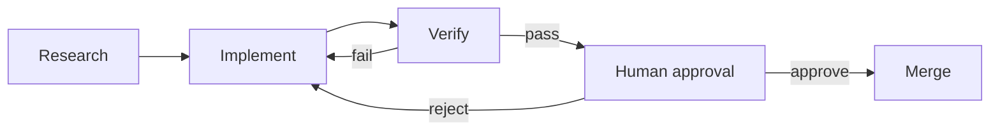

# Workflow Graph

> Draw the control flow when a loop needs specialization, rollback, parallel checks, and approval.

**Type:** Build
**Languages:** Python
**Prerequisites:** Phase 14 · 44 (Graph Engineering: Make Agent Structure Explicit), Phase 14 · 51 (Automated Loop)
**Time:** ~20 minutes

## Learning Objectives

- Define graph nodes, labeled edges, shared state, and routing rules.
- Route verification failures to repair instead of silently ending the run.
- Checkpoint state before a human approval pause and resume from that point.
- Merge parallel branch evidence with explicit append and conflict semantics.

## From loop to graph

The automated loop has one maker and one evaluator. A delivery system grows into
a graph when research, implementation, verification, security review, rollback,
and approval need different owners or paths. A graph makes those handoffs
visible. It does not make a graph automatically better: state and coordination
cost are part of the design decision.

## Build It

`GraphRunner` executes one node at a time and resolves the route before it
commits state, trace, or checkpoint. Unknown routes fail closed. The approval
node pauses rather than treating a missing decision as consent. `fan_out_merge`
gives every branch an isolated state copy, appends declared list fields, and
rejects conflicting scalar updates.

The demo includes a failed verification route, a checkpoint before approval,
and an approval resume. An approval decision is consumed by the approval node:
an approved decision reaches merge, while a rejected decision takes the repair
edge exactly once before the next approval gate pauses again. The whole graph
stays stdlib-only so its topology and failure semantics remain inspectable.

## Use It

Start with the smallest graph that exposes a real routing decision. Name every
failure, retry, rollback, and approval edge. Persist state after each committed
node in production and store traces separately when full replay is required.

## Practice notes

The artifact is intentionally deterministic, so the useful question is what evidence a change produces. Before editing it, write down which part of “Define graph nodes, labeled edges, shared state, and routing rules” should be visible in the result. Then inspect __init__, add_node, add_edge rather than treating the final sentence as an explanation.

For “Route verification failures to repair instead of silently ending the run”, keep the task and acceptance condition fixed while changing one input. A useful receipt has the input, the predicted result, the observed result, and one sentence about the mechanism. For “Checkpoint state before a human approval pause and resume from that point”, choose a boundary the implementation can actually reach and record whether it rejects, pauses, reports, or continues. Finally, use skill-workflow-graph.md to capture “Merge parallel branch evidence with explicit append and conflict semantics” as a reusable decision aid: include an owner and a next action, not only a summary.
## Ship It

Hand off `outputs/skill-workflow-graph.md` with the command `python3 main.py`, the accepted input shape (a graph with edges (0,1) and (1,2)), the expected observable result, and a failure note for malformed inputs.

## Exercises

- Add a security branch and choose append or conflict semantics for its findings.
- Add an approval expiry and an explicit escalation route.
- Compare this graph with the loop from Project 07 by counting checkpoints and
  human decisions, not only runtime.

## Further reading

- [Phase 14 · 44 — Graph Engineering](../../44-graph-engineering/docs/en.md)
- [Phase 14 · 51 — Automated Loop](../../51-automated-loop/docs/en.md)

## Reference Solution

For Workflow Graph, run python3 main.py from code/ and keep the output beside the input that produced it. A defensible submission contains:

1. Evidence for “Define graph nodes, labeled edges, shared state, and routing rules”: identify the exact field, trace entry, or report line that proves it; a successful process exit alone is not enough.
2. A one-variable comparison for “Route verification failures to repair instead of silently ending the run”. State the prediction first and explain why the observed change follows from __init__, add_node, add_edge.
3. A boundary or failure result for “Checkpoint state before a human approval pause and resume from that point”. Include the input, the expected guard or refusal, and the observed behavior. If the demo has no guard, record that gap instead of calling a crash a pass.
4. A practical update to outputs/skill-workflow-graph.md that applies “Merge parallel branch evidence with explicit append and conflict semantics” and names the person or system responsible for the next decision.

Run the relevant tests after the experiment. Keep any mismatch between prediction and observation in the receipt; the purpose of this lesson is to make the reasoning inspectable, not to make every run look successful.
