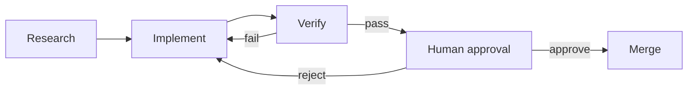

# Workflow Graph

> Draw the control flow when a loop needs specialization, rollback, parallel checks, and approval.

**Type:** Build
**Languages:** Python
**Prerequisites:** Phase 14 · 44 (Graph Engineering: Make Agent Structure Explicit), Phase 14 · 51 (Automated Loop)
**Time:** ~20 minutes

## Learning Objectives

- Define graph nodes, labeled edges, shared state, and routing rules.
- Route verification failures to repair instead of silently ending the run.
- Checkpoint state before a human approval pause and resume from that point.
- Merge parallel branch evidence with explicit append and conflict semantics.

## From loop to graph

The automated loop has one maker and one evaluator. A delivery system grows into
a graph when research, implementation, verification, security review, rollback,
and approval need different owners or paths. A graph makes those handoffs
visible. It does not make a graph automatically better: state and coordination
cost are part of the design decision.

## Build It

`GraphRunner` executes one node at a time and resolves the route before it
commits state, trace, or checkpoint. Unknown routes fail closed. The approval
node pauses rather than treating a missing decision as consent. `fan_out_merge`
gives every branch an isolated state copy, appends declared list fields, and
rejects conflicting scalar updates.

The demo includes a failed verification route, a checkpoint before approval,
and an approval resume. An approval decision is consumed by the approval node:
an approved decision reaches merge, while a rejected decision takes the repair
edge exactly once before the next approval gate pauses again. The whole graph
stays stdlib-only so its topology and failure semantics remain inspectable.

## Use It

Start with the smallest graph that exposes a real routing decision. Name every
failure, retry, rollback, and approval edge. Persist state after each committed
node in production and store traces separately when full replay is required.

## Exercises

- Add a security branch and choose append or conflict semantics for its findings.
- Add an approval expiry and an explicit escalation route.
- Compare this graph with the loop from Project 07 by counting checkpoints and
  human decisions, not only runtime.

## Further reading

- [Phase 14 · 44 — Graph Engineering](../../44-graph-engineering/docs/en.md)
- [Phase 14 · 51 — Automated Loop](../../51-automated-loop/docs/en.md)

## Reference Solution

Use the canonical [main.py](../code/main.py) as the executable baseline. A complete solution records a successful run, identifies the invariant tied to “Define graph nodes, labeled edges, shared state, and routing rules,” and changes only one variable for the comparison. The edge-case result must distinguish the prediction from the observation, explain the cause using “Checkpoint state before a human approval pause and resume from that point,” and cite a repeatable check rather than relying on visual inspection alone.
