# Communication Protocols

> Agents that can't speak the same language aren't a team. They're strangers shouting into the void.

**Type:** Build
**Languages:** TypeScript
**Prerequisites:** Phase 14 (Agent Engineering), Lesson 16.01 (Why Multi-Agent)
**Time:** ~120 minutes

## Learning Objectives

- Implement MCP tool discovery and invocation so agents can use tools exposed by external servers
- Build an A2A agent card and task endpoint that allows one agent to delegate work to another over HTTP
- Compare MCP (tool access), A2A (agent-to-agent), ACP (enterprise audit), and ANP (decentralized trust) and explain which protocol solves which problem
- Wire multiple protocols together in a single system where agents discover tools via MCP and delegate tasks via A2A

## The Problem

You split your system into multiple agents. A researcher, a coder, a reviewer. They're great at their individual jobs. But now you need them to actually talk to each other.

Your first attempt is obvious: pass strings around. The researcher returns a blob of text, the coder parses it however it can. It works until the coder misinterprets a research summary, or two agents deadlock waiting for each other, or you need agents built by different teams to collaborate. Suddenly "just pass strings" falls apart.

This is the communication protocol problem. Without a shared contract for how agents exchange information, multi-agent systems are fragile, unauditable, and impossible to scale beyond a handful of agents you personally wrote.

The AI ecosystem has responded with four protocols, each solving a different slice of the problem:

- **MCP** for tool access
- **A2A** for agent-to-agent collaboration
- **ACP** for enterprise auditability
- **ANP** for decentralized identity and trust

This lesson goes deep. You will read real wire formats from each spec, build working implementations, and connect all four into a unified system.

## The Concept

### The Protocol Landscape

Think of these four protocols as layers, each addressing a different question:

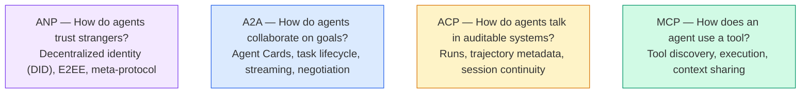

They're not competitors. They solve different problems at different levels.

### MCP (Recap)

MCP is covered in depth in Phase 13. Quick recap: MCP standardizes how an LLM connects to external tools and data sources. It's a **client-server** protocol where the agent (client) discovers and calls tools exposed by a server.

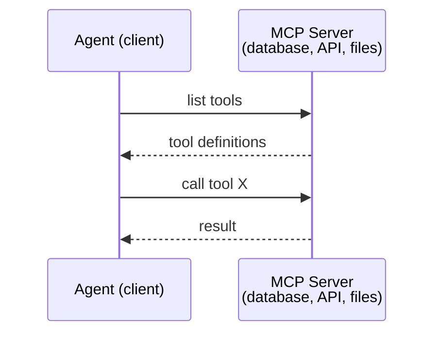

MCP is **agent-to-tool** communication. It doesn't help agents talk to each other.

### A2A (Agent2Agent Protocol)

**Created by:** Google (now under Linux Foundation as `lf.a2a.v1`)
**Spec version:** 1.0.0
**Problem:** How do autonomous agents collaborate, negotiate, and delegate tasks to each other?

A2A is the protocol for **peer-to-peer agent collaboration**. Where MCP connects an agent to tools, A2A connects an agent to other agents. Each agent publishes an **Agent Card** at a well-known URL, and other agents discover, negotiate with, and delegate tasks to it.

#### How A2A Works

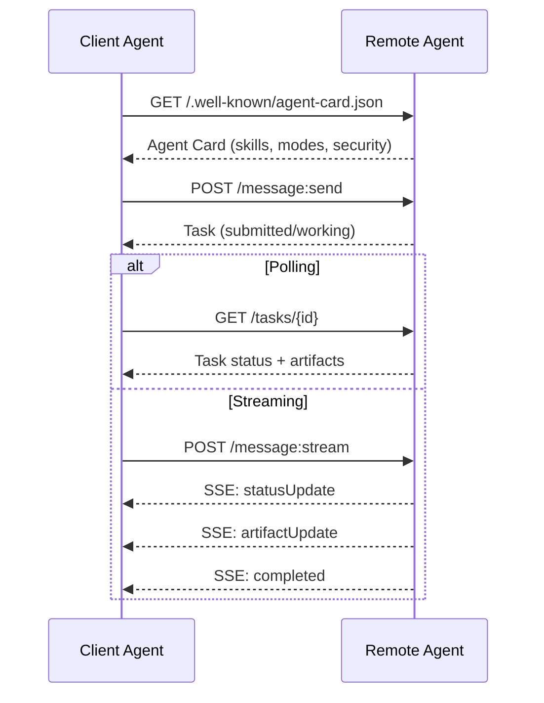

#### The Real Agent Card

This is what an A2A Agent Card actually looks like in the wild. Served at `GET /.well-known/agent-card.json`:

```json
{
  "name": "Research Agent",
  "description": "Searches documentation and summarizes findings",
  "version": "1.0.0",
  "supportedInterfaces": [
    {
      "url": "https://research-agent.example.com/a2a/v1",
      "protocolBinding": "JSONRPC",
      "protocolVersion": "1.0"
    },
    {
      "url": "https://research-agent.example.com/a2a/rest",
      "protocolBinding": "HTTP+JSON",
      "protocolVersion": "1.0"
    }
  ],
  "provider": {
    "organization": "Your Company",
    "url": "https://example.com"
  },
  "capabilities": {
    "streaming": true,
    "pushNotifications": false
  },
  "defaultInputModes": ["text/plain", "application/json"],
  "defaultOutputModes": ["text/plain", "application/json"],
  "skills": [
    {
      "id": "web-research",
      "name": "Web Research",
      "description": "Searches the web and synthesizes findings",
      "tags": ["research", "search", "summarization"],
      "examples": ["Research the latest changes in React 19"]
    },
    {
      "id": "doc-analysis",
      "name": "Documentation Analysis",
      "description": "Reads and analyzes technical documentation",
      "tags": ["docs", "analysis"],
      "inputModes": ["text/plain", "application/pdf"],
      "outputModes": ["application/json"]
    }
  ],
  "securitySchemes": {
    "bearer": {
      "httpAuthSecurityScheme": {
        "scheme": "Bearer",
        "bearerFormat": "JWT"
      }
    }
  },
  "security": [{ "bearer": [] }]
}
```

Key things to notice:
- **Skills** are what an agent can do. Each has an ID, tags, and supported input/output MIME types. This is how a client agent decides whether this remote agent can handle its request.
- **supportedInterfaces** lists multiple protocol bindings. A single agent can speak JSON-RPC, REST, and gRPC simultaneously.
- **Security** is built into the card. The client knows what auth it needs before making a single request.

#### Task Lifecycle

Tasks are the core unit of work in A2A. They move through defined states:

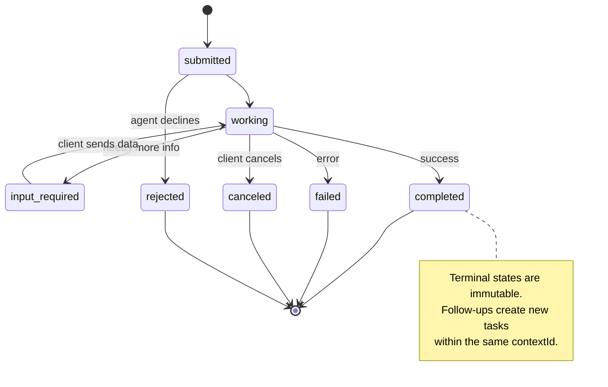

All 8 states (the spec also defines `UNSPECIFIED` as a sentinel, omitted here):

| State | Terminal? | Meaning |
|---|---|---|
| `TASK_STATE_SUBMITTED` | No | Acknowledged, not yet processing |
| `TASK_STATE_WORKING` | No | Actively being processed |
| `TASK_STATE_INPUT_REQUIRED` | No | Agent needs more info from client |
| `TASK_STATE_AUTH_REQUIRED` | No | Authentication needed |
| `TASK_STATE_COMPLETED` | Yes | Finished successfully |
| `TASK_STATE_FAILED` | Yes | Finished with error |
| `TASK_STATE_CANCELED` | Yes | Canceled before completion |
| `TASK_STATE_REJECTED` | Yes | Agent declined the task |

Once a task reaches a terminal state, it's immutable. No further messages. Follow-ups create a new task within the same `contextId`.

#### Wire Format

A2A uses JSON-RPC 2.0. Here's what a real message exchange looks like:

**Client sends a task:**
```json
{
  "jsonrpc": "2.0",
  "id": 1,
  "method": "SendMessage",
  "params": {
    "message": {
      "messageId": "msg-001",
      "role": "ROLE_USER",
      "parts": [{ "text": "Research React 19 compiler features" }]
    },
    "configuration": {
      "acceptedOutputModes": ["text/plain", "application/json"],
      "historyLength": 10
    }
  }
}
```

**Agent responds with a task:**
```json
{
  "jsonrpc": "2.0",
  "id": 1,
  "result": {
    "task": {
      "id": "task-abc-123",
      "contextId": "ctx-xyz-789",
      "status": {
        "state": "TASK_STATE_COMPLETED",
        "timestamp": "2026-03-27T10:30:00Z"
      },
      "artifacts": [
        {
          "artifactId": "art-001",
          "name": "research-results",
          "parts": [{
            "data": {
              "findings": [
                "React 19 compiler auto-memoizes components",
                "No more manual useMemo/useCallback needed",
                "Compiler runs at build time, not runtime"
              ]
            },
            "mediaType": "application/json"
          }]
        }
      ]
    }
  }
}
```

**Streaming via SSE:**
```text
POST /message:stream HTTP/1.1
Content-Type: application/json
A2A-Version: 1.0

data: {"task":{"id":"task-123","status":{"state":"TASK_STATE_WORKING"}}}

data: {"statusUpdate":{"taskId":"task-123","status":{"state":"TASK_STATE_WORKING","message":{"role":"ROLE_AGENT","parts":[{"text":"Searching documentation..."}]}}}}

data: {"artifactUpdate":{"taskId":"task-123","artifact":{"artifactId":"art-1","parts":[{"text":"partial findings..."}]},"append":true,"lastChunk":false}}

data: {"statusUpdate":{"taskId":"task-123","status":{"state":"TASK_STATE_COMPLETED"}}}
```

### ACP (Agent Communication Protocol)

**Created by:** IBM / BeeAI
**Spec version:** 0.2.0 (OpenAPI 3.1.1)
**Status:** Merging into A2A under the Linux Foundation
**Problem:** How do agents communicate with full auditability, session continuity, and trajectory tracking?

ACP is the **enterprise protocol**. Unlike what many summaries claim, ACP does **not** use JSON-LD. It's a straightforward REST/JSON API defined via OpenAPI. What makes it special is **TrajectoryMetadata**: every agent response can carry a detailed log of the reasoning steps and tool calls that produced it.

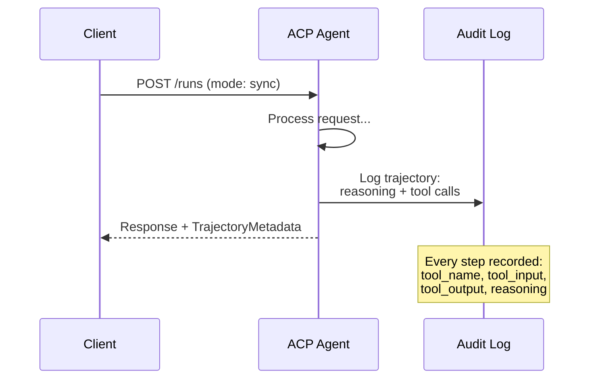

#### Agent Discovery in ACP

ACP defines four discovery methods:

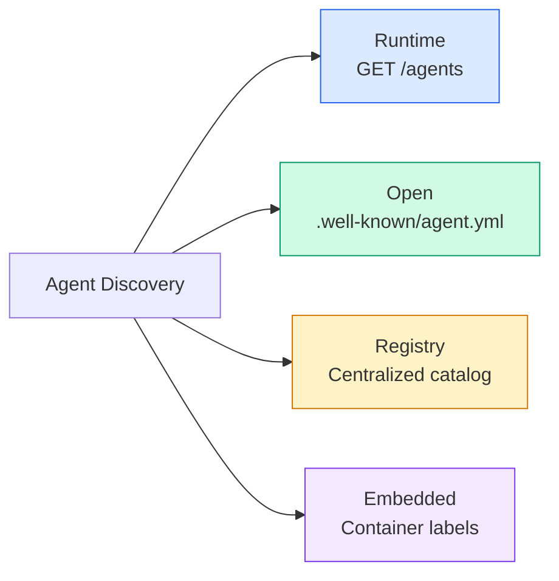

The **AgentManifest** is simpler than A2A's Agent Card:

```json
{
  "name": "summarizer",
  "description": "Summarizes documents with source citations",
  "input_content_types": ["text/plain", "application/pdf"],
  "output_content_types": ["text/plain", "application/json"],
  "metadata": {
    "tags": ["summarization", "RAG"],
    "framework": "BeeAI",
    "capabilities": [
      {
        "name": "Document Summarization",
        "description": "Condenses long documents into key points"
      }
    ],
    "recommended_models": ["llama3.3:70b-instruct-fp16"],
    "license": "Apache-2.0",
    "programming_language": "Python"
  }
}
```

#### Run Lifecycle

ACP uses "Runs" instead of "Tasks". A Run is an agent execution with three modes:

| Mode | Behavior |
|---|---|
| `sync` | Blocking. Response contains the complete result. |
| `async` | Returns 202 immediately. Poll `GET /runs/{id}` for status. |
| `stream` | SSE stream. Events fire as the agent works. |

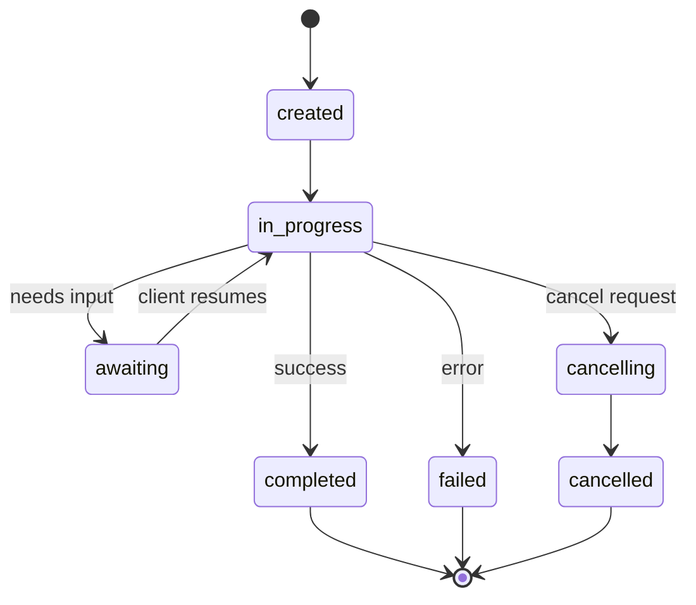

#### TrajectoryMetadata (The Audit Trail)

This is ACP's key differentiator. Every message part can include metadata showing exactly what the agent did:

```json
{
  "role": "agent/researcher",
  "parts": [
    {
      "content_type": "text/plain",
      "content": "The weather in San Francisco is 72F and sunny.",
      "metadata": {
        "kind": "trajectory",
        "message": "I need to check the weather for this location",
        "tool_name": "weather_api",
        "tool_input": { "location": "San Francisco, CA" },
        "tool_output": { "temperature": 72, "condition": "sunny" }
      }
    }
  ]
}
```

For regulated industries this is gold. Every answer comes with a provable chain of reasoning: which tools were called, what inputs were used, what outputs were received. No black box.

ACP also supports **CitationMetadata** for source attribution:

```json
{
  "kind": "citation",
  "start_index": 0,
  "end_index": 47,
  "url": "https://weather.gov/sf",
  "title": "NWS San Francisco Forecast"
}
```

### ANP (Agent Network Protocol)

**Created by:** Open-source community (founded by GaoWei Chang)
**Repo:** [github.com/agent-network-protocol/AgentNetworkProtocol](https://github.com/agent-network-protocol/AgentNetworkProtocol)
**Problem:** How do agents from different organizations trust each other without a central authority?

ANP is the **decentralized identity protocol**. It builds trust using W3C Decentralized Identifiers (DIDs) and end-to-end encryption. Unlike A2A where you discover agents through known endpoints, ANP lets agents prove their identity cryptographically.

ANP has three layers:

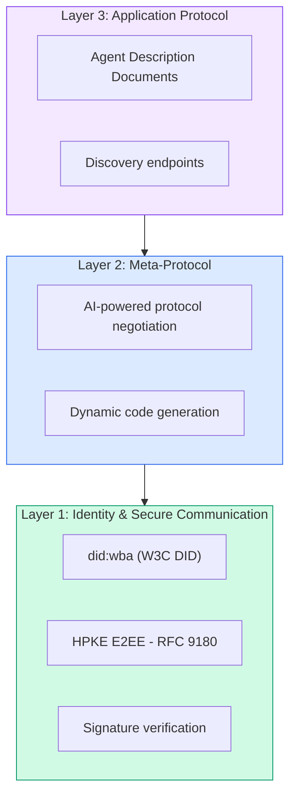

#### DID Documents (Real Structure)

ANP uses a custom DID method called `did:wba` (Web-Based Agent). The DID `did:wba:example.com:user:alice` resolves to `https://example.com/user/alice/did.json`:

```json
{
  "@context": [
    "https://www.w3.org/ns/did/v1",
    "https://w3id.org/security/suites/jws-2020/v1",
    "https://w3id.org/security/suites/secp256k1-2019/v1"
  ],
  "id": "did:wba:example.com:user:alice",
  "verificationMethod": [
    {
      "id": "did:wba:example.com:user:alice#key-1",
      "type": "EcdsaSecp256k1VerificationKey2019",
      "controller": "did:wba:example.com:user:alice",
      "publicKeyJwk": {
        "crv": "secp256k1",
        "x": "NtngWpJUr-rlNNbs0u-Aa8e16OwSJu6UiFf0Rdo1oJ4",
        "y": "qN1jKupJlFsPFc1UkWinqljv4YE0mq_Ickwnjgasvmo",
        "kty": "EC"
      }
    },
    {
      "id": "did:wba:example.com:user:alice#key-x25519-1",
      "type": "X25519KeyAgreementKey2019",
      "controller": "did:wba:example.com:user:alice",
      "publicKeyMultibase": "z9hFgmPVfmBZwRvFEyniQDBkz9LmV7gDEqytWyGZLmDXE"
    }
  ],
  "authentication": [
    "did:wba:example.com:user:alice#key-1"
  ],
  "keyAgreement": [
    "did:wba:example.com:user:alice#key-x25519-1"
  ],
  "humanAuthorization": [
    "did:wba:example.com:user:alice#key-1"
  ],
  "service": [
    {
      "id": "did:wba:example.com:user:alice#agent-description",
      "type": "AgentDescription",
      "serviceEndpoint": "https://example.com/agents/alice/ad.json"
    }
  ]
}
```

Key things to notice:
- **Key separation** is enforced. Signing keys (secp256k1) are separate from encryption keys (X25519).
- **`humanAuthorization`** is unique to ANP. These keys require explicit human approval (biometric, password, HSM) before use. High-risk operations like fund transfers go through this path.
- **`keyAgreement`** keys are used for HPKE end-to-end encryption (RFC 9180).
- The **service** section links to the Agent Description document.

#### How Trust Works in ANP

ANP does **not** use a web-of-trust or endorsement graph. Trust is bilateral and verified per-interaction:

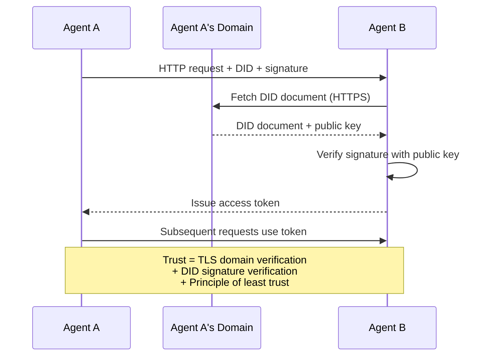

Trust comes from three sources:
1. **Domain-level TLS** verifies the DID document host
2. **DID cryptographic signatures** verify the agent's identity
3. **Principle of least trust** grants only minimum permissions

There's no gossip-based trust propagation or PageRank scoring. You verify each agent directly through its DID.

#### Meta-Protocol Negotiation

This is ANP's most novel feature. When two agents from different ecosystems meet, they don't need pre-agreed data formats. They negotiate in natural language:

```json
{
  "action": "protocolNegotiation",
  "sequenceId": 0,
  "candidateProtocols": "I can communicate using:\n1. JSON-RPC with hotel booking schema\n2. REST with OpenAPI 3.1 spec\n3. Natural language over HTTP",
  "modificationSummary": "Initial proposal",
  "status": "negotiating"
}
```

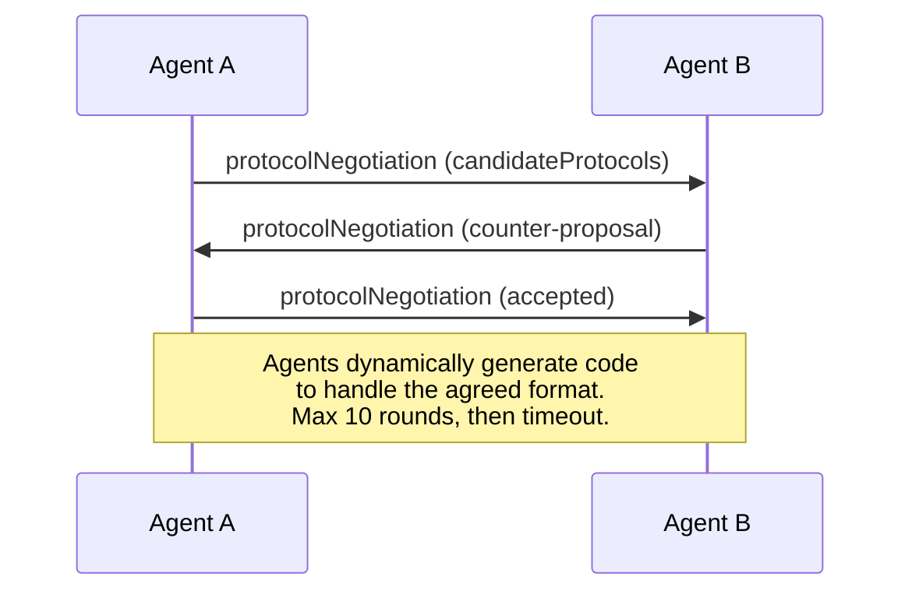

The agents go back and forth (max 10 rounds) until they agree on a format, then dynamically generate code to handle it. Status values: `negotiating`, `rejected`, `accepted`, `timeout`.

This means two agents that have never seen each other before can figure out how to communicate without anyone pre-defining a shared schema.

### Comparison (Corrected)

| | MCP | A2A | ACP | ANP |
|---|---|---|---|---|
| **Created by** | Anthropic | Google / Linux Foundation | IBM / BeeAI | Community |
| **Spec format** | JSON-RPC | JSON-RPC / REST / gRPC | OpenAPI 3.1 (REST) | JSON-RPC |
| **Primary use** | Agent to Tool | Agent to Agent | Agent to Agent | Agent to Agent |
| **Discovery** | Tool listing | `/.well-known/agent-card.json` | `GET /agents`, `/.well-known/agent.yml` | `/.well-known/agent-descriptions`, DID service endpoints |
| **Identity** | Implicit (local) | Security schemes (OAuth, mTLS) | Server-level | W3C DID (`did:wba`) with E2EE |
| **Audit trail** | N/A | Basic (task history) | TrajectoryMetadata (tool calls, reasoning) | Not formally specified |
| **State machine** | N/A | 9 task states | 7 run states | N/A |
| **Streaming** | N/A | SSE | SSE | Transport-agnostic |
| **Unique feature** | Tool schemas | Agent Cards + Skills | Trajectory audit trail | Meta-protocol negotiation |
| **Best for** | Tools & data | Dynamic collaboration | Regulated industries | Cross-org trust |
| **Status** | Stable | Stable (v1.0) | Merging into A2A | Active development |

### How They Work Together

These protocols are not mutually exclusive. A realistic enterprise system uses multiple:

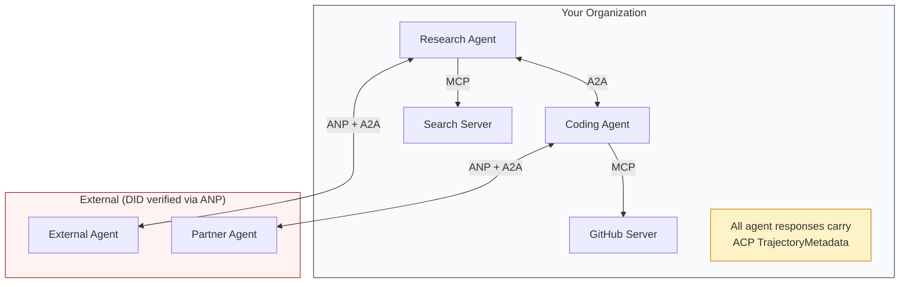

- **MCP** connects each agent to its tools
- **A2A** handles collaboration between agents (internal and external)
- **ACP** wraps responses in trajectory metadata for auditability
- **ANP** provides identity verification for agents you don't control


## Build It

Reconstruct **Communication Protocols** by following `createMessage` on the demo’s smallest built-in fixture. Run `npx tsx main.ts` and verify that the result reports the empty case explicitly or raises the documented validation error.

## Use It

Call `createMessage` from a small caller with the demo’s smallest built-in fixture. Compare its result with the demo output, and record the input contract and the one field a downstream user should rely on.

## Ship It

Hand off `outputs/prompt-protocol-selector.md` with the command `npx tsx main.ts`, the accepted input shape (the demo’s smallest built-in fixture), the expected observable result, and a failure note for malformed inputs.

## Further Reading

- [Google A2A specification](https://github.com/google/A2A) -- official spec and SDKs (v1.0.0, Linux Foundation)
- [IBM/BeeAI ACP specification](https://github.com/i-am-bee/acp) -- OpenAPI 3.1 spec for agent runs and trajectory metadata
- [Agent Network Protocol](https://github.com/agent-network-protocol/AgentNetworkProtocol) -- DID-based identity, E2EE, meta-protocol negotiation
- [Model Context Protocol docs](https://modelcontextprotocol.io/) -- Anthropic's MCP specification (covered in Phase 13)
- [W3C Decentralized Identifiers](https://www.w3.org/TR/did-core/) -- the identity standard underpinning ANP
- [RFC 9180 (HPKE)](https://www.rfc-editor.org/rfc/rfc9180) -- the encryption scheme ANP uses for E2EE
- [FIPA Agent Communication Language](http://www.fipa.org/specs/fipa00061/SC00061G.html) -- the academic precursor to modern agent protocols

## Exercises

Use `createMessage` as the trace: start from the demo’s smallest built-in fixture, keep the raw output, and tie each observation to a named objective.

1. **Reproduce the reference path.** From `code/`, run `npx tsx main.ts` using the demo’s smallest built-in fixture. Follow `createMessage`, `textMessage`, `AgentRegistry`. Expect the result reports the empty case explicitly or raises the documented validation error; capture the first printed shape, metric, status, or summary field and state which part supports **Implement MCP tool discovery and invocation so agents can use tools exposed by external servers**.
2. **Vary one named input.** Repeat the command after changing only the primary fixture value: use the same fixture with its primary value changed from 1 to 2. Predict the direction of the change, then compare the two output values. Explain why **Build an A2A agent card and task endpoint that allows one agent to delegate work to another over HTTP** says the other inputs should stay fixed.
3. **Probe the empty case.** Feed the implementation an empty fixture {}. Before running it, write down whether the relevant function should return an empty value, a zero-sized result, or a validation error. Check the observed status against **Compare MCP (tool access), A2A (agent-to-agent), ACP (enterprise audit), and ANP (decentralized trust) and explain which protocol solves which problem** and record the exception text if the code rejects the case.
4. **Package a usable handoff.** Open `outputs/prompt-protocol-selector.md` and add a worked example using the demo’s smallest built-in fixture. Include the input contract, one expected output field, and a named acceptance check for **Wire multiple protocols together in a single system where agents discover tools via MCP and delegate tasks via A2A**; note what the demo cannot establish.

## Reference Solution

A checkable result for **Communication Protocols** should contain:

- the `npx tsx main.ts` output for the demo’s smallest built-in fixture, with `createMessage`, `textMessage`, `AgentRegistry` traced to the value or shape that supports **Implement MCP tool discovery and invocation so agents can use tools exposed by external servers**;
- a before/after comparison for the primary fixture value, where the same fixture with its primary value changed from 1 to 2 changes the observation in the direction predicted by **Build an A2A agent card and task endpoint that allows one agent to delegate work to another over HTTP**;
- a recorded result for an empty fixture {} that matches the implementation’s validation or empty-result contract and explains the evidence for **Compare MCP (tool access), A2A (agent-to-agent), ACP (enterprise audit), and ANP (decentralized trust) and explain which protocol solves which problem**; and
- an updated `outputs/prompt-protocol-selector.md` example with a concrete input, expected output field, and acceptance check tied to **Wire multiple protocols together in a single system where agents discover tools via MCP and delegate tasks via A2A**.

Run the lesson tests after the demo. If the boundary behaves differently from the prediction, keep the actual exception or output and explain the implementation path that produced it.
