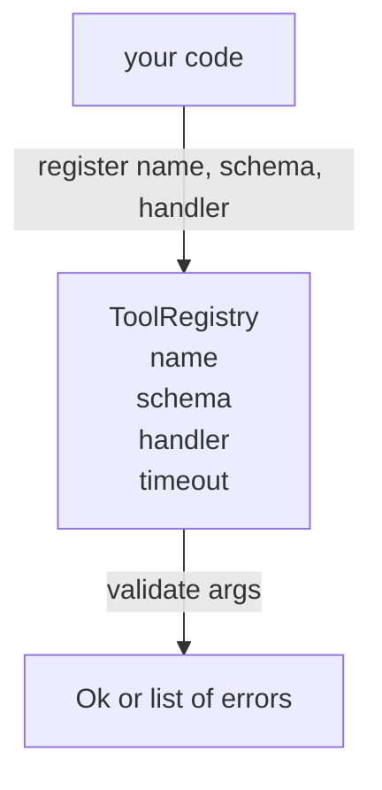

# Tool Registry with Schema Validation

> A tool the agent cannot validate is a tool the agent cannot call. Build the registry and the schema checker before you build the tools.

**Type:** Build
**Languages:** Python
**Prerequisites:** Phase 13 lessons 01-07, Phase 14 lesson 01
**Time:** ~90 minutes

## Learning Objectives
- Hold a typed registry of tool name → schema → handler that the dispatcher can ask once and trust afterwards.
- Implement a JSON Schema 2020-12 subset that covers the keywords ninety percent of tool calls actually use.
- Return precise, json-pointer-shaped error paths so the model can self-correct in one round trip.
- Reject re-registration without explicit override, since silent overwrites are how production tool catalogs drift.
- Keep the validator pure (no I/O, no time, no globals) so it can be re-run on a replay log.

## Why the registry comes before the tool

A coding agent in 2026 has more registered tools than the model can fit in a single context window. A non-trivial harness will register two hundred tools and surface ten to forty at any given turn. The registry is the source of truth for "what tools exist," "what shape do their arguments take," and "what handler do I call." Once those three answers are pinned, the rest of the harness can stop guessing.

The mistake we are avoiding is shipping handlers without schemas, or shipping schemas without validation. Both are common. Both turn the next layer (the dispatcher in lesson twenty-three) into a guessing game where the only failure mode is a stack trace from the handler.

## What a tool record looks like

```text
ToolRecord
  name        : str          (unique, lowercase alphanumeric and underscore segments separated by dots, e.g., snake_case.segment.case)
  description : str          (one line, shown to the model)
  schema      : dict         (JSON Schema 2020-12 subset)
  handler     : Callable     (async or sync, returns Any)
  idempotent  : bool         (dispatcher uses this for retry decisions)
  timeout_ms  : int          (override per-tool dispatcher default)
```

The schema is the only field the validator touches. The handler is opaque to it. We separate them on purpose. The schema is data. The handler is code. Mixing them tempts you to put validation logic inside the handler, which is the bug we are stopping.

## The JSON Schema 2020-12 subset

The full 2020-12 spec is a paper. We need eight keywords.

```text
type           string / number / integer / boolean / object / array / null
properties     map of property name -> schema
required       list of property names
enum           list of allowed primitive values
minLength      integer, applies to strings
maxLength      integer, applies to strings
pattern        ECMA-262-compatible regex, applies to strings
items          schema applied to every array element
```

That is enough to cover what a tool API actually needs. The keywords we are not adding (oneOf, anyOf, allOf, $ref, conditionals) are valid in production schemas but turn the validator into a tree walker with cycles. We are building a registry, not a JSON Schema engine.

## Json pointer error paths

When validation fails, the validator returns a list of errors. Each error carries a json-pointer path into the input. A pointer is a slash-prefixed sequence of property names and array indices.

```text
{"a": {"b": [1, 2, "x"]}}
                    ^
                    /a/b/2
```

The model reads error paths better than it reads sentences. If a schema requires `args.user.email` and the model passed an integer, the error should be `/user/email` with `expected_type: string`. The model fixes that in the next call without a round of natural language.

The validator dispatches on `schema["type"]`, checks each of the eight keywords, and prepends json-pointer path segments as it descends into objects and arrays.

```python editable
import re
from dataclasses import dataclass
from typing import Any, Callable

PRIMITIVE_TYPE_MAP = {
    "string": (str,),
    "integer": (int,),
    "number": (int, float),
    "boolean": (bool,),
    "object": (dict,),
    "array": (list,),
    "null": (type(None),),
}

@dataclass
class ValidationError:
    path: str
    keyword: str
    message: str
    def to_dict(self):
        return {"path": self.path, "keyword": self.keyword, "message": self.message}

@dataclass
class Ok:
    pass

def _type_matches(value: Any, expected: str) -> bool:
    types = PRIMITIVE_TYPE_MAP[expected]
    if expected == "boolean":
        return isinstance(value, bool)
    if expected in ("integer", "number"):
        if isinstance(value, bool):
            return False
        return isinstance(value, types)
    return isinstance(value, types)

def _path(prefix: str, segment: str | int) -> str:
    seg = str(segment).replace("~", "~0").replace("/", "~1")
    return f"{prefix}/{seg}"

def _walk(schema: dict, value: Any, path: str, errs: list) -> None:
    t = schema.get("type")
    if t is not None and not _type_matches(value, t):
        errs.append(ValidationError(path=path or "/", keyword="type",
                                    message=f"expected {t}, got {type(value).__name__}"))
        return
    if "enum" in schema:
        if value not in schema["enum"]:
            errs.append(ValidationError(path=path or "/", keyword="enum",
                                        message=f"value {value!r} not in {schema['enum']!r}"))
            return
    if t == "string":
        if "minLength" in schema and len(value) < schema["minLength"]:
            errs.append(ValidationError(path=path or "/", keyword="minLength",
                                        message=f"length {len(value)} < minLength {schema['minLength']}"))
        if "maxLength" in schema and len(value) > schema["maxLength"]:
            errs.append(ValidationError(path=path or "/", keyword="maxLength",
                                        message=f"length {len(value)} > maxLength {schema['maxLength']}"))
        if "pattern" in schema:
            try:
                if not re.search(schema["pattern"], value):
                    errs.append(ValidationError(path=path or "/", keyword="pattern",
                                                message=f"value {value!r} does not match pattern {schema['pattern']!r}"))
            except re.error as exc:
                errs.append(ValidationError(path=path or "/", keyword="pattern",
                                            message=f"invalid regex: {exc}"))
    elif t == "object":
        required = schema.get("required", [])
        for req_name in required:
            if req_name not in value:
                errs.append(ValidationError(path=_path(path, req_name), keyword="required",
                                            message=f"missing required property {req_name!r}"))
        props = schema.get("properties", {})
        for prop_name, prop_value in value.items():
            if prop_name in props:
                _walk(props[prop_name], prop_value, _path(path, prop_name), errs)
    elif t == "array":
        items_schema = schema.get("items")
        if items_schema is not None:
            for idx, item in enumerate(value):
                _walk(items_schema, item, _path(path, idx), errs)

print("Validator functions ready")
```

## Registration and override

`register(name, schema, handler, **opts)` rejects re-registration by default. The caller has to pass `override=True` to replace. This is operational hygiene. Two parts of the codebase silently registering the same tool name is the kind of bug that takes a week to find in production.

The registry exposes three read methods. `get(name)` returns the record or raises. `validate(name, args)` returns an `Ok` or a list of errors. `names()` returns the tool names in registration order.

```python editable
class ToolRegistry:
    """Name-keyed table of tool records with schema validation."""
    _NAME_RE = re.compile(r"^[a-z][a-z0-9_]*(\.[a-z][a-z0-9_]*)*$")
    def __init__(self):
        self._records = {}
        self._order = []
    def register(self, name, schema, handler, description="", idempotent=False, override=False):
        if not self._NAME_RE.match(name):
            raise ValueError(f"tool name {name!r} must match {self._NAME_RE.pattern}")
        if name in self._records and not override:
            raise ValueError(f"tool {name!r} already registered; pass override=True to replace")
        if name not in self._records:
            self._order.append(name)
        self._records[name] = {"name": name, "schema": schema, "handler": handler,
                               "description": description, "idempotent": idempotent}
        return self._records[name]
    def get(self, name: str):
        if name not in self._records:
            raise KeyError(f"unknown tool {name!r}")
        return self._records[name]
    def validate(self, name: str, args: Any):
        rec = self.get(name)
        errors = []
        _walk(rec["schema"], args, "", errors)
        return Ok() if not errors else errors
    def names(self):
        return list(self._order)

print("ToolRegistry class ready")
```

Register the lesson's example tool. It fetches a user from a database by id, with optional field filtering. `id` is required and must be an integer; `fields` (if provided) must be an array of strings from an enum.

```python editable
import json

registry = ToolRegistry()

def get_user(id: int, fields=None):
    """Fetch user record by id. Returns simulated user data."""
    users = {1: {"id": 1, "name": "Alice", "email": "alice@example.com"},
             2: {"id": 2, "name": "Bob", "email": "bob@example.com"}}
    user = users.get(id, {})
    if fields:
        return {k: user[k] for k in fields if k in user}
    return user

registry.register(
    name="db.get_user",
    description="Fetch a user record by id.",
    schema={
        "type": "object",
        "required": ["id"],
        "properties": {
            "id": {"type": "integer"},
            "fields": {
                "type": "array",
                "items": {"type": "string", "enum": ["id", "name", "email"]},
            },
        },
    },
    handler=get_user,
    idempotent=True,
)

print(f"Registered tool: {registry.names()}")
print(f"Schema: {json.dumps(registry.get('db.get_user')['schema'], indent=2)}")
```

## What the validator is and is not

It is a single pass over the schema tree, recursive. It is pure. It does not call handlers. It does not coerce types (a string `"42"` does not pass a number schema). It does not silently truncate.

It is not a security boundary. A malicious handler can still misbehave after validation passes. The dispatcher in lesson twenty-three adds timeout and sandbox layers. The registry adds shape.

A valid argument set: `id` is an integer, `fields` contains only allowed strings.

```python editable
valid_args = {"id": 1, "fields": ["id", "name"]}
result = registry.validate("db.get_user", valid_args)
print(f"Args: {valid_args}")
print(f"Result: {'Ok()' if isinstance(result, Ok) else result}")
```

Passing `id` as a string instead of an integer — no coercion, straight to a type error at `/id`.

```python editable
invalid_type = {"id": "forty-two"}
result = registry.validate("db.get_user", invalid_type)
print(f"Args: {invalid_type}")
if not isinstance(result, Ok):
    for err in result:
        print(f"  Error: {err.to_dict()}")
```

Omitting the required `id` field reports the path `/id` with keyword `required`.

```python editable
missing_required = {"fields": ["name"]}
result = registry.validate("db.get_user", missing_required)
print(f"Args: {missing_required}")
if not isinstance(result, Ok):
    for err in result:
        print(f"  Error: {err.to_dict()}")
```

Passing a `fields` value outside the allowed enum catches the invalid field name at path `/fields/1`.

```python editable
invalid_enum = {"id": 1, "fields": ["id", "phone"]}
result = registry.validate("db.get_user", invalid_enum)
print(f"Args: {invalid_enum}")
if not isinstance(result, Ok):
    for err in result:
        print(f"  Error: {err.to_dict()}")
```

Now put the error-path design to work: send a validation error report to the LLM and ask it to fix the arguments. This is what the dispatcher does in practice — try a tool call, get precise error paths back, let the model self-correct in one round trip.

```python editable
import sys, types
lrn_llm = types.ModuleType("lrn_llm")
try:
    from pyodide.http import pyfetch as _pyfetch
    _IN_PYODIDE = True
except ImportError:
    import urllib.request as _urlreq
    _IN_PYODIDE = False
lrn_llm.API_BASE = "/api/llm"
lrn_llm.DEFAULT_MODEL = "azure/gpt-5.4-mini"
lrn_llm.API_KEY = ""

async def _lrn_call(messages, *, system=None, max_tokens=400, model=None):
    if system is not None:
        messages = [{"role": "system", "content": system}] + list(messages)
    payload = {"model": model or lrn_llm.DEFAULT_MODEL, "messages": messages,
               "max_completion_tokens": max_tokens}
    headers = {"content-type": "application/json"}
    _key = lrn_llm.API_KEY
    if _key:
        headers["Authorization"] = "Bearer " + _key
    url = lrn_llm.API_BASE.rstrip("/") + "/chat/completions"
    body = json.dumps(payload)
    if _IN_PYODIDE:
        r = await _pyfetch(url, method="POST", headers=headers, body=body)
        data = await r.json()
    else:
        req = _urlreq.Request(url, method="POST", headers=headers, data=body.encode("utf-8"))
        with _urlreq.urlopen(req, timeout=60) as r:
            data = json.loads(r.read())
    if "error" in data:
        raise RuntimeError("LLM error: " + str(data["error"]))
    return data

def _lrn_text(r):
    ch = (r or {}).get("choices") or []
    return (ch[0].get("message", {}) or {}).get("content", "") if ch else ""

async def _lrn_ping():
    r = await _lrn_call([{"role": "user", "content": "Reply with exactly: OK"}], max_tokens=5)
    return {"ok": _lrn_text(r).strip().upper().startswith("OK"), "model": r.get("model")}

lrn_llm.call = _lrn_call
lrn_llm.text = _lrn_text
lrn_llm.ping = _lrn_ping

bad_args = {"id": "alice", "fields": ["id", "phone", "address"]}
errors = registry.validate("db.get_user", bad_args)

error_report = f"""Tool: db.get_user
Attempted args: {json.dumps(bad_args)}
Validation errors:
"""
if not isinstance(errors, Ok):
    for err in errors:
        error_report += f"  - {err.path}: [{err.keyword}] {err.message}\n"

print("Validation errors for LLM:")
print(error_report)
```

```python editable
system_prompt = """You are an agent assistant. You help fix tool arguments based on schema validation errors.
You read the error paths and messages, understand what's wrong, and suggest corrected arguments.
Always output ONLY a valid JSON object, no markdown or explanation."""

user_message = f"""{error_report}
What are the corrected arguments?"""

response = await lrn_llm.call(
    [{"role": "user", "content": user_message}],
    system=system_prompt,
    max_tokens=200
)

response_text = lrn_llm.text(response)
print("LLM response:")
print(response_text)

try:
    corrected_args = json.loads(response_text)
    print(f"\nCorrected args: {corrected_args}")

    result = registry.validate("db.get_user", corrected_args)
    if isinstance(result, Ok):
        print("Corrected arguments are valid!")
    else:
        print(f"Still has errors: {[e.to_dict() for e in result]}")

    # Self-check: don't just trust that the validator returned Ok() —
    # confirm the self-corrected args actually match the known-good shape
    # for db.get_user (id is an int, fields only contains id/name/email).
    try:
        assert isinstance(result, Ok), "validator still reports errors on the corrected args"
        assert isinstance(corrected_args.get("id"), int) and not isinstance(corrected_args.get("id"), bool), \
            "id must be corrected to an integer"
        allowed_fields = {"id", "name", "email"}
        assert all(f in allowed_fields for f in corrected_args.get("fields", [])), \
            "fields must only contain the allowed enum values (id, name, email)"
        print("PASS: self-corrected args match the expected shape")
    except AssertionError as e:
        print(f"WRONG: {e}")
except json.JSONDecodeError:
    print("Could not parse JSON from LLM response")
```

## Shape



## How to read the code

`code/main.py` defines `ToolRegistry`, `ToolRecord`, `ValidationError`, and the eight validator functions. The validator dispatches on `schema["type"]` (or treats a schema with `enum` as untyped enum check). Each type validator returns either an empty list or a list of `ValidationError`. The top-level walker concatenates errors and prepends path segments as it descends.

`code/tests/test_registry.py` covers registration, override, validation success, validation failure with paths, and every keyword in the subset.

## Try It Yourself

The registry prevents accidental re-registration: registering `db.get_user` again without `override=True` raises, and with `override=True` it replaces the record. (Run after the validation walkthrough above, so it doesn't clobber the `db.get_user` schema those examples validate against.)

```python editable
try:
    registry.register(
        name="db.get_user",
        schema={"type": "object"},
        handler=lambda: None,
        override=False
    )
    print("Should have raised ValueError")
except ValueError as e:
    print(f"Registration protection works: {e}")

registry.register(
    name="db.get_user",
    schema={"type": "object"},
    handler=lambda: None,
    override=True
)
print(f"Override successful. Registry now has: {registry.names()}")
```

The `user.signup` schema below has a bug: every test case passes `subscribe` as a boolean (`True`), but the schema types it as `"string"` — so Case 1, which should be valid, fails validation with a type error. Fix the type so Case 1 passes while Cases 2 and 3 still fail for their intended reasons (bad email pattern, invalid enum tag).

```python fillin
my_schema = {
    "type": "object",
    "required": ["email", "subscribe"],
    "properties": {
        "email": {
            "type": "string",
            "pattern": r"^[\w.-]+@[\w.-]+\.\w+$",  # basic email regex
            "minLength": 5,
            "maxLength": 100
        },
        "subscribe": {"type": {{blank:"boolean"}}},
        "tags": {
            "type": "array",
            "items": {"type": "string", "enum": ["news", "updates", "offers"]}
        }
    }
}

registry.register(
    name="user.signup",
    description="Sign up a user with email and preferences.",
    schema=my_schema,
    handler=lambda **kw: {"status": "ok"},
    override=False
)

test_cases = [
    {"email": "alice@example.com", "subscribe": True},
    {"email": "invalid", "subscribe": True},
    {"email": "bob@example.com", "subscribe": True, "tags": ["news", "spam"]},
]
expected_ok = [True, False, False]
results_ok = [isinstance(registry.validate("user.signup", args), Ok) for args in test_cases]

if results_ok == expected_ok:
    print("PASS")
else:
    print("WRONG:", results_ok)
```

## Going further

The two extensions you will want once this lesson lands are `$ref` resolution against a local definitions block, and `additionalProperties: false` for strict shape. Both are small. Both are common to add as the tool catalog grows past fifty tools. We left them out of the lesson to keep the file under one read.

The next lesson (twenty-two) builds the JSON-RPC stdio transport that surfaces this registry to a model client. The lesson after (twenty-three) wraps both behind a dispatcher with timeouts and retries.
