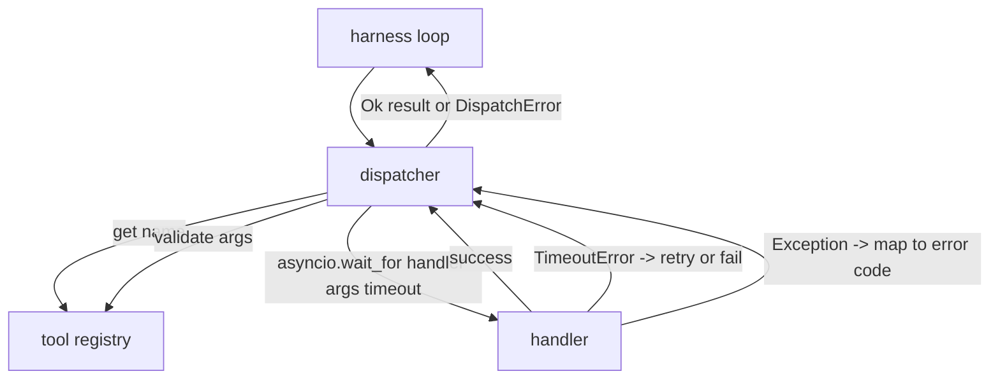
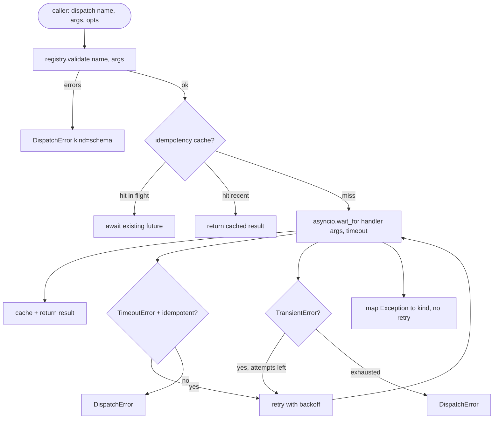

# Function Call Dispatcher

> The dispatcher is where the harness pays for every promise the schema made. Timeouts, retries, dedupe, error mapping. All on one seam.

**Type:** Build
**Languages:** Python
**Prerequisites:** Phase 13 lessons 01-07, Phase 14 lesson 01
**Time:** ~90 minutes

## Learning Objectives
- Wrap a tool handler in a per-call timeout that returns a typed error instead of hanging the loop.
- Apply exponential backoff retry with jitter and a maximum attempt count.
- Deduplicate retries on an idempotency key so a retry that races with a slow original does not run twice.
- Map handler exceptions and transport faults onto a single error envelope the harness loop already understands.
- Bound parallel dispatch with a concurrency limit so a fan-out of forty tool calls does not exhaust the event loop.

## Where the dispatcher sits

Between the harness loop (lesson twenty) and the tool registry (lesson twenty-one). The transport (lesson twenty-two) feeds the loop. The loop hands a tool call to the dispatcher. The dispatcher calls the registry, runs the handler, and returns either a result or a JSON-RPC-shaped error envelope.



The dispatcher is the only layer that knows about timers, retries, and idempotency. The loop does not. The registry does not. The handler does not. That isolation is the point.

## Timeouts

Each tool has a default timeout. The registry record carries `timeout_ms`. The dispatcher overrides it from a per-call override when the harness passes one. We use `asyncio.wait_for`. On timeout, the handler task is cancelled and the dispatcher returns `DispatchError(kind="timeout")`.

A timeout is not a retryable error by default for non-idempotent tools. A `db.write` that timed out may or may not have committed. Retrying duplicates the write. The dispatcher honors the `idempotent` flag from the registry record. Idempotent tools retry. Non-idempotent tools do not.

Every example below shares this setup — run it once, then the rest reuse `lrn_llm`.

```python editable
import sys, json, types
lrn_llm = types.ModuleType("lrn_llm")
try:
    from pyodide.http import pyfetch as _pyfetch
    _IN_PYODIDE = True
except ImportError:
    import urllib.request as _urlreq
    _IN_PYODIDE = False
lrn_llm.API_BASE = "/api/llm"
lrn_llm.DEFAULT_MODEL = "azure/gpt-5.4-mini"
lrn_llm.API_KEY = ""

async def _lrn_call(messages, *, system=None, max_tokens=400, model=None):
    if system is not None:
        messages = [{"role": "system", "content": system}] + list(messages)
    payload = {"model": model or lrn_llm.DEFAULT_MODEL, "messages": messages,
               "max_completion_tokens": max_tokens}
    headers = {"content-type": "application/json"}
    _key = lrn_llm.API_KEY
    if _key:
        headers["Authorization"] = "Bearer " + _key
    url = lrn_llm.API_BASE.rstrip("/") + "/chat/completions"
    body = json.dumps(payload)
    if _IN_PYODIDE:
        r = await _pyfetch(url, method="POST", headers=headers, body=body)
        data = await r.json()
    else:
        req = _urlreq.Request(url, method="POST", headers=headers, data=body.encode("utf-8"))
        with _urlreq.urlopen(req, timeout=60) as r:
            data = json.loads(r.read())
    if "error" in data:
        raise RuntimeError("LLM error: " + str(data["error"]))
    return data

def _lrn_text(r):
    ch = (r or {}).get("choices") or []
    return (ch[0].get("message", {}) or {}).get("content", "") if ch else ""

async def _lrn_ping():
    r = await _lrn_call([{"role": "user", "content": "Reply with exactly: OK"}], max_tokens=5)
    return {"ok": _lrn_text(r).strip().upper().startswith("OK"), "model": r.get("model")}

lrn_llm.call = _lrn_call
lrn_llm.text = _lrn_text
lrn_llm.ping = _lrn_ping
r = await lrn_llm.ping()
print(f"LLM reachable: {r}")
```

```python editable
message = "Why is it important to set a timeout on each tool call in an agent loop? Keep it to 2 sentences."
resp = await lrn_llm.call([{"role": "user", "content": message}], max_tokens=100)
answer = lrn_llm.text(resp)
print("Q: Why timeouts matter?")
print(f"A: {answer}")
```

## Retries with exponential backoff

The retry policy is three attempts maximum. Backoff is exponential with jitter.

```text
attempt 1  -> delay 0
attempt 2  -> delay 0.1s * (1 + random[0..0.5])
attempt 3  -> delay 0.4s * (1 + random[0..0.5])
```

Only `timeout` and `transient` errors retry. A `schema` error, a `not_found`, or an `internal` error does not retry. Schema errors are deterministic. Retrying does not change the outcome and burns the budget.

The retry loop respects the budget from the harness. If the caller's budget has zero remaining tool calls, the dispatcher fails fast on the first attempt and returns `kind="budget_exceeded"`.

```python editable
message = "Why is random jitter added to exponential backoff delays? Give one reason in 1 sentence."
resp = await lrn_llm.call([{"role": "user", "content": message}], max_tokens=100)
answer = lrn_llm.text(resp)
print("Q: Why jitter in backoff?")
print(f"A: {answer}")
```

## Idempotency key dedupe

A retry that fires while the original is still in flight is a real production bug. The first call hangs at four point nine seconds (just under the timeout). The retry fires at five seconds. Now two requests race against the same backend. If the tool is `payments.charge`, you charged twice.

The dispatcher accepts an optional `idempotency_key`. If the same key is in flight when a call arrives, the dispatcher waits on the in-flight future and returns its result. The cache holds keys for sixty seconds after completion to absorb late retries.

The key is the caller's responsibility. The harness derives it from the planner: `f"{step_id}:{tool_name}:{hash(args)}"`. The dispatcher does not invent keys, because deriving a key from arguments alone makes two semantically-different calls look the same.

```python editable
message = "In tool dispatch, an idempotency key prevents duplicate calls. What's a real-world example of why this matters? 1-2 sentences."
resp = await lrn_llm.call([{"role": "user", "content": message}], max_tokens=100)
answer = lrn_llm.text(resp)
print("Q: Idempotency examples?")
print(f"A: {answer}")
```

## Error envelope

A failed dispatch returns a single shape.

```text
DispatchError
  kind        : "timeout" | "transient" | "schema" | "not_found" | "internal" | "budget_exceeded"
  message     : str
  attempts    : int
  jsonrpc_code: int   (one of -32601, -32602, -32603)
```

The harness loop maps `kind` to the next state. `schema` and `not_found` go to `on_error` and trigger a replan. `timeout` and `transient` go to `on_error` and may or may not replan depending on attempts. `budget_exceeded` triggers `on_budget_exceeded`.

```python editable
message = "In an agent loop, should a schema error (invalid arguments) trigger a retry? Why or why not? 1-2 sentences."
resp = await lrn_llm.call([{"role": "user", "content": message}], max_tokens=100)
answer = lrn_llm.text(resp)
print("Q: Should schema errors retry?")
print(f"A: {answer}")
```

A minimal dispatcher that puts all of the above together: timeout via `asyncio.wait_for`, retry-only-if-idempotent on timeout, always-retry on `TransientError`, no retry on `SchemaError`/`NotFoundError`, and idempotency-key dedupe against in-flight and recently-completed calls.

```python editable
import asyncio
import time
from dataclasses import dataclass
from typing import Any

@dataclass
class DispatchError:
    kind: str            # schema | not_found | transient | timeout | internal | budget_exceeded
    message: str
    attempts: int
    jsonrpc_code: int

@dataclass
class DispatchOk:
    result: Any
    attempts: int

class TransientError(Exception):
    """Raised by a handler to signal the error is retryable regardless of idempotency
    (the handler itself is asserting nothing committed yet)."""
    pass

class SchemaError(Exception):
    """Raised by a handler to signal invalid arguments — deterministic, never retried."""
    pass

class NotFoundError(Exception):
    """Raised when the dispatcher can't resolve the requested tool/handler —
    deterministic, never retried."""
    pass

JSONRPC_CODES = {
    "not_found": -32601,   # Method not found
    "schema": -32602,      # Invalid params
    "internal": -32603,    # Internal error
    "timeout": -32000,     # Server error (implementation-defined range)
    "transient": -32000,
    "budget_exceeded": -32000,
}

class MiniDispatcher:
    def __init__(self, max_attempts=3, timeout_s=5.0):
        self.max_attempts = max_attempts
        self.timeout_s = timeout_s
        self._inflight = {}   # idempotency_key -> Future, for calls currently running
        self._completed = {}  # idempotency_key -> (finished_at, result), 60s TTL

    def _cached(self, key):
        entry = self._completed.get(key)
        if entry is None:
            return None
        finished_at, result = entry
        if time.monotonic() - finished_at > 60.0:
            del self._completed[key]
            return None
        return result

    async def dispatch(self, handler_factory, *, timeout_s=None, idempotency_key=None, idempotent=False):
        """Dispatch handler_factory() with timeout, retry, and idempotency dedup.

        handler_factory: a zero-arg callable returning a fresh coroutine each call —
        a coroutine object can only be awaited once, so a retry needs a fresh one per
        attempt, not the same object re-awaited.
        idempotency_key: if two calls share a key, a call already in flight is joined
        instead of re-run, and a call that completed within the last 60s returns the
        cached result instead of running again.
        idempotent: whether a *timeout* on this call is safe to retry. A timeout alone
        doesn't tell you whether the handler's side effect already committed — retrying
        a non-idempotent call (e.g. a payment) can duplicate it. TransientError always
        retries regardless, because raising it is the handler asserting "nothing
        committed yet".
        """
        fut = None
        if idempotency_key is not None:
            cached = self._cached(idempotency_key)
            if cached is not None:
                return cached
            inflight = self._inflight.get(idempotency_key)
            if inflight is not None:
                return await inflight
            fut = asyncio.get_running_loop().create_future()
            self._inflight[idempotency_key] = fut

        try:
            result = await self._run_with_retries(handler_factory, timeout_s or self.timeout_s, idempotent)
        except Exception as e:
            # Anything _run_with_retries doesn't already turn into a DispatchError
            # (i.e. not TransientError/SchemaError/NotFoundError/asyncio.TimeoutError)
            # is a genuine bug — resolve the future with it instead of leaving any
            # concurrent joiner on this idempotency_key hanging forever.
            if fut is not None:
                fut.set_exception(e)
            raise
        finally:
            if fut is not None:
                del self._inflight[idempotency_key]

        if fut is not None:
            self._completed[idempotency_key] = (time.monotonic(), result)
            fut.set_result(result)
        return result

    async def _run_with_retries(self, handler_factory, timeout_s, idempotent):
        """The actual timeout + retry + error-classification loop. Subclasses that add
        concurrency limiting wrap this method rather than dispatch() — see below —
        so a call that only joins an in-flight duplicate never has to wait for a
        concurrency slot just to receive that result."""
        attempt = 0
        last_error = None
        while attempt < self.max_attempts:
            attempt += 1
            try:
                result = await asyncio.wait_for(handler_factory(), timeout=timeout_s)
                return DispatchOk(result=result, attempts=attempt)
            except asyncio.TimeoutError:
                last_error = DispatchError(kind="timeout", message=f"timeout after {timeout_s}s",
                                            attempts=attempt, jsonrpc_code=JSONRPC_CODES["timeout"])
                if not idempotent:
                    return last_error  # may have partially committed — unsafe to retry
            except TransientError as e:
                last_error = DispatchError(kind="transient", message=str(e), attempts=attempt,
                                            jsonrpc_code=JSONRPC_CODES["transient"])
            except SchemaError as e:
                return DispatchError(kind="schema", message=str(e), attempts=attempt,
                                      jsonrpc_code=JSONRPC_CODES["schema"])
            except NotFoundError as e:
                return DispatchError(kind="not_found", message=str(e), attempts=attempt,
                                      jsonrpc_code=JSONRPC_CODES["not_found"])
            if attempt < self.max_attempts:
                await asyncio.sleep(0.1 * (2 ** (attempt - 1)))  # backoff
        return last_error or DispatchError(kind="internal", message="unknown error",
                                            attempts=attempt, jsonrpc_code=JSONRPC_CODES["internal"])

print("MiniDispatcher defined (idempotency dedup, retry-only-if-idempotent timeouts, JSON-RPC error codes)")
```

## Concurrency limit on fan-out

`gather(*calls)` runs all coroutines simultaneously. With forty tool calls, that is forty open sockets or forty subprocess pipes. Most backends do not like forty parallel connections from one client.

The dispatcher wraps `gather` in a semaphore. Default concurrency limit is eight. Each call acquires the semaphore before dispatching and releases on completion. The caller sees `gather`-shaped output but the actual scheduling is bounded.

A subclass wraps `_run_with_retries` (not `dispatch`) in a semaphore, so a call that only joins an in-flight idempotent duplicate never has to wait on the concurrency slot just to receive that result.

```python editable
class ConcurrentDispatcher(MiniDispatcher):
    def __init__(self, max_attempts=3, timeout_s=5.0, concurrency=2):
        super().__init__(max_attempts, timeout_s)
        self._sem = asyncio.Semaphore(concurrency)

    async def _run_with_retries(self, handler_factory, timeout_s, idempotent):
        async with self._sem:
            return await super()._run_with_retries(handler_factory, timeout_s, idempotent)

    async def dispatch_many(self, factories):
        """Dispatch multiple handler factories with bounded concurrency."""
        return await asyncio.gather(*[self.dispatch(f) for f in factories])

async def classify_intent_handler(query: str):
    """Handler that calls the LLM to classify intent."""
    system = "You are an intent classifier. Respond with exactly one word: greeting, question, or command."
    msg = f"Classify this user message: '{query}'"
    resp = await lrn_llm.call(
        [{"role": "user", "content": msg}],
        system=system,
        max_tokens=10
    )
    intent = lrn_llm.text(resp).strip().lower()
    return {"intent": intent, "query": query}

conc_dispatcher = ConcurrentDispatcher(max_attempts=2, timeout_s=10.0, concurrency=2)

# Each task is a zero-arg factory (not an already-created coroutine) — a coroutine
# object can only be awaited once, so a retry needs a fresh one per attempt.
tasks = [
    lambda: classify_intent_handler("What time is it?"),
    lambda: classify_intent_handler("Please send an email."),
    lambda: classify_intent_handler("Hi there!"),
]

results = await conc_dispatcher.dispatch_many(tasks)

print(f"Dispatched {len(results)} tasks with concurrency limit=2")
for i, res in enumerate(results):
    if isinstance(res, DispatchOk):
        print(f"  Task {i}: {res.result['intent']} (attempts={res.attempts})")
    else:
        print(f"  Task {i}: {res.kind}")
```

## Flow for one call



Each scenario below actually calls `dispatcher.dispatch()` and inspects the real `DispatchOk`/`DispatchError` it returns, walking every branch of the flowchart above.

```python editable
def make_schema_check_handler(user_id):
    """Returns a handler factory that validates its own argument first — this is what
    makes a schema error fail fast instead of retrying."""
    async def _run():
        if not isinstance(user_id, int):
            raise SchemaError(f"user_id must be an int, got {type(user_id).__name__!r}")
        return {"user_id": user_id}
    return _run

_flaky_state = {"calls": 0}
async def flaky_handler():
    """Fails with a transient error on the first attempt, succeeds on retry."""
    if _flaky_state["calls"] == 0:
        _flaky_state["calls"] += 1
        raise TransientError("upstream not ready")
    return {"ok": True}

async def slow_handler():
    """Always exceeds a short timeout — a real asyncio.TimeoutError, not a description of one."""
    await asyncio.sleep(2)
    return {"ok": True}

_charge_calls = {"n": 0}
async def counted_handler():
    """Counts how many times it actually ran — used to prove idempotency dedup below."""
    _charge_calls["n"] += 1
    await asyncio.sleep(0.05)
    return {"charged": True}

scenario_dispatcher = MiniDispatcher(max_attempts=3, timeout_s=10.0)

# 1. Happy path
r1 = await scenario_dispatcher.dispatch(lambda: classify_intent_handler("What is 2+2?"))
if isinstance(r1, DispatchOk):
    print(f"1. Happy path               -> ok (attempts={r1.attempts})")
else:
    print(f"1. Happy path               -> unexpected error: {r1.kind}")

# 2. Schema error — fails fast, no retry
r2 = await scenario_dispatcher.dispatch(make_schema_check_handler("not-a-number"))
print(f"2. Schema error             -> kind={r2.kind} jsonrpc_code={r2.jsonrpc_code} "
      f"attempts={r2.attempts} (no retry)")

# 3. Transient error — retried, succeeds on the 2nd attempt
_flaky_state["calls"] = 0
r3 = await scenario_dispatcher.dispatch(flaky_handler)
status = "ok after retry" if isinstance(r3, DispatchOk) else r3.kind
print(f"3. Transient error          -> {status} (attempts={r3.attempts})")

# 4. Timeout on a non-idempotent call (the default) — fails immediately, no retry
r4 = await scenario_dispatcher.dispatch(slow_handler, timeout_s=0.2)
print(f"4. Timeout, non-idempotent  -> kind={r4.kind} jsonrpc_code={r4.jsonrpc_code} "
      f"attempts={r4.attempts} (no retry: may have already committed)")

# 5. Timeout on an idempotent call — retried up to max_attempts
r5 = await scenario_dispatcher.dispatch(slow_handler, timeout_s=0.2, idempotent=True)
print(f"5. Timeout, idempotent      -> kind={r5.kind} jsonrpc_code={r5.jsonrpc_code} "
      f"attempts={r5.attempts} (retried up to max_attempts={scenario_dispatcher.max_attempts})")

# 6. Idempotency-key dedup — two concurrent calls sharing a key collapse into one
# underlying handler invocation.
_charge_calls["n"] = 0
await asyncio.gather(
    scenario_dispatcher.dispatch(counted_handler, idempotency_key="charge-42"),
    scenario_dispatcher.dispatch(counted_handler, idempotency_key="charge-42"),
)
print(f"6. Idempotency dedup        -> handler ran {_charge_calls['n']}x for 2 concurrent "
      f"calls sharing a key (expected: 1)")
```

## How to read the code

`code/main.py` defines `Dispatcher`, `DispatchError`, and `TransientError`. The dispatcher takes a registry on construction. The async `dispatch(name, args, ...)` is the only entry point. Per-attempt timeouts are applied inline inside `_run_with_retries` using `asyncio.wait_for`. `gather_bounded(calls)` runs many dispatches with the concurrency limit.

`code/tests/test_dispatcher.py` covers timeout firing, retry on transient, no-retry on schema error, idempotency dedupe (two concurrent calls with the same key collapse to one handler invocation), and concurrency limiting (the semaphore in action).

The tests use `asyncio.sleep(0)` and deterministic `Counter`-based handlers, so they finish in milliseconds and do not depend on wall-clock timing.

## Try It Yourself

The cell below dispatches a batch of sentiment-analysis calls through the `ConcurrentDispatcher` — same scenario as the happy-path case above — but it has one deliberate bug. One of the keyword arguments is misspelled, so every call to `lrn_llm.call()` inside `sentiment_handler` raises `TypeError` instead of dispatching. Find and fix the typo (it should be `system=system`) so all three dispatches complete with `DispatchOk`.

```python editable
async def sentiment_handler(text: str):
    system = "Classify the sentiment as positive, negative, or neutral. Respond with one word."
    msg = f"Analyze sentiment: '{text}'"
    resp = await lrn_llm.call(
        [{"role": "user", "content": msg}],
        syste=system,  # BUG: misspelled kwarg -- should be system=system
        max_tokens=10
    )
    return {"sentiment": lrn_llm.text(resp).strip(), "text": text}

test_texts = [
    "I love this product!",
    "This is terrible.",
    "It's okay, nothing special.",
]

# Each task is a zero-arg factory (not an already-created coroutine) — see dispatch()'s
# docstring above.
task_dispatcher = ConcurrentDispatcher(max_attempts=2, timeout_s=10.0, concurrency=2)
tasks = [(lambda t=t: sentiment_handler(t)) for t in test_texts]
sentiment_results = await task_dispatcher.dispatch_many(tasks)

print("Sentiment Analysis Results:")
for i, res in enumerate(sentiment_results):
    if isinstance(res, DispatchOk):
        print(f"  {test_texts[i][:40]:40s} -> {res.result['sentiment']} (attempts={res.attempts})")
    else:
        print(f"  {test_texts[i][:40]:40s} -> ERROR ({res.kind})")

if all(isinstance(res, DispatchOk) for res in sentiment_results):
    print("PASS")
else:
    print("WRONG: not all sentiment dispatches succeeded")
```

## Going further

Two extensions production dispatchers add. First, structured logging at every transition (which the loop's event stream already gives you, but the dispatcher should also emit `dispatch.attempt` and `dispatch.retry` events). Second, circuit breakers: after N failures in a window, a tool gets a cool-down period where dispatches return immediately with `kind="circuit_open"` instead of attempting the handler. Both fit on top of this dispatcher without changing the contract.

Lesson twenty-four glues the dispatcher to a plan-and-execute agent so you see all four pieces in motion.
