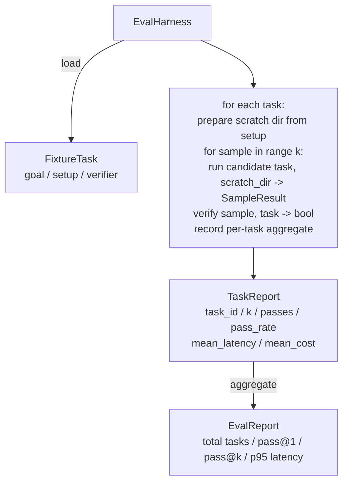

# Eval Harness with Fixture Tasks

> A coding agent is only as good as the suite of tasks you measure it against. This lesson builds an evaluation harness that takes a folder of fixture tasks, runs each through a candidate agent, scores pass or fail through a deterministic verifier, and aggregates the results into pass@1, pass@k, mean latency, and mean cost. The harness is the source of truth that lets you tell a regression from a refactor.

**Type:** Build
**Languages:** Python
**Prerequisites:** Phase 19 · 25 (verification gates), Phase 19 · 26 (sandbox runner), Phase 14 · 30 (eval-driven agent development), Phase 14 · 19 (SWE-bench and GAIA benchmarks)
**Time:** ~90 minutes

## Learning Objectives

- Define a fixture task as a triple of goal, setup, and verifier.
- Score multiple sample runs per task and compute pass@1 and pass@k.
- Aggregate latency and cost into mean and 95th-percentile metrics.
- Wire deterministic verifiers (file diff, exit code, regex match) into reusable functions.
- Emit a structured JSON report a regression-tracking script can ingest.

## The Problem

Three failure modes plague agent benchmarks built without an eval harness.

The first is unverified pass. The agent says it fixed the bug, the human glances at the diff, the suite is marked green, and three weeks later the regression test surfaces the same bug. The agent had reasoned plausibly without actually fixing anything.

The second is undetected regression. A change to the prompt template makes the agent 4% better on the loud task and 14% worse on the quiet one. Without a goldset and a per-task score, the regression rides into main and surfaces only when a customer complains.

The third is per-task drift. The eval was run on Monday with 100 tasks and on Friday with 95 of them, because somebody renamed five fixtures. The pass rate looks like a 5% improvement. It isn't.

The harness is the program that turns these failures into facts. It runs every fixture, every time, in a reproducible order, against a verifier that returns true or false on a deterministic check.

## The Concept

```mermaid
flowchart LR
  F1[fixtures/task_001/<br/>task.json + expected/] --> Harness
  F2[fixtures/task_002/<br/>...] --> Harness
  Harness[Harness<br/>for each task:<br/>setup / run agent k samples /<br/>verify each sample /<br/>record latency, cost]
  Harness --> Report[EvalReport<br/>pass@1 / pass@k<br/>mean ms / p95 ms<br/>mean cost]
```

A `FixtureTask` is a small JSON file plus an optional `expected/` directory. The JSON declares an `id`, a `goal` (the prompt fed to the agent), a `setup` block (files to drop into the scratch dir), and a `verifier` block. The verifier block names a function in the harness's verifier registry and supplies its arguments.

Three verifier shapes cover the majority of useful tasks.

The first is `file_equals`. After the agent runs, compare a named file against an expected content. This catches "fix this bug in this exact way" tasks.

The second is `regex_match`. The named file's contents are matched against a regex. This catches "the function must exist and return X" tasks where there are many acceptable solutions.

The third is `shell_exit_zero`. The harness runs a shell command (through the sandbox runner with denylist and path jail built earlier in this phase) and passes the task only if the command exits zero. This catches "the tests must pass" tasks.

The harness runs each task `k` times. Pass@k is `1 - (1 - p)^k` where p is the empirical pass rate; the harness also reports raw counts so you can spot variance. This is the simplified i.i.d.-Bernoulli approximation used here for teaching, not the canonical unbiased estimator: Chen et al. 2021 ("Evaluating Large Language Models Trained on Code", arXiv:2107.03374) define `pass@k = 1 - C(n-c, k) / C(n, k)` from `n` samples of which `c` pass, which avoids the bias this formula has when `p` itself is estimated from a small `k`. Latency is wall-clock per sample. Cost is whatever the agent self-reports (token count, USD, or both); the harness sums it across samples and presents the per-task and aggregate numbers.

A `FixtureTask` pairs a goal with setup/expected file content and a verifier name. A `SampleResult` records one candidate run against a task.

```python editable
from dataclasses import dataclass
from typing import Any
import tempfile, shutil, os, time, statistics, json

@dataclass
class FixtureTask:
    """A single evaluation task: goal + setup files + verifier."""
    id: str
    goal: str
    setup_files: dict[str, str]  # filename -> content
    expected_files: dict[str, str]  # filename -> expected content
    verifier_name: str
    verifier_args: dict[str, Any]

@dataclass
class SampleResult:
    """One execution of a candidate against a task."""
    task_id: str
    sample_index: int
    latency_ms: float
    cost_units: float = 0.0
    notes: str = ""

print("Data structures defined")
```

`file_equals` compares a file from the candidate's output against the expected content.

```python editable
def verify_file_equals(scratch_files: dict[str, str], expected_files: dict[str, str], args: dict) -> tuple[bool, str]:
    """Compare a file from agent output against expected."""
    path = args.get("path")
    if path not in scratch_files:
        return False, f"Output file missing: {path}"
    if path not in expected_files:
        return False, f"Expected file missing: {path}"
    actual = scratch_files[path].rstrip("\n") + "\n"
    expected = expected_files[path].rstrip("\n") + "\n"
    if actual == expected:
        return True, f"File '{path}' matches expected"
    return False, f"File '{path}' differs from expected"

print("file_equals verifier defined")
```

## Architecture



The candidate is a callable: `Callable[[FixtureTask, str], SampleResult]`. The harness creates the scratch directory via `tempfile.mkdtemp()` and passes its path as a plain string. The harness does not care how the candidate works. The candidate could be a deterministic patch applier (useful for harness self-tests), a real LLM agent, a fuzzer. The contract is the SampleResult.

## What you will build

`main.py` ships:

1. `FixtureTask` dataclass.
2. `SampleResult` dataclass: success_self_reported, latency_ms, cost_units, edits.
3. `TaskReport`, `EvalReport` dataclasses with `to_dict()`.
4. `VerifierRegistry` mapping verifier name to function. Built-in verifiers: file_equals, regex_match, shell_exit_zero.
5. `EvalHarness` class. Runs a directory of tasks against a candidate. Returns EvalReport.
6. Five fixture tasks bundled in `tasks/`:
   - off-by-one in `fizzbuzz`
   - missing return in `factorial`
   - typo in error message
   - empty function body
   - off-by-one in linked-list traversal
7. A deterministic reference candidate (`apply_known_fixes`) the harness uses to demonstrate a clean pass@1 of 1.0.
8. Demo prints the EvalReport JSON and exits zero.

The fixture tasks are bundled as JSON files in `tasks/` plus paired source files in `tasks/<id>/buggy/` and `tasks/<id>/expected/`. The harness copies buggy into a scratch dir, hands it to the candidate, and verifies against expected.

The off-by-one fizzbuzz fixture from the bundled set: the buggy version's loop bound stops one short of `n`.

```python editable
buggy_fizzbuzz = '''def fizzbuzz(n):
    for i in range(1, n):
        if i % 15 == 0:
            print("FizzBuzz")
        elif i % 3 == 0:
            print("Fizz")
        elif i % 5 == 0:
            print("Buzz")
        else:
            print(i)
'''

expected_fizzbuzz = '''def fizzbuzz(n):
    for i in range(1, n + 1):
        if i % 15 == 0:
            print("FizzBuzz")
        elif i % 3 == 0:
            print("Fizz")
        elif i % 5 == 0:
            print("Buzz")
        else:
            print(i)
'''

fizzbuzz_task = FixtureTask(
    id="task_001_fizzbuzz_offbyone",
    goal="fizzbuzz(n) should print FizzBuzz for numbers 1..n inclusive. The buggy version skips the final number. Fix the loop bound so that the function prints all numbers from 1 to n.",
    setup_files={"fizzbuzz.py": buggy_fizzbuzz},
    expected_files={"fizzbuzz.py": expected_fizzbuzz},
    verifier_name="file_equals",
    verifier_args={"path": "fizzbuzz.py"}
)

print(f"Task created: {fizzbuzz_task.id}")
print(f"Goal: {fizzbuzz_task.goal[:60]}...")
```

Every example below shares this setup — run it once, then the rest reuse `lrn_llm`.

```python editable
import sys, types
lrn_llm = types.ModuleType("lrn_llm")
try:
    from pyodide.http import pyfetch as _pyfetch
    _IN_PYODIDE = True
except ImportError:
    import urllib.request as _urlreq
    _IN_PYODIDE = False
lrn_llm.API_BASE = "/api/llm"
lrn_llm.DEFAULT_MODEL = "azure/gpt-5.4-mini"
lrn_llm.API_KEY = ""

async def _lrn_call(messages, *, system=None, max_tokens=400, model=None):
    if system is not None:
        messages = [{"role": "system", "content": system}] + list(messages)
    payload = {"model": model or lrn_llm.DEFAULT_MODEL, "messages": messages,
               "max_completion_tokens": max_tokens}
    headers = {"content-type": "application/json"}
    _key = lrn_llm.API_KEY
    if _key:
        headers["Authorization"] = "Bearer " + _key
    url = lrn_llm.API_BASE.rstrip("/") + "/chat/completions"
    body = json.dumps(payload)
    if _IN_PYODIDE:
        r = await _pyfetch(url, method="POST", headers=headers, body=body)
        data = await r.json()
    else:
        req = _urlreq.Request(url, method="POST", headers=headers, data=body.encode("utf-8"))
        with _urlreq.urlopen(req, timeout=60) as r:
            data = json.loads(r.read())
    if "error" in data:
        raise RuntimeError("LLM error: " + str(data["error"]))
    return data

def _lrn_text(r):
    ch = (r or {}).get("choices") or []
    return (ch[0].get("message", {}) or {}).get("content", "") if ch else ""

async def _lrn_ping():
    r = await _lrn_call([{"role": "user", "content": "Reply with exactly: OK"}], max_tokens=5)
    return {"ok": _lrn_text(r).strip().upper().startswith("OK"), "model": r.get("model")}

lrn_llm.call = _lrn_call
lrn_llm.text = _lrn_text
lrn_llm.ping = _lrn_ping
r = await lrn_llm.ping()
print("LLM reachable", r)
```

Use the candidate agent — here, a real LLM call — to fix the FizzBuzz bug. It receives the buggy code and the goal, and is asked to output only the fixed code.

```python editable
prompt = f"""Here is a buggy Python function:

{buggy_fizzbuzz}

Goal: {fizzbuzz_task.goal}

Respond with ONLY the corrected Python code, no explanation."""

r = await lrn_llm.call(
    [{"role": "user", "content": prompt}],
    max_tokens=300
)

agent_output = lrn_llm.text(r)
print("Agent output:")
print(agent_output)
```

Extract the code from the agent's response and run it through the `file_equals` verifier.

```python editable
import re

def extract_code(text: str) -> str:
    # Remove markdown code blocks. Fence built from a repeated backtick char
    # rather than a literal fence in this source, since this file is itself
    # markdown and an inline fence would terminate the enclosing block early.
    fence = "`" * 3
    match = re.search(fence + r'(?:python)?\s*\n(.+?)\n' + fence, text, re.DOTALL)
    if match:
        return match.group(1)
    return text.strip()

agent_code = extract_code(agent_output)
scratch_files = {"fizzbuzz.py": agent_code}

passed, detail = verify_file_equals(scratch_files, fizzbuzz_task.expected_files, fizzbuzz_task.verifier_args)

print(f"Verification result: {detail}")
print(f"Sample passed: {passed}")
```

## Why pass@k and not just pass@1

Real LLM agents are stochastic. A pass@1 of 0.6 looks like a failure. A pass@5 of 0.95 says the agent gets the right answer most of the time but is choosing wrong on early samples. The fix is sampling and ranking, not always more training. Pass@k makes that visible.

Pass@k is reported alongside pass@1 because pass@k papers over a real failure: if the model gets the right answer once in twenty tries you do not have a useful agent. The harness shows both.

```python editable
def pass_at_k(empirical_pass_rate: float, k: int) -> float:
    """Probability of at least one pass in k independent samples."""
    if k <= 0:
        return 0.0
    p = max(0.0, min(1.0, empirical_pass_rate))
    return 1.0 - (1.0 - p) ** k

# Example: if agent passes 60% of tries, what's the chance of success in k samples?
for k_val in [1, 3, 5, 10]:
    prob = pass_at_k(0.6, k_val)
    print(f"pass@{k_val}: {prob:.4f}  (with p=0.6)")
```

Run the candidate several times against the fizzbuzz fixture and score each sample. Cost is real per-call spend when the gateway reports token usage, and an approximate word-count-based estimate (flagged as such) when it doesn't.

```python editable
# Approximate per-call pricing for azure/gpt-5.4-mini: the gateway proxy has
# no public list price, so these rates approximate the gpt-4o-mini tier.
_INPUT_PRICE_PER_M = 0.15
_OUTPUT_PRICE_PER_M = 0.60

def estimate_cost(response: dict, text: str) -> tuple[float, str]:
    """Real per-call cost from the gateway's token usage when available;
    otherwise an approximate cost from a word-count token proxy (flagged)."""
    usage = response.get("usage") or {}
    in_tok, out_tok = usage.get("prompt_tokens"), usage.get("completion_tokens")
    if in_tok is not None and out_tok is not None:
        cost = (in_tok / 1_000_000) * _INPUT_PRICE_PER_M + (out_tok / 1_000_000) * _OUTPUT_PRICE_PER_M
        return cost, "measured"
    # No usage field in this response: approximate tokens from word count
    # (~0.75 tokens/word) and flag it as an estimate, not a measurement.
    approx_tokens = len(text.split()) / 0.75
    cost = (approx_tokens / 1_000_000) * _OUTPUT_PRICE_PER_M
    return cost, "approximate (no usage field)"

k = 3
passes = 0
results = []
latencies = []
costs = []

for sample_idx in range(k):
    prompt = f"""Here is a buggy Python function:

{buggy_fizzbuzz}

Goal: {fizzbuzz_task.goal}

Respond with ONLY the corrected Python code, no explanation."""

    start = time.monotonic()
    r = await lrn_llm.call(
        [{"role": "user", "content": prompt}],
        max_tokens=300
    )
    elapsed_ms = (time.monotonic() - start) * 1000
    latencies.append(elapsed_ms)

    agent_text = lrn_llm.text(r)
    cost, cost_note = estimate_cost(r, agent_text)
    costs.append(cost)

    agent_code = extract_code(agent_text)
    scratch_files = {"fizzbuzz.py": agent_code}
    passed, detail = verify_file_equals(scratch_files, fizzbuzz_task.expected_files, fizzbuzz_task.verifier_args)

    if passed:
        passes += 1

    results.append({"sample": sample_idx, "passed": passed, "detail": detail,
                     "latency_ms": round(elapsed_ms, 1), "cost": round(cost, 6)})
    print(f"Sample {sample_idx}: {'PASS' if passed else 'FAIL'} - {detail} "
          f"({elapsed_ms:.1f} ms, cost {cost_note})")

pass_rate = passes / k

print(f"\nSummary:")
print(f"  Passes: {passes}/{k}")
print(f"  Pass rate (this run): {pass_rate:.4f}")
```

The harness computes, from the k samples just run: `pass_rate` (the observed fraction that passed *this run* — not a probabilistic estimate, since we already know exactly how many of the k passed), `mean_latency_ms`, `p95_latency_ms`, and `mean_cost`.

```python editable
def percentile_95(values: list[float]) -> float:
    """95th percentile via nearest-rank."""
    if not values:
        return 0.0
    sorted_vals = sorted(values)
    idx = max(0, int(round(0.95 * len(sorted_vals))) - 1)
    return sorted_vals[min(idx, len(sorted_vals) - 1)]

mean_latency = statistics.mean(latencies)
p95_latency = percentile_95(latencies)
mean_cost = statistics.mean(costs)

print(f"Task Report:")
print(f"  Task ID: {fizzbuzz_task.id}")
print(f"  k: {k}")
print(f"  Passes: {passes}/{k}")
print(f"  Pass rate (this run): {pass_rate:.4f}")
print(f"  Mean latency: {mean_latency:.1f} ms")
print(f"  P95 latency: {p95_latency:.1f} ms")
print(f"  Mean cost: {mean_cost:.6f} units")
```

The harness emits a structured JSON report that regression-tracking scripts can ingest.

```python editable
report = {
    "task_id": fizzbuzz_task.id,
    "k": k,
    "passes": passes,
    "pass_rate": round(pass_rate, 4),
    "mean_latency_ms": round(mean_latency, 3),
    "p95_latency_ms": round(p95_latency, 3),
    "mean_cost": round(mean_cost, 4),
    "samples": results
}

print(json.dumps(report, indent=2))
```

## How this composes with the rest of Track A

Lesson 25 produced the gate chain. Lesson 26 produced the sandbox. The harness uses the sandbox for any `shell_exit_zero` verifier. Lesson 28 wraps each harness run in an OTel trace. Lesson 29 runs the end-to-end demo against one of the bundled fixtures and asserts pass@1 = 1.0 for the reference candidate.

## Try It Yourself

Edit the buggy code or the goal below and run it against the candidate — try a missing return statement, an off-by-one error, or a logic error in a conditional.

```python editable
custom_buggy = '''def double(x):
    result = x * 2
    # BUG: missing return statement
'''

custom_goal = "Add a return statement to the double() function"

custom_prompt = f"""Fix this Python function:

{custom_buggy}

Goal: {custom_goal}

Respond with ONLY the corrected Python code."""

r = await lrn_llm.call(
    [{"role": "user", "content": custom_prompt}],
    max_tokens=300
)

fixed_code = lrn_llm.text(r)
print("Agent's fix:")
print(fixed_code)
```

## Running it

```bash
cd phases/19-capstone-projects/27-eval-harness-fixture-tasks
python3 code/main.py
python3 -m pytest code/tests/ -v
```

The demo prints the EvalReport in JSON, including pass@1, pass@5, mean latency, and per-task breakdown. The exit code is zero. The tests cover the verifier functions, the pass@k math, fixture loading, and the harness end-to-end against the bundled reference candidate.

## Build It

Reconstruct **Eval Harness with Fixture Tasks** by following `call` on the demo’s smallest built-in fixture. Run `python3 main.py` and verify that the result reports the empty case explicitly or raises the documented validation error.

## Use It

Call `call` from a small caller with the demo’s smallest built-in fixture. Compare its result with the demo output, and record the input contract and the one field a downstream user should rely on.

## Ship It

Hand off `outputs/artifact-card.md` with the command `python3 main.py`, the accepted input shape (the demo’s smallest built-in fixture), the expected observable result, and a failure note for malformed inputs.

## Exercises

Work from the smallest fixture that the Eval Harness with Fixture Tasks demo already understands, then make one deliberate change and record what moved.

1. **Run the smallest fixture.** From `code/`, run `python3 main.py` using the demo’s smallest built-in fixture. Follow `call`, `text`, `usage`. Expect the result reports the empty case explicitly or raises the documented validation error; capture the first printed shape, metric, status, or summary field and state which part supports **Define a fixture task as a triple of goal, setup, and verifier.**.
2. **Perturb one field.** Repeat the command after changing only the primary fixture value: use the same fixture with its primary value changed from 1 to 2. Predict the direction of the change, then compare the two output values. Explain why **Score multiple sample runs per task and compute pass@1 and pass@k.** says the other inputs should stay fixed.
3. **Check the failure boundary.** Feed the implementation an empty fixture {}. Before running it, write down whether the relevant function should return an empty value, a zero-sized result, or a validation error. Check the observed status against **Aggregate latency and cost into mean and 95th-percentile metrics.** and record the exception text if the code rejects the case.
4. **Make the result repeatable.** Open `outputs/artifact-card.md` and add a worked example using the demo’s smallest built-in fixture. Include the input contract, one expected output field, and a named acceptance check for **Wire deterministic verifiers (file diff, exit code, regex match) into reusable functions.**; note what the demo cannot establish.

## Reference Solution

A checkable result for **Eval Harness with Fixture Tasks** should contain:

- the `python3 main.py` output for the demo’s smallest built-in fixture, with `call`, `text`, `usage` traced to the value or shape that supports **Define a fixture task as a triple of goal, setup, and verifier.**;
- a before/after comparison for the primary fixture value, where the same fixture with its primary value changed from 1 to 2 changes the observation in the direction predicted by **Score multiple sample runs per task and compute pass@1 and pass@k.**;
- a recorded result for an empty fixture {} that matches the implementation’s validation or empty-result contract and explains the evidence for **Aggregate latency and cost into mean and 95th-percentile metrics.**; and
- an updated `outputs/artifact-card.md` example with a concrete input, expected output field, and acceptance check tied to **Wire deterministic verifiers (file diff, exit code, regex match) into reusable functions.**.

Run the lesson tests after the demo. If the boundary behaves differently from the prediction, keep the actual exception or output and explain the implementation path that produced it.
