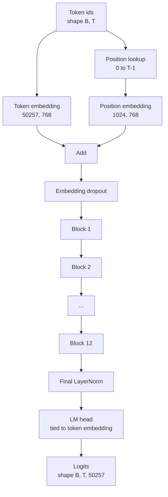
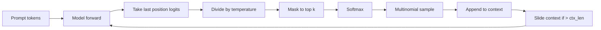

# GPT Model Assembly

> Twelve blocks stacked, a token embedding, a learned position embedding, a final LayerNorm, and a tied language model head. That is the entire 124 million parameter GPT model. This lesson assembles those pieces into a working class, counts the parameters to confirm the model matches the reference 124M shape, and generates text with multinomial sampling, temperature, and top-k.

**Type:** Build
**Languages:** Python
**Prerequisites:** Phase 19 lessons 30 to 34
**Time:** ~90 minutes

## Learning Objectives

- Assemble the transformer block from lesson 34 into a full GPT model: token embedding, position embedding, N blocks, final LayerNorm, language model head.
- Reproduce the 124 million parameter configuration: vocab 50257, context 1024, embedding 768, twelve heads, twelve layers.
- Tie the language model head weights to the token embedding and explain why that saves ~38 million parameters at this scale.
- Generate text from a prompt with multinomial sampling, temperature scaling, and top-k truncation, holding context length with a sliding window.
- Measure parameter count and forward pass cost against the 124M target.

## The Problem

A transformer block does nothing on its own. You need to turn token ids into vectors, mix in positional information, run them through the stack, and project back to vocabulary logits. Forget any one of those four steps and the model either fails to forward, drifts in position information, or cannot speak.

The shape of the model also matters. The reference GPT-2 small is 124 million parameters at exactly the configuration above. The numbers are not magic. Vocab 50257 times embedding 768 is the token table. Position 1024 times 768 is the position table. Twelve blocks at roughly 7 million parameters each is 84 million. The final head reuses the token table by weight tying. Sum the pieces and you land on 124 million. Building a model whose parameter count does not match the reference is a sign you wired something wrong.

## The Concept

Token ids become token vectors. Position ids become position vectors. The two are added and sent through the stack. The final LayerNorm is the one piece outside the blocks that survives every modern variant. The LM head reuses the token embedding matrix, which is what weight tying means.

### Weight tying

The token embedding has shape `(vocab, d_model)`. The language model head needs to project from `d_model` back to `vocab`. Those are transposes of each other. Tying the two means literally the same parameter tensor, used twice. At vocab 50257 and d_model 768, the matrix is 38 million parameters. Untied, you pay for it twice. Tied, you pay for it once and you also get a slightly cleaner gradient signal because the embedding and head update together.

### Position embedding is learned, not sinusoidal

GPT-2 ships a learned position embedding. The position table is one parameter tensor of shape `(1024, 768)`. The model looks up position 0 through T-1 at every forward and adds the lookup to the token embedding. This is the simplest of the position schemes (RoPE, ALiBi, T5 relative bias are the alternatives) and it is what the 124M reference uses.

### Generation: temperature, top-k, multinomial

Generation is autoregressive. At every step, the model returns logits over the full vocabulary at every position. You take the last position only, divide by temperature, optionally mask all but the top k logits to negative infinity, softmax to get probabilities, and sample one token from the resulting distribution.

Three knobs, three different behaviors. Temperature near zero collapses to greedy. Temperature one matches the model's natural distribution. Top-k one is greedy. Top-k forty filters the long tail. The combinations matter; the next lesson on training uses generation as a qualitative eval signal.

## Use It

- The model class in this lesson is the same shape as the one the next lesson trains.
- Replacing the learned position embedding with RoPE gets you the LLaMA family without touching the block or the head.
- Replacing the GELU with SiLU and the LayerNorm with RMSNorm gets you the rest of the LLaMA family changes.
- The generation function works with any logits source, not only this model. You can pull logits from a pretrained GPT-2 file in lesson 37 and reuse the same generation loop.

## Key Terms

| Term | What people say | What it actually means |
|------|-----------------|------------------------|
| Weight tying | "Tied embeddings" | The LM head and the token embedding share the same parameter tensor; saves vocab times d_model parameters and matches the GPT-2 reference |
| Position embedding | "Learned positions" | A separate table of shape (context length, d_model) added to token vectors; learned end to end |
| Sliding window context | "Context cap" | When the prompt plus generated tokens exceed the context length, drop the oldest tokens so the active window fits |
| Top-k sampling | "K truncation" | Keep the K logits with the highest values, mask the rest to negative infinity, softmax over the remainder |
| Temperature | "Sampling temperature" | Divide logits by T before softmax; T less than 1 sharpens, T equal to 1 keeps the natural distribution, T greater than 1 flattens |

## Build It

Reconstruct **GPT Model Assembly** by following `GPTConfig` on tokens=["red","fox"]. Run `python3 main.py` and verify that the attention/embedding shape follows the token count and each valid attention row remains normalized.

## Ship It

Hand off `outputs/artifact-card.md` with the command `python3 main.py`, the accepted input shape (tokens=["red","fox"]), the expected observable result, and a failure note for malformed inputs.

## Further Reading

- Phase 19 lesson 34 for the block this model stacks.
- Phase 19 lesson 36 for the training loop that drives this model with cross entropy loss.
- Phase 19 lesson 37 for loading pretrained GPT-2 weights into this exact architecture.
- Phase 7 lesson 07 (GPT causal language modeling) for the math of next token prediction.
- Phase 10 lesson 04 (pre training mini GPT) for the original training procedure on the same architecture.

## Exercises

Work from the smallest fixture that the GPT Model Assembly demo already understands, then make one deliberate change and record what moved.

1. **Run the smallest fixture.** From `code/`, run `python3 main.py` using tokens=["red","fox"]. Follow `GPTConfig`, `LayerNorm`, `forward`. Expect the attention/embedding shape follows the token count and each valid attention row remains normalized; capture the first printed shape, metric, status, or summary field and state which part supports **Assemble the transformer block from lesson 34 into a full GPT model: token embedding, position embedding, N blocks, final LayerNorm, language model head.**.
2. **Perturb one field.** Repeat the command after changing only the token sequence: use tokens=["red","fox","runs"]. Predict the direction of the change, then compare the two output values. Explain why **Reproduce the 124 million parameter configuration: vocab 50257, context 1024, embedding 768, twelve heads, twelve layers.** says the other inputs should stay fixed.
3. **Check the failure boundary.** Feed the implementation tokens=[]. Before running it, write down whether the relevant function should return an empty value, a zero-sized result, or a validation error. Check the observed status against **Tie the language model head weights to the token embedding and explain why that saves ~38 million parameters at this scale.** and record the exception text if the code rejects the case.
4. **Make the result repeatable.** Open `outputs/artifact-card.md` and add a worked example using tokens=["red","fox"]. Include the input contract, one expected output field, and a named acceptance check for **Generate text from a prompt with multinomial sampling, temperature scaling, and top-k truncation, holding context length with a sliding window.**; note what the demo cannot establish.

## Reference Solution

A checkable result for **GPT Model Assembly** should contain:

- the `python3 main.py` output for tokens=["red","fox"], with `GPTConfig`, `LayerNorm`, `forward` traced to the value or shape that supports **Assemble the transformer block from lesson 34 into a full GPT model: token embedding, position embedding, N blocks, final LayerNorm, language model head.**;
- a before/after comparison for the token sequence, where tokens=["red","fox","runs"] changes the observation in the direction predicted by **Reproduce the 124 million parameter configuration: vocab 50257, context 1024, embedding 768, twelve heads, twelve layers.**;
- a recorded result for tokens=[] that matches the implementation’s validation or empty-result contract and explains the evidence for **Tie the language model head weights to the token embedding and explain why that saves ~38 million parameters at this scale.**; and
- an updated `outputs/artifact-card.md` example with a concrete input, expected output field, and acceptance check tied to **Generate text from a prompt with multinomial sampling, temperature scaling, and top-k truncation, holding context length with a sliding window.**.

Run the lesson tests after the demo. If the boundary behaves differently from the prediction, keep the actual exception or output and explain the implementation path that produced it.
