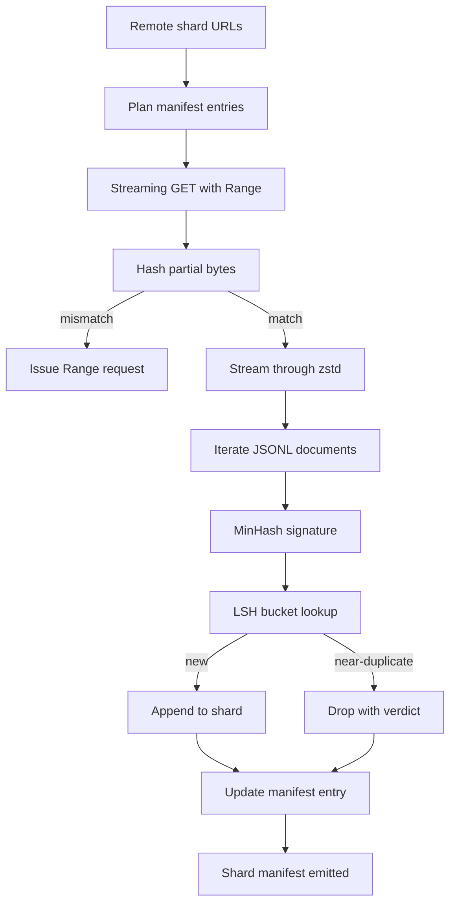

# Large Corpus Downloader

> Training a language model begins long before the first forward pass. The corpus has to land on disk, decompressed, deduplicated, and addressable, with the resume story already worked out before the network drops at 4 percent. This lesson builds a streaming downloader that pulls compressed shards, decompresses on the fly with Zstandard, fingerprints near-duplicates via MinHash plus locality-sensitive hashing, and writes a shard manifest the rest of the pipeline can trust.

**Type:** Build
**Languages:** Python
**Prerequisites:** Phase 19 lessons 30-37
**Time:** ~90 minutes

## Learning Objectives

- Stream remote shards with `urllib` and decompress with `zstandard` without buffering the whole file in memory.
- Resume partial downloads by issuing HTTP `Range` requests against a verified byte offset.
- Build a MinHash signature per document and bucket it with LSH so near-duplicates collide.
- Emit a shard manifest with content hash, byte size, document count, and dedup verdict.

## The Problem

The first time you train on a 200 GB corpus the network drops at percent 41 and the script exits with a `urllib` exception. The second time it drops at percent 78. By percent 99 you have rewritten the loop three times. The two failures you have to design for from minute one are partial-download resume and duplicate document removal. Both have well-known solutions; both are routinely skipped because the pipeline begins as a one-line `requests.get` call that grew teeth.

Resume is an HTTP problem. The server has to honour `Range`, the client has to track verified offset against an on-disk record, and the verified offset has to survive process death. If the offset and the file diverge by even one byte the resumed download writes garbage and the corpus is corrupted in a way that only shows up during tokenization.

Deduplication is a signature problem. Exact-hash dedup misses near-duplicates: the same Wikipedia article shows up with three different boilerplate footers, the same code file with a different license header, the same blog post with a tracking parameter on every link. MinHash plus LSH catches these at sub-linear cost. The cost is one signature per document and one bucket lookup per signature.

## The Concept

### Streaming with `urllib`

The standard-library `urllib.request.urlopen` returns a file-like object. Wrap it in a `zstandard.ZstdDecompressor().stream_reader` and the bytes flow from the network through the decompressor into the document iterator without ever materialising the compressed shard or the decompressed shard in memory. The only memory cost is the line buffer, the MinHash signature for the current document, and the LSH index.

### Resume with `Range`

The downloader writes two files per shard: the shard itself and a `.partial.json` checkpoint. The checkpoint records `verified_bytes`, `expected_size`, `sha256_prefix` (computed over the first `verified_bytes` bytes), and the source URL. On startup the downloader reads the checkpoint, recomputes `sha256_prefix` over the on-disk bytes, and only resumes if the recomputed hash matches. If the hash is wrong the partial is discarded and the download restarts from byte zero. Silent corruption is impossible because the verified bytes are checked, not assumed.

### MinHash plus LSH

MinHash estimates the Jaccard similarity of two sets in fixed space. For a document the set is the shingles (overlapping n-grams) of its text. The signature is `k` minimum hash values, one per independent hash function. Two documents with Jaccard similarity `s` have a probability `s` of agreeing on any single component of the signature.

LSH then groups the `k` components into `b` bands of `r` rows each, where `k = b * r`. Two documents collide in at least one band with probability `1 - (1 - s^r)^b`, which is a sharp threshold around the value of `s` you tune `(b, r)` to. The threshold for typical corpus dedup is `s = 0.8`, which the LSH research literature reaches with `k = 128`, `b = 32`, `r = 4`.

### Shard manifest as a contract

The downloader's only durable output is the manifest. The manifest holds, per shard, the URL, the decompressed byte count, the document count, the unique document count after dedup, and the sha256 of the final shard file. Downstream tokenization reads the manifest, not the directory listing. If a shard is missing or its sha256 is wrong, the manifest tells the next stage to refuse to start. The manifest is the deciding edge between "the data is downloaded" and "the data is downloaded and verifiable".

## Build It

Reconstruct **Large Corpus Downloader** by following `ShardPlan` on the text "red fox". Run `python3 main.py` and verify that the tokenizer/retriever reports zero or a clear empty-input result, rather than borrowing a result from the previous text.

## Use It

Call `ShardPlan` from a small caller with the text "red fox". Compare its result with the demo output, and record the input contract and the one field a downstream user should rely on.

## Ship It

Hand off `outputs/artifact-card.md` with the command `python3 main.py`, the accepted input shape (the text "red fox"), the expected observable result, and a failure note for malformed inputs.

## Further Reading

- [RFC 7233](https://datatracker.ietf.org/doc/html/rfc7233) - HTTP Range requests, the resume protocol
- [Zstandard format specification](https://datatracker.ietf.org/doc/html/rfc8478) - frame format that makes streaming decompression safe
- [MinHash](https://en.wikipedia.org/wiki/MinHash) - the signature family this lesson uses
- [Locality-sensitive hashing](https://en.wikipedia.org/wiki/Locality-sensitive_hashing) - the banding scheme behind the dedup threshold
- Phase 19 · 43 - the HDF5 tokenized corpus the downloader feeds
- Phase 19 · 44 - the cosine schedule that trains on the corpus
- Phase 19 · 45 - the AMP loop that consumes the schedule

## Exercises

Use `ShardPlan` as the trace: start from the text "red fox", keep the raw output, and tie each observation to a named objective.

1. **Reproduce the reference path.** From `code/`, run `python3 main.py` using the text "red fox". Follow `ShardPlan`, `ShardResult`, `to_manifest_row`. Expect the tokenizer/retriever reports zero or a clear empty-input result, rather than borrowing a result from the previous text; capture the first printed shape, metric, status, or summary field and state which part supports **Stream remote shards with `urllib` and decompress with `zstandard` without buffering the whole file in memory.**.
2. **Vary one named input.** Repeat the command after changing only the input text: use the text "red fox runs". Predict the direction of the change, then compare the two output values. Explain why **Resume partial downloads by issuing HTTP `Range` requests against a verified byte offset.** says the other inputs should stay fixed.
3. **Probe the empty case.** Feed the implementation an empty string. Before running it, write down whether the relevant function should return an empty value, a zero-sized result, or a validation error. Check the observed status against **Build a MinHash signature per document and bucket it with LSH so near-duplicates collide.** and record the exception text if the code rejects the case.
4. **Package a usable handoff.** Open `outputs/artifact-card.md` and add a worked example using the text "red fox". Include the input contract, one expected output field, and a named acceptance check for **Emit a shard manifest with content hash, byte size, document count, and dedup verdict.**; note what the demo cannot establish.

## Reference Solution

A checkable result for **Large Corpus Downloader** should contain:

- the `python3 main.py` output for the text "red fox", with `ShardPlan`, `ShardResult`, `to_manifest_row` traced to the value or shape that supports **Stream remote shards with `urllib` and decompress with `zstandard` without buffering the whole file in memory.**;
- a before/after comparison for the input text, where the text "red fox runs" changes the observation in the direction predicted by **Resume partial downloads by issuing HTTP `Range` requests against a verified byte offset.**;
- a recorded result for an empty string that matches the implementation’s validation or empty-result contract and explains the evidence for **Build a MinHash signature per document and bucket it with LSH so near-duplicates collide.**; and
- an updated `outputs/artifact-card.md` example with a concrete input, expected output field, and acceptance check tied to **Emit a shard manifest with content hash, byte size, document count, and dedup verdict.**.

Run the lesson tests after the demo. If the boundary behaves differently from the prediction, keep the actual exception or output and explain the implementation path that produced it.
