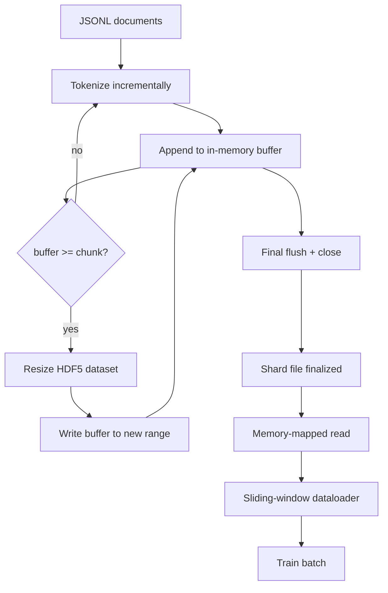

# HDF5 Tokenized Corpus

> The downloaded corpus has to land in a layout the trainer can stream from at line speed. JSONL on disk does not survive 16 dataloader workers. HDF5 with a resizable, chunked integer dataset does. This lesson builds streaming tokenization into a resizable HDF5 dataset, sharded write across multiple files, memory-mapped read at training time, and a sliding-window dataloader that produces fixed-length sequences with the right packing.

**Type:** Build
**Languages:** Python
**Prerequisites:** Phase 19 lessons 30-37
**Time:** ~90 minutes

## Learning Objectives

- Stream documents into a resizable HDF5 integer dataset with deterministic chunking.
- Shard the write across multiple HDF5 files so failure is bounded and parallelism is possible.
- Read tokens back through HDF5's page-cache-backed chunked layout so the dataloader copies into batch buffers only at batch time.
- Implement a sliding-window dataloader that emits fixed-length training sequences with explicit packing rules.

## The Problem

A modern language-model training run reads tokens at hundreds of thousands of samples per second across dozens of workers. JSONL on disk dies at the first cold-cache page fault: the JSON parser is slow, the document boundaries are not addressable, and seeking to "sample 4,217,884" requires scanning the file. Even Parquet, which compresses well, is a poor fit because the trainer does not want columns; it wants a flat token stream with O(1) random access.

HDF5 fits because it offers a chunked, resizable, integer-only dataset whose chunks are page-cache friendly at read time. The trainer asks for a slice of `tokens[3,200,000 : 3,200,8192]` and HDF5 copies the requested hyperslab from the page cache into a freshly allocated NumPy array. The cost is one open file handle and a chunk-sized page-cache footprint per worker, which is negligible compared to the cost of decoding JSONL.

The build problem is making the write side honest. Resizable datasets are easy to misuse: write one document at a time and the HDF5 file is fragmented to the point of unusable. Write all documents in one resize and a process death loses the whole shard. The right discipline is buffer-then-extend, with a buffer size that matches the chunk size, and a sharded write that splits the workload across files so a crash loses at most one shard.

## The Concept

### Resizable HDF5 done right

The token dataset is created with `maxshape=(None,)` and a fixed `chunks=(chunk_size,)`. Writing proceeds by buffering tokens in a NumPy array of length `chunk_size`. When the buffer fills, the dataset is resized by exactly `chunk_size` and the buffer is written into the new range. At end-of-shard the residual buffer is written into a final partial range. Every write is contiguous and chunk-aligned except the last one, which the reader is told to truncate at the recorded `token_count` in the shard's HDF5 attributes.

### Sharded write

A single HDF5 file is a single point of failure. The pipeline writes shards in parallel: each input shard from Phase 19 lesson 42 produces one HDF5 output shard. A `shards.json` index records, per shard, the file path, the token count, the document count, and a sha256 over the tokens. The trainer reads `shards.json` to compute global offsets and to validate the corpus.

### Memory-mapped read

At training time each worker opens its share of HDF5 files in `swmr=True` mode and asks for `tokens[start:stop]`. HDF5's chunk layout makes this a page-cache-backed read once the chunk is hot. The worker never materialises the whole file: the slice is copied into the dataloader's batch buffer, which the dataloader then copies into a pinned-memory training tensor at batch time. The hot path has one syscall per chunk transition; everything else is RAM access.

### Sliding-window dataloader

The dataloader is the only stage that knows about training-sequence length. It picks a random start index in the global token stream, reads `window_size + 1` tokens, and returns `(input, target) = (tokens[:-1], tokens[1:])`. Document boundaries are not enforced: a window may straddle two documents, with an explicit `boundary_token_id` between them so the model learns to use the separator. This is the standard packing rule; it is also the rule a beginner forgets, ending up with a corpus that is 8 percent training boundary tokens and 92 percent natural text.

## Build It

Reconstruct **HDF5 Tokenized Corpus** by following `ShardWriteResult` on tokens=["red","fox"]. Run `python3 main.py` and verify that the attention/embedding shape follows the token count and each valid attention row remains normalized.

## Use It

Call `ShardWriteResult` from a small caller with tokens=["red","fox"]. Compare its result with the demo output, and record the input contract and the one field a downstream user should rely on.

## Ship It

Hand off `outputs/artifact-card.md` with the command `python3 main.py`, the accepted input shape (tokens=["red","fox"]), the expected observable result, and a failure note for malformed inputs.

## Further Reading

- [HDF5 chunking documentation](https://docs.hdfgroup.org/hdf5/v1_14/) - the chunked, resizable dataset layout this lesson uses
- [h5py user guide](https://docs.h5py.org/en/stable/) - Python bindings for HDF5
- [NumPy memory mapping](https://numpy.org/doc/stable/reference/generated/numpy.memmap.html) - the read-side primitive HDF5 exposes through h5py
- Phase 19 · 42 - the downloader whose output this lesson tokenizes
- Phase 19 · 44 - the cosine schedule that consumes this dataloader
- Phase 19 · 45 - the AMP loop that wraps the training step

## Exercises

This lab follows `ShardWriteResult` and `to_dict` on a controlled fixture; write down the value before changing the input.

1. **Trace the canonical fixture.** From `code/`, run `python3 main.py` using tokens=["red","fox"]. Follow `ShardWriteResult`, `to_dict`, `ShardIndexEntry`. Expect the attention/embedding shape follows the token count and each valid attention row remains normalized; capture the first printed shape, metric, status, or summary field and state which part supports **Stream documents into a resizable HDF5 integer dataset with deterministic chunking.**.
2. **Change the controlled parameter.** Repeat the command after changing only the token sequence: use tokens=["red","fox","runs"]. Predict the direction of the change, then compare the two output values. Explain why **Shard the write across multiple HDF5 files so failure is bounded and parallelism is possible.** says the other inputs should stay fixed.
3. **Exercise the guard.** Feed the implementation tokens=[]. Before running it, write down whether the relevant function should return an empty value, a zero-sized result, or a validation error. Check the observed status against **Read tokens back through HDF5's page-cache-backed chunked layout so the dataloader copies into batch buffers only at batch time.** and record the exception text if the code rejects the case.
4. **Prepare the artifact for reuse.** Open `outputs/artifact-card.md` and add a worked example using tokens=["red","fox"]. Include the input contract, one expected output field, and a named acceptance check for **Implement a sliding-window dataloader that emits fixed-length training sequences with explicit packing rules.**; note what the demo cannot establish.

## Reference Solution

A checkable result for **HDF5 Tokenized Corpus** should contain:

- the `python3 main.py` output for tokens=["red","fox"], with `ShardWriteResult`, `to_dict`, `ShardIndexEntry` traced to the value or shape that supports **Stream documents into a resizable HDF5 integer dataset with deterministic chunking.**;
- a before/after comparison for the token sequence, where tokens=["red","fox","runs"] changes the observation in the direction predicted by **Shard the write across multiple HDF5 files so failure is bounded and parallelism is possible.**;
- a recorded result for tokens=[] that matches the implementation’s validation or empty-result contract and explains the evidence for **Read tokens back through HDF5's page-cache-backed chunked layout so the dataloader copies into batch buffers only at batch time.**; and
- an updated `outputs/artifact-card.md` example with a concrete input, expected output field, and acceptance check tied to **Implement a sliding-window dataloader that emits fixed-length training sequences with explicit packing rules.**.

Run the lesson tests after the demo. If the boundary behaves differently from the prediction, keep the actual exception or output and explain the implementation path that produced it.
