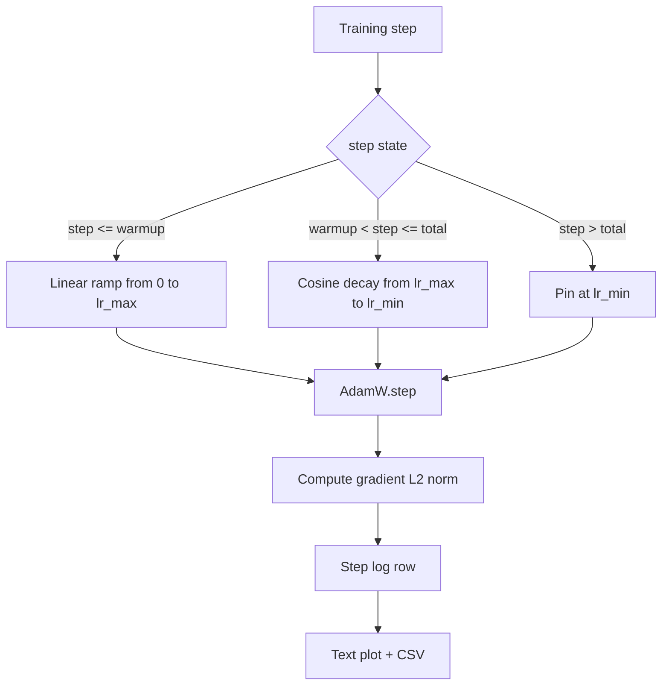

# Cosine LR with Linear Warmup

> The learning-rate schedule is the second most important decision after the loss function. AdamW with a cosine decay and a linear warmup is the modern default for language-model training because it lets the model see a small effective step size during the brittle first thousand updates, ramps up to a configured peak, and decays smoothly back toward zero. This lesson builds that schedule, plots the curve over training steps, logs gradient norms next to the schedule, and proves the schedule honors warmup, peak, and decay boundaries.

**Type:** Build
**Languages:** Python
**Prerequisites:** Phase 19 lessons 30-37
**Time:** ~90 minutes

## Learning Objectives

- Implement an AdamW optimizer wired to a cosine learning-rate schedule with linear warmup.
- Compute the schedule's exact value at any step without floating-point drift across runs.
- Log gradient L2 norm side by side with the learning rate so training health is observable.
- Render the schedule to a text plot the eye can read and a CSV any tool can consume.

## The Problem

The first thousand training updates are the loudest. The model's weights are still close to initialization. The optimizer's running second-moment estimate has not stabilised. The gradient norm is large and noisy. If the learning rate is at its peak during these updates the model either diverges outright or settles into a loss plateau it never escapes. The two well-known fixes are gradient clipping, which is the subject of Phase 19 lesson 45, and a learning-rate schedule that starts small and ramps up.

The cosine-with-warmup schedule has three regions. From step zero to step `warmup_steps` the learning rate scales linearly from zero to the configured peak `lr_max`. From step `warmup_steps` to step `total_steps` the learning rate follows the upper half of a cosine curve, decaying from `lr_max` to `lr_min`. After `total_steps` the learning rate is pinned at `lr_min` so a misconfigured trainer that overshoots does not silently exit the schedule.

The build problem is that schedules are easy to get wrong off by one. The off-by-one shows up six hours into a training run as a learning rate that is 1 percent too high or too low at the moment the model starts overfitting, which is invisible unless the schedule is exhaustively tested at boundaries.

## The Concept

### Warmup formula

For `step` in `[0, warmup_steps]` with `warmup_steps > 0`, the learning rate is `lr_max * step / warmup_steps`. The degenerate `warmup_steps = 0` case is treated as "no warmup": the schedule starts directly at `lr_max` at step zero and immediately enters cosine decay. Some test harnesses pass `warmup_steps = 0` to check the schedule still produces a usable curve.

### Cosine formula

For `step` in `(warmup_steps, total_steps]` the learning rate is `lr_min + 0.5 * (lr_max - lr_min) * (1 + cos(pi * progress))` where `progress = (step - warmup_steps) / max(1, total_steps - warmup_steps)`. At `step = warmup_steps` the cosine evaluates to `cos(0) = 1`, which gives `lr_max`, matching the warmup endpoint exactly. At `step = total_steps` the cosine evaluates to `cos(pi) = -1`, which gives `lr_min`, matching the decay endpoint exactly.

The continuity at both endpoints is not an accident. It is the reason the schedule is implemented as a single function over `step`, not as three different functions glued together. A glued schedule loses one boundary the first time `lr_max` is changed.

### Floor after total steps

For `step > total_steps` the learning rate stays at `lr_min`. The contract is explicit: the schedule does not error out and does not extrapolate; it pins at the floor and lets the trainer log a warning. Trainers that need to extend training change the schedule's `total_steps`, not the loop.

### Gradient norm logging alongside the rate

The schedule is half of training health. The gradient norm is the other half. The training loop logs both per step. A divergent training run shows the gradient norm spike before the loss does; a well-tuned warmup keeps the norm rising linearly with the rate; a too-aggressive peak shows up as a norm that stays high after warmup. The dataset on disk is `step, lr, grad_l2_norm, loss`. The CSV is the only durable record.

## Build It

Reconstruct **Cosine LR with Linear Warmup** by following `CosineWithWarmup` on the text "red fox". Run `python3 main.py` and verify that the tokenizer/retriever reports zero or a clear empty-input result, rather than borrowing a result from the previous text.

## Use It

Call `CosineWithWarmup` from a small caller with the text "red fox". Compare its result with the demo output, and record the input contract and the one field a downstream user should rely on.

## Ship It

Hand off `outputs/artifact-card.md` with the command `python3 main.py`, the accepted input shape (the text "red fox"), the expected observable result, and a failure note for malformed inputs.

## Further Reading

- [Loshchilov and Hutter, SGDR: Stochastic Gradient Descent with Warm Restarts (arXiv 1608.03983)](https://arxiv.org/abs/1608.03983) - the cosine schedule's reference paper
- [Loshchilov and Hutter, Decoupled Weight Decay Regularization (arXiv 1711.05101)](https://arxiv.org/abs/1711.05101) - AdamW's reference paper
- [PyTorch torch.optim.lr_scheduler](https://docs.pytorch.org/docs/stable/optim.html#how-to-adjust-learning-rate) - how step functions compose with framework schedulers
- Phase 19 · 42 - the downloader whose corpus this schedule consumes
- Phase 19 · 43 - the dataloader the schedule co-evolves with
- Phase 19 · 45 - gradient clipping and AMP, the next layer in the loop

## Exercises

Keep two runs side by side for **Cosine LR with Linear Warmup**. The important evidence is the named field, shape, or status—not a polished paragraph about the run.

1. **Read the first result.** From `code/`, run `python3 main.py` using the text "red fox". Follow `CosineWithWarmup`, `lr`, `points`. Expect the tokenizer/retriever reports zero or a clear empty-input result, rather than borrowing a result from the previous text; capture the first printed shape, metric, status, or summary field and state which part supports **Implement an AdamW optimizer wired to a cosine learning-rate schedule with linear warmup.**.
2. **Run a two-value comparison.** Repeat the command after changing only the input text: use the text "red fox runs". Predict the direction of the change, then compare the two output values. Explain why **Compute the schedule's exact value at any step without floating-point drift across runs.** says the other inputs should stay fixed.
3. **Try an adversarial fixture.** Feed the implementation an empty string. Before running it, write down whether the relevant function should return an empty value, a zero-sized result, or a validation error. Check the observed status against **Log gradient L2 norm side by side with the learning rate so training health is observable.** and record the exception text if the code rejects the case.
4. **Write the operator note.** Open `outputs/artifact-card.md` and add a worked example using the text "red fox". Include the input contract, one expected output field, and a named acceptance check for **Render the schedule to a text plot the eye can read and a CSV any tool can consume.**; note what the demo cannot establish.

## Reference Solution

A checkable result for **Cosine LR with Linear Warmup** should contain:

- the `python3 main.py` output for the text "red fox", with `CosineWithWarmup`, `lr`, `points` traced to the value or shape that supports **Implement an AdamW optimizer wired to a cosine learning-rate schedule with linear warmup.**;
- a before/after comparison for the input text, where the text "red fox runs" changes the observation in the direction predicted by **Compute the schedule's exact value at any step without floating-point drift across runs.**;
- a recorded result for an empty string that matches the implementation’s validation or empty-result contract and explains the evidence for **Log gradient L2 norm side by side with the learning rate so training health is observable.**; and
- an updated `outputs/artifact-card.md` example with a concrete input, expected output field, and acceptance check tied to **Render the schedule to a text plot the eye can read and a CSV any tool can consume.**.

Run the lesson tests after the demo. If the boundary behaves differently from the prediction, keep the actual exception or output and explain the implementation path that produced it.
