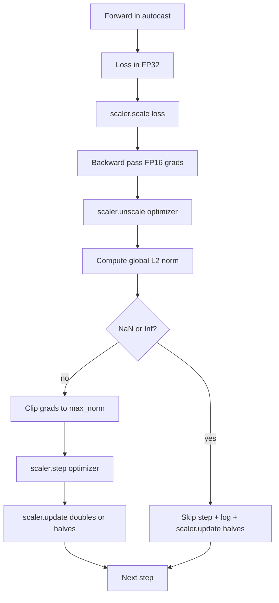

# Gradient Clipping and Mixed Precision

> The optimizer and schedule from the previous lesson assume gradients are sane. They usually are not. A single bad batch can spike the gradient norm by three orders of magnitude. Mixed-precision training amplifies this by introducing FP16 overflow on the loss side. This lesson builds the two safety belts that production training cannot ship without: gradient clipping to a configured global L2 norm, and a mixed-precision loop with autocast and GradScaler that detects NaN and Inf, skips the step cleanly, and logs the scaling factor for forensics.

**Type:** Build
**Languages:** Python
**Prerequisites:** Phase 19 lessons 30-37
**Time:** ~90 minutes

## Learning Objectives

- Compute the global L2 norm over all parameter gradients and clip in place when it exceeds a configured threshold.
- Wrap a training step in autocast plus a GradScaler so FP16 forward and backward passes survive overflow.
- Detect NaN and Inf in the loss or gradient, skip the optimizer step, and log the skip.
- Report the GradScaler's scaling factor every step so a long sequence of skips is visible immediately.

## The Problem

A training run that ran clean yesterday produces a loss curve that goes vertical at step 8,217. The culprit is a single batch whose gradient norm is 4,200, twenty times the previous peak. Without clipping the optimizer applies a step that resets every learning the model had done in the previous hour. With a global L2 clip at norm 1.0, the same batch contributes a unit-norm update; the loss stays on its trend line; the run survives.

Mixed-precision training pushes throughput by 2-3x by computing the forward pass and most of the backward pass in FP16. The cost is that FP16 has a narrow exponent range. A typical gradient that overflows in FP16 evaluates to Inf, which propagates through subsequent layers as NaN, which sets every weight to NaN at the next optimizer step. PyTorch's GradScaler solves this by multiplying the loss by a large scaling factor before the backward pass and dividing the gradients by the same factor before the optimizer step. If any gradient is Inf or NaN at unscale time, the scaler skips the step and halves the scaling factor; if the previous N steps were clean, the scaler doubles the factor. Over the course of training the factor finds the highest value the FP16 range allows.

The build problem is wiring the two correctly. Clip before unscale and the threshold is on scaled gradients; clip after unscale and the order of operations on the GradScaler matters. The right order is: `scaler.scale(loss).backward()`, then `scaler.unscale_(optimizer)`, then `clip_grad_norm_`, then `scaler.step(optimizer)`, then `scaler.update()`. Any other order produces a silently broken loop.

## The Concept

### Global L2 norm

The global L2 norm is the Euclidean norm of the concatenated gradient vector, not the per-parameter norm. PyTorch implements this as `torch.nn.utils.clip_grad_norm_(parameters, max_norm)`. The function returns the pre-clip norm so the lesson can log both the natural and the clipped value, which is necessary for the "we are clipping at every step" diagnosis.

### autocast and GradScaler

`torch.amp.autocast(device_type)` is the context manager that selectively runs eligible operations (most matmul-class operations) in FP16. `torch.amp.GradScaler(device_type)` is the helper that scales the loss before backward and inverse-scales the gradients before the optimizer step. The two are designed together; using one without the other is a configuration error the test should catch.

The lesson uses CPU autocast because that is what runs in CI; the same pattern transfers verbatim to CUDA by changing `device_type="cpu"` to `device_type="cuda"`. The GradScaler on CPU is a stub (CPU autocast already operates in BF16 by default and does not need loss scaling), but the lesson includes the call sites so the wiring is identical to the GPU loop.

### NaN and Inf detection

The detection happens in two places. First, the loss itself is checked with `torch.isfinite` before backward; an Inf or NaN loss does not produce useful gradients and is skipped without entering the optimizer. Second, after `scaler.unscale_(optimizer)` the lesson scans the unscaled gradients with `has_non_finite_grad(...)` and treats any Inf or NaN as a skip. The two checks together cover both the forward-pass and the backward-pass failure modes.

### Scaling factor diagnostics

The scaling factor is the GradScaler's internal state. Every step the lesson reads `scaler.get_scale()` and logs it next to the learning rate and gradient norm. A healthy run shows the scaling factor climbing in powers of two until it saturates near `2^17` or `2^18`. A misbehaving run shows the factor oscillating between high and low values, which is the signal that the model's gradients are sometimes in range and sometimes not. The diagnostic is invisible without logging.

## Build It

Reconstruct **Gradient Clipping and Mixed Precision** by following `StepLog` on x=0.5 with the demo defaults. Run `python3 main.py` and verify that the update or loss change agrees with the gradient sign; a zero gradient produces no accidental jump.

## Use It

Call `StepLog` from a small caller with x=0.5 with the demo defaults. Compare its result with the demo output, and record the input contract and the one field a downstream user should rely on.

## Ship It

Hand off `outputs/artifact-card.md` with the command `python3 main.py`, the accepted input shape (x=0.5 with the demo defaults), the expected observable result, and a failure note for malformed inputs.

## Further Reading

- [Micikevicius et al., Mixed Precision Training (arXiv 1710.03740)](https://arxiv.org/abs/1710.03740) - the original loss-scaling proposal
- [Pascanu, Mikolov, Bengio, On the difficulty of training recurrent neural networks (arXiv 1211.5063)](https://arxiv.org/abs/1211.5063) - the gradient-clipping reference paper
- [PyTorch torch.amp.GradScaler](https://docs.pytorch.org/docs/stable/amp.html) - the scaler API this lesson wraps
- [PyTorch torch.nn.utils.clip_grad_norm_](https://docs.pytorch.org/docs/stable/generated/torch.nn.utils.clip_grad_norm_.html) - the clipping primitive this lesson uses
- Phase 19 · 42 - the downloader whose corpus feeds the loop
- Phase 19 · 43 - the dataloader the loop consumes
- Phase 19 · 44 - the schedule this loop composes with

## Exercises

Work from the smallest fixture that the Gradient Clipping and Mixed Precision demo already understands, then make one deliberate change and record what moved.

1. **Run the smallest fixture.** From `code/`, run `python3 main.py` using x=0.5 with the demo defaults. Follow `StepLog`, `to_csv_row`, `SkipLog`. Expect the update or loss change agrees with the gradient sign; a zero gradient produces no accidental jump; capture the first printed shape, metric, status, or summary field and state which part supports **Compute the global L2 norm over all parameter gradients and clip in place when it exceeds a configured threshold.**.
2. **Perturb one field.** Repeat the command after changing only the learning rate: use the same run with learning rate 0.1 instead of 0.01. Predict the direction of the change, then compare the two output values. Explain why **Wrap a training step in autocast plus a GradScaler so FP16 forward and backward passes survive overflow.** says the other inputs should stay fixed.
3. **Check the failure boundary.** Feed the implementation a zero gradient or an already-minimized point. Before running it, write down whether the relevant function should return an empty value, a zero-sized result, or a validation error. Check the observed status against **Detect NaN and Inf in the loss or gradient, skip the optimizer step, and log the skip.** and record the exception text if the code rejects the case.
4. **Make the result repeatable.** Open `outputs/artifact-card.md` and add a worked example using x=0.5 with the demo defaults. Include the input contract, one expected output field, and a named acceptance check for **Report the GradScaler's scaling factor every step so a long sequence of skips is visible immediately.**; note what the demo cannot establish.

## Reference Solution

A checkable result for **Gradient Clipping and Mixed Precision** should contain:

- the `python3 main.py` output for x=0.5 with the demo defaults, with `StepLog`, `to_csv_row`, `SkipLog` traced to the value or shape that supports **Compute the global L2 norm over all parameter gradients and clip in place when it exceeds a configured threshold.**;
- a before/after comparison for the learning rate, where the same run with learning rate 0.1 instead of 0.01 changes the observation in the direction predicted by **Wrap a training step in autocast plus a GradScaler so FP16 forward and backward passes survive overflow.**;
- a recorded result for a zero gradient or an already-minimized point that matches the implementation’s validation or empty-result contract and explains the evidence for **Detect NaN and Inf in the loss or gradient, skip the optimizer step, and log the skip.**; and
- an updated `outputs/artifact-card.md` example with a concrete input, expected output field, and acceptance check tied to **Report the GradScaler's scaling factor every step so a long sequence of skips is visible immediately.**.

Run the lesson tests after the demo. If the boundary behaves differently from the prediction, keep the actual exception or output and explain the implementation path that produced it.
