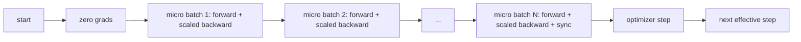
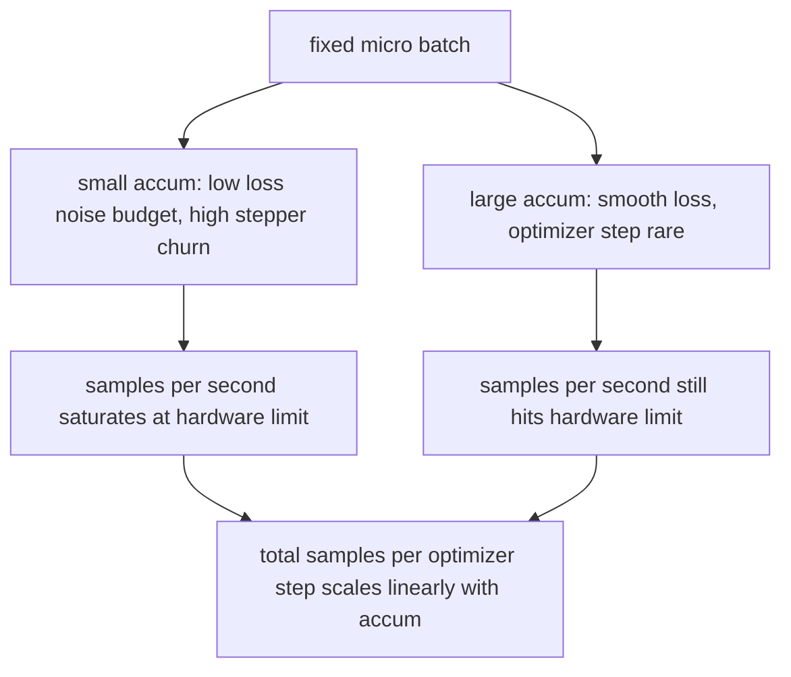

# Gradient Accumulation

> Train at an effective batch you cannot afford, one micro-batch at a time. Scale the loss, hold the optimizer step, and let the gradients pile up.

**Type:** Build
**Languages:** Python
**Prerequisites:** Phase 19 lessons 42 to 45
**Time:** ~90 minutes

## Learning Objectives

- Derive the effective batch identity: `effective_batch = micro_batch * accum_steps`.
- Implement loss-per-micro-batch scaling so the accumulated gradient matches a single full-batch backward.
- Skip optimizer synchronization until the last micro-batch (sync-on-last-step).
- Read a throughput against effective batch curve and explain the diminishing return.

## The Problem

You want to train at an effective batch of 512 because the loss curve is smoother and the optimizer step makes more sense at that scale. The accelerator on the desk holds 32 examples before it runs out of memory. Doubling the batch is not an option. Halving the model is not an option. The trick the field reached for in 2017 and never stopped using is to run 16 backward passes, let the gradients accumulate inside the parameter buffers, and only step the optimizer when the count reaches the target.

The risk is that the loss is no longer the same number it was at the bigger batch. The cross entropy of 16 mini-batches summed naively is 16 times the loss of one full batch. Without scaling, the gradient direction is correct but the magnitude is wrong, and the optimizer step is 16 times too big. The fix is one division. The fix is also easy to forget.

## The Concept



The contract is short:

- Loss for each micro-batch is divided by `accum_steps` before `backward()`. PyTorch sums gradients into `param.grad` by default; the division pushes the running sum back into the right scale.
- The optimizer step fires once per effective batch, after the last micro-batch's backward. Stepping mid-accumulation skews every parameter the rest of the run depends on.
- The optimizer's state (momentum buffers, Adam moments) advances once per effective step, not once per micro-batch. The exponential moving averages would otherwise see the wrong frequency and burn through the schedule.
- On a single device this is bookkeeping. On a multi-rank cluster the same pattern wraps the non-final micro-batches in a `no_sync` context that skips the gradient all-reduce; the last micro-batch reduces the full accumulated gradient in one pass instead of paying the network cost N times.

### The equivalence proof in code

```python
loss = criterion(model(x_full), y_full)
loss.backward()
opt.step()
```

is equivalent to

```python
for x, y in chunks(x_full, y_full, n):
    scaled = criterion(model(x), y) / n
    scaled.backward()
opt.step()
```

up to floating point summation order. The accumulated gradient buffer at the end of the loop is the same tensor that a single full-batch backward would produce. The lesson code asserts this with a max-abs difference under 1e-4 in `equivalence_check`.

### Where the cost goes

Each micro-batch costs one forward and one backward. With accumulation you trade memory for time. The throughput curve in `outputs/accum-curve.json` shows what happens as the effective batch grows at fixed micro-batch:



There is no free lunch. Doubling `accum_steps` doubles the wall time per optimizer step. What changes is the variance of the gradient estimate: at the same wall budget you have made fewer optimizer steps but each one was averaged over more samples. The literature treats large batch and small batch as different optimization problems; the lesson here is mechanical, not statistical.


## Further Reading

- PyTorch docs on `DistributedDataParallel.no_sync` for the production version of the sync-on-last-step trick.
- Goyal et al., 2017, on linear scaling for large batch training, the canonical reason to care about effective batch.
- PyTorch issue tracker on gradient accumulation interactions with mixed precision unscaling.
- Phase 19 lessons 42 to 45 cover the model, data loader, optimizer, and trainer scaffolding this lesson assumes.
- Phase 19 lesson 47 covers checkpoint and resume so a long accumulation run survives a wallclock cap.
