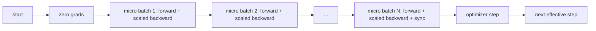
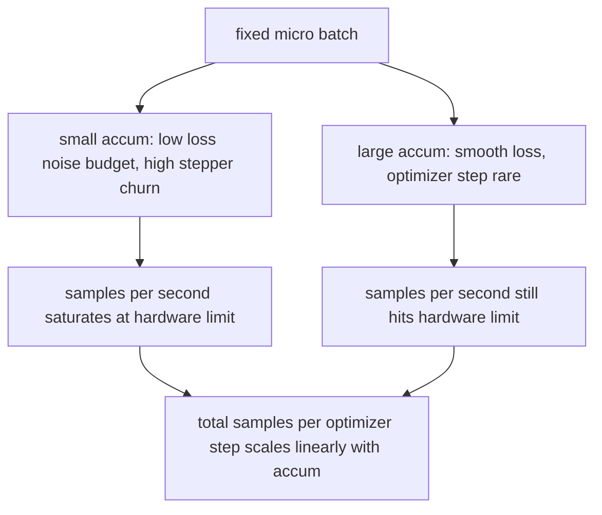

# Gradient Accumulation

> Train at an effective batch you cannot afford, one micro-batch at a time. Scale the loss, hold the optimizer step, and let the gradients pile up.

**Type:** Build
**Languages:** Python
**Prerequisites:** Phase 19 lessons 42 to 45
**Time:** ~90 minutes

## Learning Objectives

- Derive the effective batch identity: `effective_batch = micro_batch * accum_steps`.
- Implement loss-per-micro-batch scaling so the accumulated gradient matches a single full-batch backward.
- Skip optimizer synchronization until the last micro-batch (sync-on-last-step).
- Read a throughput against effective batch curve and explain the diminishing return.

## The Problem

You want to train at an effective batch of 512 because the loss curve is smoother and the optimizer step makes more sense at that scale. The accelerator on the desk holds 32 examples before it runs out of memory. Doubling the batch is not an option. Halving the model is not an option. The trick the field reached for in 2017 and never stopped using is to run 16 backward passes, let the gradients accumulate inside the parameter buffers, and only step the optimizer when the count reaches the target.

The risk is that the loss is no longer the same number it was at the bigger batch. The cross entropy of 16 mini-batches summed naively is 16 times the loss of one full batch. Without scaling, the gradient direction is correct but the magnitude is wrong, and the optimizer step is 16 times too big. The fix is one division. The fix is also easy to forget.

## The Concept



The contract is short:

- Loss for each micro-batch is divided by `accum_steps` before `backward()`. PyTorch sums gradients into `param.grad` by default; the division pushes the running sum back into the right scale.
- The optimizer step fires once per effective batch, after the last micro-batch's backward. Stepping mid-accumulation skews every parameter the rest of the run depends on.
- The optimizer's state (momentum buffers, Adam moments) advances once per effective step, not once per micro-batch. The exponential moving averages would otherwise see the wrong frequency and burn through the schedule.
- On a single device this is bookkeeping. On a multi-rank cluster the same pattern wraps the non-final micro-batches in a `no_sync` context that skips the gradient all-reduce; the last micro-batch reduces the full accumulated gradient in one pass instead of paying the network cost N times.

### The equivalence proof in code

```python
loss = criterion(model(x_full), y_full)
loss.backward()
opt.step()
```

is equivalent to

```python
for x, y in chunks(x_full, y_full, n):
    scaled = criterion(model(x), y) / n
    scaled.backward()
opt.step()
```

up to floating point summation order. The accumulated gradient buffer at the end of the loop is the same tensor that a single full-batch backward would produce. The lesson code asserts this with a max-abs difference under 1e-4 in `equivalence_check`.

PyTorch isn't available here, but the scaling arithmetic underneath `loss.backward()` is ordinary division. Rebuild it with a toy gradient function `grad_fn(w, x) = 2*(w - x)` and a manual accumulation loop:

```python fillin
def grad_fn(w, x):
    return 2 * (w - x)

x_full = [1.0, 2.0, 3.0, 4.0, 5.0, 6.0, 7.0, 8.0]
w = 0.0
accum_steps = 4

full_grad = sum(grad_fn(w, x) for x in x_full) / len(x_full)

def micro_batches(data, n):
    size = len(data) // n
    return [data[i*size:(i+1)*size] for i in range(n)]

# Naive: accumulate each micro-batch's gradient with no scaling.
naive_total = 0.0
for mb in micro_batches(x_full, accum_steps):
    mb_grad = sum(grad_fn(w, x) for x in mb) / len(mb)
    naive_total += mb_grad
print("naive (unscaled) accumulated grad:", naive_total, "vs full-batch grad:", full_grad)

# Fixed: same loop, scale each contribution by accum_steps before summing.
scaled_total = 0.0
for mb in micro_batches(x_full, accum_steps):
    mb_grad = sum(grad_fn(w, x) for x in mb) / {{blank:len(mb)}}
    scaled_total += mb_grad / {{blank:accum_steps}}

if abs(scaled_total - full_grad) < 1e-9:
    print("PASS")
else:
    print("WRONG:", scaled_total, "expected", full_grad)
```

The naive accumulation lands at -36.0, four times the full-batch gradient of -9.0 -- exactly `accum_steps` too big, the same failure mode the section above warns about. Dividing each micro-batch's mean gradient by `accum_steps` before adding it in recovers the full-batch value exactly.

### Where the cost goes

Each micro-batch costs one forward and one backward. With accumulation you trade memory for time. The throughput curve in `outputs/accum-curve.json` shows what happens as the effective batch grows at fixed micro-batch:



There is no free lunch. Doubling `accum_steps` doubles the wall time per optimizer step. What changes is the variance of the gradient estimate: at the same wall budget you have made fewer optimizer steps but each one was averaged over more samples. The literature treats large batch and small batch as different optimization problems; the lesson here is mechanical, not statistical.


## Build It

Reconstruct **Gradient Accumulation** by following `StepResult` on x=0.5 with the demo defaults. Run `python3 main.py` and verify that the update or loss change agrees with the gradient sign; a zero gradient produces no accidental jump.

## Use It

Call `StepResult` from a small caller with x=0.5 with the demo defaults. Compare its result with the demo output, and record the input contract and the one field a downstream user should rely on.

## Ship It

Hand off `outputs/accum-curve.json` with the command `python3 main.py`, the accepted input shape (x=0.5 with the demo defaults), the expected observable result, and a failure note for malformed inputs.

## Further Reading

- PyTorch docs on `DistributedDataParallel.no_sync` for the production version of the sync-on-last-step trick.
- Goyal et al., 2017, on linear scaling for large batch training, the canonical reason to care about effective batch.
- PyTorch issue tracker on gradient accumulation interactions with mixed precision unscaling.
- Phase 19 lessons 42 to 45 cover the model, data loader, optimizer, and trainer scaffolding this lesson assumes.
- Phase 19 lesson 47 covers checkpoint and resume so a long accumulation run survives a wallclock cap.

## Exercises

Use `StepResult` as the trace: start from x=0.5 with the demo defaults, keep the raw output, and tie each observation to a named objective.

1. **Reproduce the reference path.** From `code/`, run `python3 main.py` using x=0.5 with the demo defaults. Follow `StepResult`, `CurvePoint`, `seed_everything`. Expect the update or loss change agrees with the gradient sign; a zero gradient produces no accidental jump; capture the first printed shape, metric, status, or summary field and state which part supports **Derive the effective batch identity: `effective_batch = micro_batch * accum_steps`.**.
2. **Vary one named input.** Repeat the command after changing only the learning rate: use the same run with learning rate 0.1 instead of 0.01. Predict the direction of the change, then compare the two output values. Explain why **Implement loss-per-micro-batch scaling so the accumulated gradient matches a single full-batch backward.** says the other inputs should stay fixed.
3. **Probe the empty case.** Feed the implementation a zero gradient or an already-minimized point. Before running it, write down whether the relevant function should return an empty value, a zero-sized result, or a validation error. Check the observed status against **Skip optimizer synchronization until the last micro-batch (sync-on-last-step).** and record the exception text if the code rejects the case.
4. **Package a usable handoff.** Open `outputs/accum-curve.json` and add a worked example using x=0.5 with the demo defaults. Include the input contract, one expected output field, and a named acceptance check for **Read a throughput against effective batch curve and explain the diminishing return.**; note what the demo cannot establish.

## Reference Solution

A checkable result for **Gradient Accumulation** should contain:

- the `python3 main.py` output for x=0.5 with the demo defaults, with `StepResult`, `CurvePoint`, `seed_everything` traced to the value or shape that supports **Derive the effective batch identity: `effective_batch = micro_batch * accum_steps`.**;
- a before/after comparison for the learning rate, where the same run with learning rate 0.1 instead of 0.01 changes the observation in the direction predicted by **Implement loss-per-micro-batch scaling so the accumulated gradient matches a single full-batch backward.**;
- a recorded result for a zero gradient or an already-minimized point that matches the implementation’s validation or empty-result contract and explains the evidence for **Skip optimizer synchronization until the last micro-batch (sync-on-last-step).**; and
- an updated `outputs/accum-curve.json` example with a concrete input, expected output field, and acceptance check tied to **Read a throughput against effective batch curve and explain the diminishing return.**.

Run the lesson tests after the demo. If the boundary behaves differently from the prediction, keep the actual exception or output and explain the implementation path that produced it.
