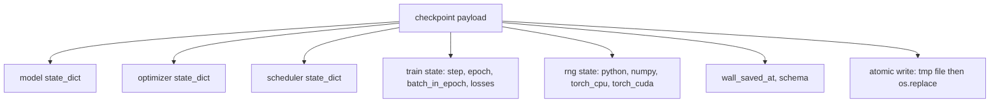
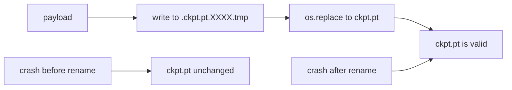
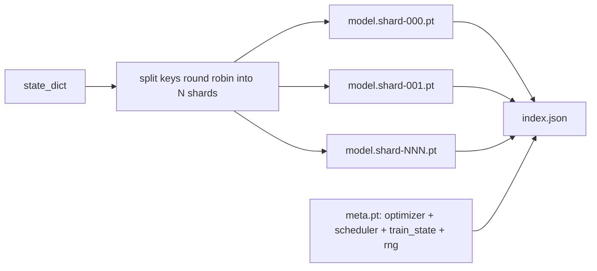

# Checkpoint Save and Resume

> Train interrupts kill runs; checkpoints let them continue. Save model, optimizer, scheduler, loss history, step counter, and RNG state, atomically, so a kill at any moment leaves a valid file on disk.

**Type:** Build
**Languages:** Python
**Prerequisites:** Phase 19 lessons 42 to 45
**Time:** ~90 minutes

## Learning Objectives

- Capture the full training state into a single payload that can be reloaded into a fresh process.
- Implement atomic save with write-to-temp then rename so a crash never leaves a half-written file.
- Restore the RNG state for Python, NumPy, and PyTorch so the post-resume loss matches the uninterrupted baseline.
- Build a sharded checkpoint layout for models that no longer fit in a single file, with hash-verified shards and a JSON index.

## The Problem

You set a training job for 18 hours. The wallclock cap is 4 hours. The cluster reboots at hour 11 because someone above your pay grade approved a kernel upgrade. Without checkpoints you start over. Without resume you also lose the optimizer state that took the first 11 hours to learn, so even if the model weights survived, the AdamW moments are gone and the next step lurches in a direction the training trajectory had already moved past.

The right artifact is a single file that holds everything needed to continue: model parameters, optimizer state, scheduler state, the loss history for plots, the current step and epoch and batch-in-epoch counters, and the RNG state for every source of randomness. Without the RNG state the resumed loss curve is a different curve. Same model, same data, different shuffle, different dropout mask, different number on the dashboard.

Atomic save is the other half of the contract. Writing into the final filename means a crash mid-write leaves a corrupt file; the resume reads garbage. Writing into a temporary file in the same directory and then renaming means a crash mid-write leaves the previous good file untouched. The rename is atomic on POSIX file systems.

## The Concept

### The five state buckets

| Bucket | Why it matters |
|--------|----------------|
| Model | Weights and buffers; what the model is. |
| Optimizer | Momentum and adaptive moments; without these the next step is a different optimization problem. |
| Scheduler | Where the learning rate is on its curve; cosine schedules in particular care. |
| Train counters | Step, epoch, batch-in-epoch, plus the loss history that draws the dashboard. |
| RNG state | Determinism for dropout, data shuffling, and any sampling inside the model. |

### Atomic save

Two rules. First, the temporary file lives in the same directory as the target so the rename stays within the same file system; cross-device renames are not atomic. Second, the temporary name is unique per attempt so two writers do not stomp.

### Sharded checkpoints

When the model gets large the single-file payload becomes too big to load fast, too big to inspect, and too painful when a network share hiccups mid-read. The fix is to split the parameter state into shards and write a small index that ties them together.

The index records the shard count, the sha256 of each shard, and the sha256 of the meta file. The loader fails loudly when any hash mismatches. The shards can land on different physical disks; the meta is small and reads first.

### Resume continues mid epoch

A resume that snaps to the start of the next epoch wastes anywhere from minutes to a day. The fix is `(epoch, batch_in_epoch)` plus the RNG state. After load, the training loop fast-forwards the random number generator past the batches already consumed in the current epoch and continues from `batch_in_epoch`. The lesson code does this exactly; the assertion is that the loss trajectory after resume matches the uninterrupted baseline within 1e-4.

## Further Reading

- POSIX `rename` semantics for the atomicity claim that `os.replace` relies on.
- PyTorch documentation on `torch.save` and `torch.load`, including `map_location` for cross-device restores.
- Phase 19 lesson 46 covers the gradient accumulation that this lesson's checkpoint payload survives across.
- Phase 19 lesson 48 covers the distributed wrappers whose state dict format this scheme accommodates.
- The Linux kernel `fsync` documentation for the durability guarantee behind atomic rename.

## Exercises

1. **Establish a baseline.** Run the lesson demo, then capture the inputs, outputs, and one invariant that demonstrates this objective: Capture the full training state into a single payload that can be reloaded into a fresh process.
2. **Change one variable.** Modify a single input or parameter and use the resulting evidence to investigate this objective: Implement atomic save with write-to-temp then rename so a crash never leaves a half-written file.
3. **Probe an edge case.** Predict the result before running it, compare prediction with observation, and explain the discrepancy while applying this objective: Restore the RNG state for Python, NumPy, and PyTorch so the post-resume loss matches the uninterrupted baseline.

## Reference Solution

Use the canonical [main.py](../code/main.py) as the executable baseline. A complete solution records a successful run, identifies the invariant tied to “Capture the full training state into a single payload that can be reloaded into a fresh process,” and changes only one variable for the comparison. The edge-case result must distinguish the prediction from the observation, explain the cause using “Restore the RNG state for Python, NumPy, and PyTorch so the post-resume loss matches the uninterrupted baseline,” and cite a repeatable check rather than relying on visual inspection alone.
