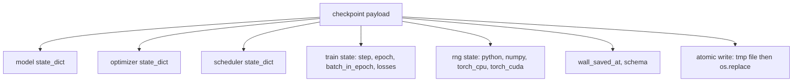
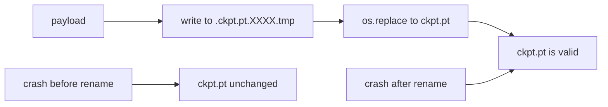
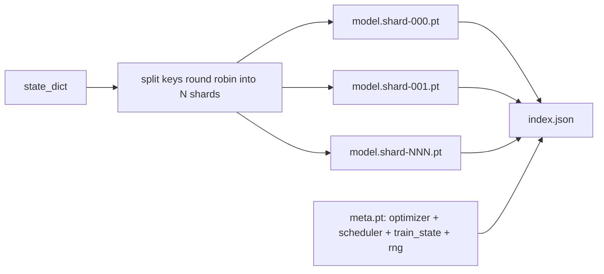

# Checkpoint Save and Resume

> Train interrupts kill runs; checkpoints let them continue. Save model, optimizer, scheduler, loss history, step counter, and RNG state, atomically, so a kill at any moment leaves a valid file on disk.

**Type:** Build
**Languages:** Python
**Prerequisites:** Phase 19 lessons 42 to 45
**Time:** ~90 minutes

## Learning Objectives

- Capture the full training state into a single payload that can be reloaded into a fresh process.
- Implement atomic save with write-to-temp then rename so a crash never leaves a half-written file.
- Restore the RNG state for Python, NumPy, and PyTorch so the post-resume loss matches the uninterrupted baseline.
- Build a sharded checkpoint layout for models that no longer fit in a single file, with hash-verified shards and a JSON index.

## The Problem

You set a training job for 18 hours. The wallclock cap is 4 hours. The cluster reboots at hour 11 because someone above your pay grade approved a kernel upgrade. Without checkpoints you start over. Without resume you also lose the optimizer state that took the first 11 hours to learn, so even if the model weights survived, the AdamW moments are gone and the next step lurches in a direction the training trajectory had already moved past.

The right artifact is a single file that holds everything needed to continue: model parameters, optimizer state, scheduler state, the loss history for plots, the current step and epoch and batch-in-epoch counters, and the RNG state for every source of randomness. Without the RNG state the resumed loss curve is a different curve. Same model, same data, different shuffle, different dropout mask, different number on the dashboard.

Atomic save is the other half of the contract. Writing into the final filename means a crash mid-write leaves a corrupt file; the resume reads garbage. Writing into a temporary file in the same directory and then renaming means a crash mid-write leaves the previous good file untouched. The rename is atomic on POSIX file systems.

## The Concept

### The five state buckets

| Bucket | Why it matters |
|--------|----------------|
| Model | Weights and buffers; what the model is. |
| Optimizer | Momentum and adaptive moments; without these the next step is a different optimization problem. |
| Scheduler | Where the learning rate is on its curve; cosine schedules in particular care. |
| Train counters | Step, epoch, batch-in-epoch, plus the loss history that draws the dashboard. |
| RNG state | Determinism for dropout, data shuffling, and any sampling inside the model. |

### Atomic save

Two rules. First, the temporary file lives in the same directory as the target so the rename stays within the same file system; cross-device renames are not atomic. Second, the temporary name is unique per attempt so two writers do not stomp.

### Sharded checkpoints

When the model gets large the single-file payload becomes too big to load fast, too big to inspect, and too painful when a network share hiccups mid-read. The fix is to split the parameter state into shards and write a small index that ties them together.

The index records the shard count, the sha256 of each shard, and the sha256 of the meta file. The loader fails loudly when any hash mismatches. The shards can land on different physical disks; the meta is small and reads first.

### Resume continues mid epoch

A resume that snaps to the start of the next epoch wastes anywhere from minutes to a day. The fix is `(epoch, batch_in_epoch)` plus the RNG state. After load, the training loop fast-forwards the random number generator past the batches already consumed in the current epoch and continues from `batch_in_epoch`. The lesson code does this exactly; the assertion is that the loss trajectory after resume matches the uninterrupted baseline within 1e-4.

## Build It

Reconstruct **Checkpoint Save and Resume** by following `TrainState` on x=0.5 with the demo defaults. Run `python3 main.py` and verify that the update or loss change agrees with the gradient sign; a zero gradient produces no accidental jump.

## Use It

Call `TrainState` from a small caller with x=0.5 with the demo defaults. Compare its result with the demo output, and record the input contract and the one field a downstream user should rely on.

## Ship It

Hand off `outputs/resume-demo.json` with the command `python3 main.py`, the accepted input shape (x=0.5 with the demo defaults), the expected observable result, and a failure note for malformed inputs.

## Further Reading

- POSIX `rename` semantics for the atomicity claim that `os.replace` relies on.
- PyTorch documentation on `torch.save` and `torch.load`, including `map_location` for cross-device restores.
- Phase 19 lesson 46 covers the gradient accumulation that this lesson's checkpoint payload survives across.
- Phase 19 lesson 48 covers the distributed wrappers whose state dict format this scheme accommodates.
- The Linux kernel `fsync` documentation for the durability guarantee behind atomic rename.

## Exercises

This lab follows `TrainState` and `seed_everything` on a controlled fixture; write down the value before changing the input.

1. **Trace the canonical fixture.** From `code/`, run `python3 main.py` using x=0.5 with the demo defaults. Follow `TrainState`, `seed_everything`, `make_model`. Expect the update or loss change agrees with the gradient sign; a zero gradient produces no accidental jump; capture the first printed shape, metric, status, or summary field and state which part supports **Capture the full training state into a single payload that can be reloaded into a fresh process.**.
2. **Change the controlled parameter.** Repeat the command after changing only the learning rate: use the same run with learning rate 0.1 instead of 0.01. Predict the direction of the change, then compare the two output values. Explain why **Implement atomic save with write-to-temp then rename so a crash never leaves a half-written file.** says the other inputs should stay fixed.
3. **Exercise the guard.** Feed the implementation a zero gradient or an already-minimized point. Before running it, write down whether the relevant function should return an empty value, a zero-sized result, or a validation error. Check the observed status against **Restore the RNG state for Python, NumPy, and PyTorch so the post-resume loss matches the uninterrupted baseline.** and record the exception text if the code rejects the case.
4. **Prepare the artifact for reuse.** Open `outputs/resume-demo.json` and add a worked example using x=0.5 with the demo defaults. Include the input contract, one expected output field, and a named acceptance check for **Build a sharded checkpoint layout for models that no longer fit in a single file, with hash-verified shards and a JSON index.**; note what the demo cannot establish.

## Reference Solution

A checkable result for **Checkpoint Save and Resume** should contain:

- the `python3 main.py` output for x=0.5 with the demo defaults, with `TrainState`, `seed_everything`, `make_model` traced to the value or shape that supports **Capture the full training state into a single payload that can be reloaded into a fresh process.**;
- a before/after comparison for the learning rate, where the same run with learning rate 0.1 instead of 0.01 changes the observation in the direction predicted by **Implement atomic save with write-to-temp then rename so a crash never leaves a half-written file.**;
- a recorded result for a zero gradient or an already-minimized point that matches the implementation’s validation or empty-result contract and explains the evidence for **Restore the RNG state for Python, NumPy, and PyTorch so the post-resume loss matches the uninterrupted baseline.**; and
- an updated `outputs/resume-demo.json` example with a concrete input, expected output field, and acceptance check tied to **Build a sharded checkpoint layout for models that no longer fit in a single file, with hash-verified shards and a JSON index.**.

Run the lesson tests after the demo. If the boundary behaves differently from the prediction, keep the actual exception or output and explain the implementation path that produced it.
