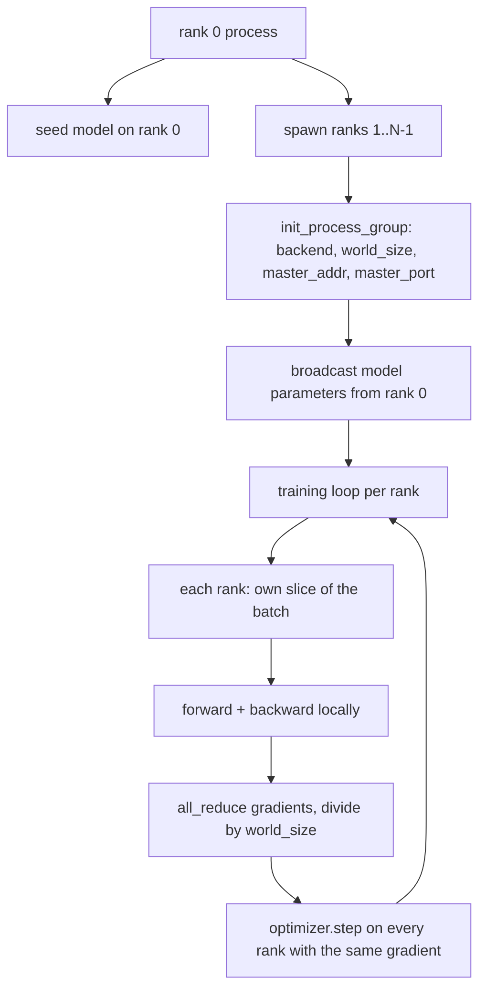
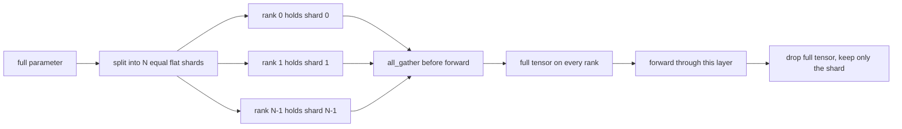

# Distributed Data Parallel and FSDP from Scratch

> Multi-rank training is two collectives and one rule. Broadcast the parameters at startup, average the gradients after backward, never let the ranks disagree about what step they are on.

**Type:** Build
**Languages:** Python
**Prerequisites:** Phase 19 lessons 42 to 45
**Time:** ~90 minutes

## Learning Objectives

- Bring up a process group across N ranks with the `gloo` backend, no special hardware.
- Implement a minimal DDP wrapper that broadcasts parameters at construction and all-reduces gradients after backward.
- Prove that the all-reduce of per-rank gradients matches a single-process gradient on the concatenated input.
- Sketch FSDP parameter sharding: each rank holds a slice, the full tensor is gathered for the forward pass and dropped after.

## The Problem

The model fits on one device. The dataset does not. The optimization budget says you want to see N times the examples per wallclock second. The first lever is data parallel: each rank runs the same model on a different slice of the batch, then averages gradients before the optimizer step. The second lever is FSDP: the model does not fit on one device either, so each rank holds a fraction of every parameter and reconstructs the full tensors layer by layer during the forward pass.

The pain is the bookkeeping. If parameters drift across ranks the run is silently corrupt. If you average gradients but not the loss the dashboard lies. If the collective backend cannot agree on a topology the run hangs forever. The fix is to write the collectives by hand once and never trust a wrapper you cannot reproduce.

This lesson runs on CPU. CUDA is not assumed. The `gloo` backend ships with every PyTorch build and accepts `torch.multiprocessing` workers; the same code switches to `nccl` on a multi-GPU node without changing structure.

## The Concept

### The two collectives that matter

| Collective | What it does | When |
|------------|--------------|------|
| `broadcast` | Copy a tensor from one rank to all others | Parameter init, scheduler state, any one-to-all sync |
| `all_reduce` | Sum (or mean, or max) a tensor across all ranks, every rank gets the result | Gradient averaging after backward |
| `all_gather` | Each rank contributes a tensor, every rank gets the concatenation | Logits collection, FSDP parameter unshard |

The DDP contract is `broadcast` at construction and `all_reduce` after backward. The FSDP sketch adds `all_gather` before each layer's forward pass.

### Gradient averaging matches single-process gradient

A model trained on a batch of B examples across N ranks must produce the same gradient as a single process training on a batch of N*B. The trick is that summing per-rank gradients and dividing by N gives the average loss gradient, which is what cross entropy with mean reduction would produce on the full batch. The lesson code asserts this with `max-abs-diff < 1e-3` between the manual all-reduce gradient and the reference single-process gradient.

### FSDP sketch

The memory win is exact: per-rank memory for parameters drops to 1/N. The cost is the gather, which is paid every forward pass. Production FSDP overlaps the gather with the previous layer's compute so the wallclock cost is much smaller than the naive accounting predicts. The lesson does the round-trip on every parameter and asserts the reconstruction is bit-equal to the original.

### CPU and the gloo backend

CUDA is the production target, but the same code paths exist on CPU. `gloo` is the CPU collective backend. It is slower than `nccl` on GPUs by orders of magnitude, but the API surface is identical. The lesson's process group is initialized with `backend="gloo"` and ranks are spawned with `torch.multiprocessing` rather than `torchrun`; both end up at the same `torch.distributed` calls. On a multi-GPU node, the only changes are `backend="nccl"`, device tensors, and `torchrun` to launch.

## Further Reading

- PyTorch `torch.distributed` documentation for the collective semantics this lesson relies on.
- The `gloo` library's collective list, identical in shape to the CUDA-backed `nccl` primitives.
- Phase 19 lesson 46 for the gradient accumulation pattern that wraps the DDP all-reduce in `no_sync`.
- Phase 19 lesson 47 for the checkpoint layout that survives DDP and FSDP runs.
- PyTorch FSDP documentation for the production implementation of the parameter sharding sketched here.

## Exercises

1. **Establish a baseline.** Run the lesson demo, then capture the inputs, outputs, and one invariant that demonstrates this objective: Bring up a process group across N ranks with the `gloo` backend, no special hardware.
2. **Change one variable.** Modify a single input or parameter and use the resulting evidence to investigate this objective: Implement a minimal DDP wrapper that broadcasts parameters at construction and all-reduces gradients after backward.
3. **Probe an edge case.** Predict the result before running it, compare prediction with observation, and explain the discrepancy while applying this objective: Prove that the all-reduce of per-rank gradients matches a single-process gradient on the concatenated input.

## Reference Solution

Use the canonical [main.py](../code/main.py) as the executable baseline. A complete solution records a successful run, identifies the invariant tied to “Bring up a process group across N ranks with the `gloo` backend, no special hardware,” and changes only one variable for the comparison. The edge-case result must distinguish the prediction from the observation, explain the cause using “Prove that the all-reduce of per-rank gradients matches a single-process gradient on the concatenated input,” and cite a repeatable check rather than relying on visual inspection alone.
