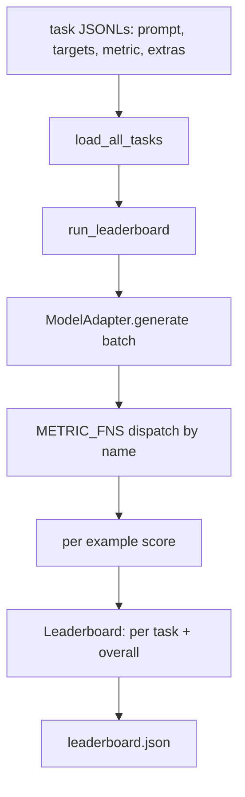
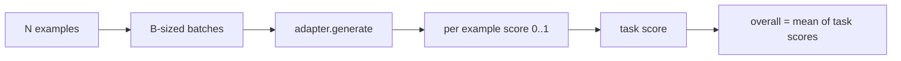

# Language Model Evaluation Harness

> A model that does well on a task you cannot define is a model that does well by accident. The harness is the task definition, the metric, the runner, and the leaderboard, in one short, swappable shape.

**Type:** Build
**Languages:** Python
**Prerequisites:** Phase 19 lessons 42 to 45
**Time:** ~90 minutes

## Learning Objectives

- Define a task as a JSONL file with `prompt`, `targets`, `metric`, and optional `extras` per example.
- Implement five metrics: exact match, rouge-l F1, executable check, multiple choice, and substring contains.
- Build a runner that batches examples per task and dispatches to a swappable model adapter.
- Emit a leaderboard JSON with per-task scores, latency, and an overall average that is reproducible.

## The Problem

A new language model lands every week. The marketing claim is that it does well. The honest question is: well at what? The honest answer is the leaderboard you wrote yourself, because the vendor's leaderboard is the one they tuned to.

Without a harness in your repo you compare two models by vibes. With a harness you compare them by score on a fixed task set with a fixed metric, on a JSON output you can diff. The harness is the contract between yesterday's run and today's run. Without it, regressions ship.

The trap is over-fitting the harness to a single model. The fix is the same trap in reverse: the harness is small enough to read in fifteen minutes, the tasks are small enough to ship in the repo, the metrics are written from scratch so a colleague can audit them, and the adapter is the only place model-specific code lives. Swap the adapter, the leaderboard moves; swap the tasks, the leaderboard moves. Nothing else should move.

## The Concept



### Task spec

Every example is one JSONL line:

```json
{"id": "arith-00", "prompt": "compute: 2 + 2", "targets": ["4"], "metric": "exact_match"}
```

For metrics that need scoring helpers, `extras` carries the side payload:

```json
{
  "id": "code-00",
  "prompt": "python: write a function f that doubles its input",
  "targets": ["ok"],
  "metric": "code_exec",
  "extras": {"io_pairs": [[1, 2], [3, 6]]}
}
```

A task is a `.jsonl` file under `outputs/tasks/`. The file name is the task name. All examples in a file share a metric.

### The five fixture tasks

| Task | Metric | What it tests |
|------|--------|---------------|
| arithmetic | exact_match | Token-level correctness on a deterministic answer |
| summary | rouge_l | Longest common subsequence F1 against a one-line reference summary |
| code-exec | code_exec | Executable test: the predicted function must satisfy a list of input-output pairs |
| multiple-choice | multiple_choice | First letter of the prediction must match an allowed letter |
| generation | substring_contains | Free-form text must contain at least one target substring |

### The metric contract

Every metric is a function from `(prediction, targets, extras) -> float in [0.0, 1.0]`. The harness averages the per-example scores to get a task score, then averages task scores to get the overall. The metric functions are tiny:

- `exact_match`: lowercase, collapse whitespace, equality.
- `substring_contains`: same normalization, substring test.
- `multiple_choice`: first character uppercased.
- `rouge_l`: LCS length divided by lengths of prediction and reference, F1 of precision and recall.
- `code_exec`: execute the prediction in a restricted namespace, call `f(x)` on every input-output pair, count matches.

The code_exec metric runs the prediction in a stripped builtins namespace. The lesson's test asserts that `import os` blows up because `os` is not in the namespace; you cannot reach the filesystem from a code prediction.

The naive rouge-l below treats the prediction and reference as unordered bags of words — it can't tell "the cat sat on the mat" from "the mat sat on the cat". Fix it with a real longest-common-subsequence.

```python fillin
def naive_rouge_l(pred, ref):
    p_tokens = pred.lower().split()
    r_tokens = ref.lower().split()
    overlap = len(set(p_tokens) & set(r_tokens))  # unordered set overlap, ignores order
    precision = overlap / len(p_tokens) if p_tokens else 0.0
    recall = overlap / len(r_tokens) if r_tokens else 0.0
    return 2 * precision * recall / (precision + recall) if (precision + recall) else 0.0

pred = "the cat sat on the mat"
ref = "the mat sat on the cat"  # same bag of words, different order/meaning

print("naive:", naive_rouge_l(pred, ref))

def lcs_length(a, b):
    m, n = len(a), len(b)
    dp = [[0] * (n + 1) for _ in range(m + 1)]
    for i in range(1, m + 1):
        for j in range(1, n + 1):
            if a[i - 1] == b[j - 1]:
                dp[i][j] = dp[i - 1][j - 1] + {{blank:1}}
            else:
                dp[i][j] = max({{blank:dp[i - 1][j]}}, dp[i][j - 1])
    return dp[m][n]

def rouge_l(pred, ref):
    p_tokens = pred.lower().split()
    r_tokens = ref.lower().split()
    lcs = lcs_length(p_tokens, r_tokens)
    precision = lcs / len(p_tokens) if p_tokens else 0.0
    recall = lcs / len(r_tokens) if r_tokens else 0.0
    return 2 * precision * recall / (precision + recall) if (precision + recall) else 0.0

result = rouge_l(pred, ref)
expected = 4 / 6
if abs(result - expected) < 1e-9:
    print("PASS")
else:
    print("WRONG:", result)
```

### The model adapter

```python
class ModelAdapter(Protocol):
    def generate(self, prompts: Sequence[str]) -> List[str]: ...
    @property
    def name(self) -> str: ...
```

The adapter is the seam. The lesson ships `ToyAdapter`, a deterministic pattern matcher that returns the right answer for every prompt in the five fixture tasks. A real adapter calls the model and returns its output. The harness does not care which.

### The runner

`run_task` batches `batch_size` prompts at a time and dispatches to the metric function. `run_leaderboard` walks every task and averages. `write_leaderboard` emits JSON with a schema string so future format changes do not silently break dashboards.




## Build It

Reconstruct **Language Model Evaluation Harness** by following `Example` on the text "red fox". Run `python3 main.py` and verify that the tokenizer/retriever reports zero or a clear empty-input result, rather than borrowing a result from the previous text.

## Use It

Call `Example` from a small caller with the text "red fox". Compare its result with the demo output, and record the input contract and the one field a downstream user should rely on.

## Ship It

Hand off `outputs/leaderboard.json` with the command `python3 main.py`, the accepted input shape (the text "red fox"), the expected observable result, and a failure note for malformed inputs.

## Further Reading

- The original lm-evaluation-harness for the production reference, much larger but the same shape.
- HuggingFace's lighteval for an alternative implementation of the same contract.
- Phase 19 lesson 46 covers the gradient accumulation patterns used in the training stack the harness scores.
- Phase 19 lesson 47 covers the checkpoint format you score against; pin the checkpoint hash in the leaderboard.
- Phase 19 lesson 48 covers the distributed training stack that produced the model under test.

## Exercises

Work from the smallest fixture that the Language Model Evaluation Harness demo already understands, then make one deliberate change and record what moved.

1. **Run the smallest fixture.** From `code/`, run `python3 main.py` using the text "red fox". Follow `Example`, `TaskResult`, `Leaderboard`. Expect the tokenizer/retriever reports zero or a clear empty-input result, rather than borrowing a result from the previous text; capture the first printed shape, metric, status, or summary field and state which part supports **Define a task as a JSONL file with `prompt`, `targets`, `metric`, and optional `extras` per example.**.
2. **Perturb one field.** Repeat the command after changing only the input text: use the text "red fox runs". Predict the direction of the change, then compare the two output values. Explain why **Implement five metrics: exact match, rouge-l F1, executable check, multiple choice, and substring contains.** says the other inputs should stay fixed.
3. **Check the failure boundary.** Feed the implementation an empty string. Before running it, write down whether the relevant function should return an empty value, a zero-sized result, or a validation error. Check the observed status against **Build a runner that batches examples per task and dispatches to a swappable model adapter.** and record the exception text if the code rejects the case.
4. **Make the result repeatable.** Open `outputs/leaderboard.json` and add a worked example using the text "red fox". Include the input contract, one expected output field, and a named acceptance check for **Emit a leaderboard JSON with per-task scores, latency, and an overall average that is reproducible.**; note what the demo cannot establish.

## Reference Solution

A checkable result for **Language Model Evaluation Harness** should contain:

- the `python3 main.py` output for the text "red fox", with `Example`, `TaskResult`, `Leaderboard` traced to the value or shape that supports **Define a task as a JSONL file with `prompt`, `targets`, `metric`, and optional `extras` per example.**;
- a before/after comparison for the input text, where the text "red fox runs" changes the observation in the direction predicted by **Implement five metrics: exact match, rouge-l F1, executable check, multiple choice, and substring contains.**;
- a recorded result for an empty string that matches the implementation’s validation or empty-result contract and explains the evidence for **Build a runner that batches examples per task and dispatches to a swappable model adapter.**; and
- an updated `outputs/leaderboard.json` example with a concrete input, expected output field, and acceptance check tied to **Emit a leaderboard JSON with per-task scores, latency, and an overall average that is reproducible.**.

Run the lesson tests after the demo. If the boundary behaves differently from the prediction, keep the actual exception or output and explain the implementation path that produced it.
