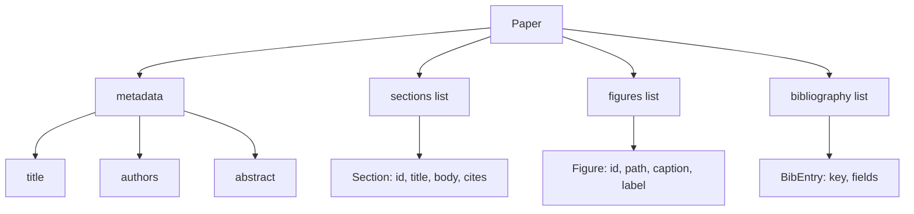
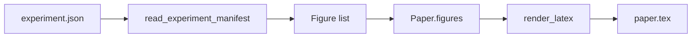
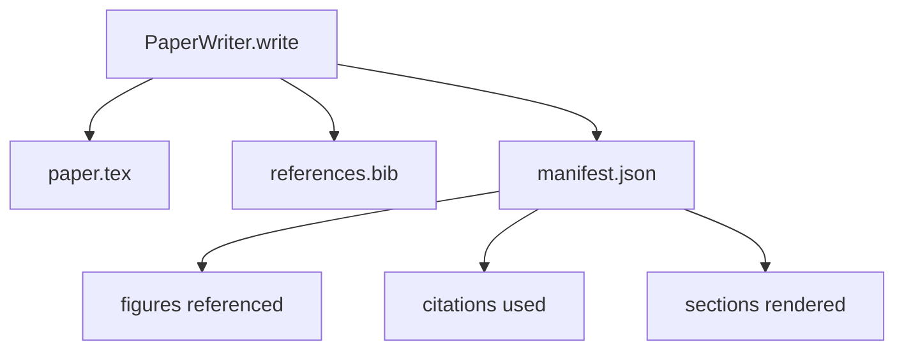

# Paper Writer

> A LaTeX skeleton is a contract between the researcher and the typesetter. If the contract is broken the document does not compile, and the failure is loud. Build the skeleton first, then fill it.

**Type:** Build
**Languages:** Python
**Prerequisites:** Phase 19 lessons 50-53
**Time:** ~90 minutes

## Learning Objectives

- Treat a research paper as a structured artifact with a known section graph, not a freeform document.
- Generate a LaTeX skeleton that declares its abstract, sections, figure slots, and bibliography keys before any prose is written.
- Inject figures from experiment outputs (paths and captions) into the skeleton through a deterministic slot mechanism.
- Wire a mocked prose generator that fills each section from a structured outline so the harness is testable without a model.
- Emit a single `paper.tex` plus a `references.bib` plus a manifest that lists every figure referenced and every citation used.

## Why a skeleton first

A draft that starts as prose accumulates structural debt. The introduction grows three paragraphs that should be in related work. A figure gets referenced before it is defined. The bibliography ends up with three keys for the same paper. By the time the author notices, the rewriting cost is higher than the writing cost.

A skeleton inverts that. The structure is declared up front as data. Sections are slots with names and order. Figures are slots with ids and captions. Bibliography keys are declared at the top with the entries they point at. Prose is generated into those slots one at a time. The harness can validate, before any prose is written, that every figure has a slot, every citation has an entry, and every section appears in the table of contents.

This is the same discipline that earlier lessons applied to plans, tool calls, and traces. The structure is the contract.

## The Paper shape

Every field is plain Python data. The renderer is a pure function from `Paper` to a LaTeX string. The harness can introspect the paper before rendering: count sections, list missing figure files, check that every `\cite{key}` has a matching `BibEntry`.

## The render contract

The renderer guarantees three properties. First, every figure slot in the skeleton emits a `\begin{figure}` block with a stable label of the form `fig:<id>`. Second, every section emits a `\section{}` with a stable label of the form `sec:<id>` so cross-references work. Third, the bibliography emits a `\bibliography` block whose `references.bib` contains exactly the entries declared on the paper, no more and no fewer.

Violating any of these is a render error, not a warning. The skeleton is the contract; a render that silently drops a figure is a contract break.

## Figure injection from experiments

The earlier lessons in this track produced experiment outputs as JSON manifests. Each manifest carries a list of artifacts with paths and short captions. The paper writer reads that manifest and produces `Figure` records.

The injection is deterministic. Figure ids are derived from the experiment name plus a monotonic counter. Captions come from the manifest. Paths are normalised relative to the paper's output directory so the LaTeX compiles even when the experiment outputs sit elsewhere on disk.

## The mocked prose generator

The lesson does not call a model. A `MockProseGenerator` reads an outline shape and emits prose deterministically. The outline shape is one short string per section. The generator expands that string into two short paragraphs with the section title woven in. The generated prose name-drops figures and citations exactly when the outline declares them.

This is enough to test every behaviour of the writer. A real implementation would swap the generator for a model call. The harness around it does not change. That is the value of declaring the prose generator as a callable: the test substitutes a deterministic one, production substitutes a model one, the rest of the pipeline is identical.

## The manifest output

The writer emits three files into the output directory.

The manifest is what a downstream evaluator or critic loop reads. It does not parse LaTeX; it reads the manifest. The next lesson, the critic loop, takes this manifest as input and produces a feedback list. That is why the manifest is part of the contract and the LaTeX is not.

## Validation gates

The writer runs four gates before writing any file.

1. Every figure id is unique within the paper.
2. Every section's `cites` field references a bibliography key that is declared on the paper.
3. The abstract is non-empty.
4. The title is non-empty.

A failed gate raises `PaperValidationError` with a precise reason. The harness surfaces the reason as the failure mode. There is no partial write: either all three files are emitted, or none.

## How to read the code

`code/main.py` defines `Paper`, `Section`, `Figure`, `BibEntry`, `PaperValidationError`, `MockProseGenerator`, `PaperWriter`, and a `render_latex` function. The `write` method takes an output directory and emits `paper.tex`, `references.bib`, and `manifest.json`. The `read_experiment_manifest` helper converts a list of experiment manifests into `Figure` records.

`code/tests/test_paper_writer.py` covers: skeleton render with no sections, full render with two sections and two figures, missing-citation gate, duplicate-figure-id gate, manifest content, and the LaTeX-string contract (every section emits a `\section{}`, every figure emits a `\begin{figure}`).

## Going further

Two extensions a real implementation will want. First, multi-format render: the same `Paper` shape compiles to Markdown for blog posts and HTML for previews. The renderer becomes a strategy on `Paper`. Second, citation enrichment: the writer fetches BibTeX entries from a citation key, given a local cache of DOIs. Both add value, both can be added without touching the skeleton contract.

The skeleton is the bet. Sections, figures, and citations declared as data, prose generated into slots, manifest emitted alongside the LaTeX. Every other improvement composes on top.

## Build It

Reconstruct **Paper Writer** by following `PaperValidationError` on the text "red fox". Run `python3 main.py` and verify that the tokenizer/retriever reports zero or a clear empty-input result, rather than borrowing a result from the previous text.

## Use It

Call `PaperValidationError` from a small caller with the text "red fox". Compare its result with the demo output, and record the input contract and the one field a downstream user should rely on.

## Ship It

Hand off `outputs/artifact-card.md` with the command `python3 main.py`, the accepted input shape (the text "red fox"), the expected observable result, and a failure note for malformed inputs.

## Exercises

Use `PaperValidationError` as the trace: start from the text "red fox", keep the raw output, and tie each observation to a named objective.

1. **Reproduce the reference path.** From `code/`, run `python3 main.py` using the text "red fox". Follow `PaperValidationError`, `BibEntry`, `to_bibtex`. Expect the tokenizer/retriever reports zero or a clear empty-input result, rather than borrowing a result from the previous text; capture the first printed shape, metric, status, or summary field and state which part supports **Treat a research paper as a structured artifact with a known section graph, not a freeform document.**.
2. **Vary one named input.** Repeat the command after changing only the input text: use the text "red fox runs". Predict the direction of the change, then compare the two output values. Explain why **Generate a LaTeX skeleton that declares its abstract, sections, figure slots, and bibliography keys before any prose is written.** says the other inputs should stay fixed.
3. **Probe the empty case.** Feed the implementation an empty string. Before running it, write down whether the relevant function should return an empty value, a zero-sized result, or a validation error. Check the observed status against **Inject figures from experiment outputs (paths and captions) into the skeleton through a deterministic slot mechanism.** and record the exception text if the code rejects the case.
4. **Package a usable handoff.** Open `outputs/artifact-card.md` and add a worked example using the text "red fox". Include the input contract, one expected output field, and a named acceptance check for **Wire a mocked prose generator that fills each section from a structured outline so the harness is testable without a model.**; note what the demo cannot establish.

## Reference Solution

A checkable result for **Paper Writer** should contain:

- the `python3 main.py` output for the text "red fox", with `PaperValidationError`, `BibEntry`, `to_bibtex` traced to the value or shape that supports **Treat a research paper as a structured artifact with a known section graph, not a freeform document.**;
- a before/after comparison for the input text, where the text "red fox runs" changes the observation in the direction predicted by **Generate a LaTeX skeleton that declares its abstract, sections, figure slots, and bibliography keys before any prose is written.**;
- a recorded result for an empty string that matches the implementation’s validation or empty-result contract and explains the evidence for **Inject figures from experiment outputs (paths and captions) into the skeleton through a deterministic slot mechanism.**; and
- an updated `outputs/artifact-card.md` example with a concrete input, expected output field, and acceptance check tied to **Wire a mocked prose generator that fills each section from a structured outline so the harness is testable without a model.**.

Run the lesson tests after the demo. If the boundary behaves differently from the prediction, keep the actual exception or output and explain the implementation path that produced it.
