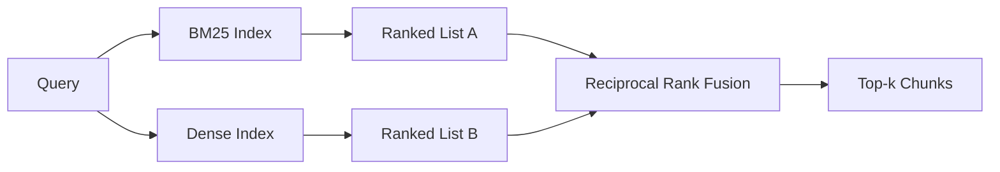

# Hybrid Retrieval with BM25 and Dense Embeddings

> Lexical and semantic retrieval fail on opposite query distributions. Hybrid retrieval with reciprocal rank fusion does not interpolate, it votes - and the vote wins on every query class.

**Type:** Build
**Languages:** Python
**Prerequisites:** Phase 11 lessons 04 (embeddings), 06 (RAG); Phase 19 Track B foundations (lessons 20-29); Phase 19 lesson 64 (chunking strategies)
**Time:** ~90 minutes

## Learning Objectives
- Implement BM25 from scratch from the Robertson and Sparck Jones formulation, with field weighting, document length normalization, and tunable k1 and b.
- Build a dense retriever on top of a deterministic mock embedding so the loop runs offline.
- Implement reciprocal rank fusion exactly as Cormack, Clarke, and Buettcher published it in 2009, and explain why it dominates score-weighted interpolation.
- Tune the RRF k constant and the per-modality weights and read the trade-offs on a small fixture corpus.

## The Problem

Lexical search wins when the query carries a literal identifier the corpus contains verbatim. A query for `AbortMultipartOnFail` returns the right Go function via BM25 in microseconds. The same query, embedded, sits at the boundary of three similarity clusters and a dense retriever ranks the wrong file first.

Dense search wins when the query is paraphrased away from the corpus's literal tokens. A user asking "how do we handle cancelled uploads" never typed the word abort or multipart. BM25 returns the documentation chunk on "uploading large files" because that page contains the word uploads. Dense retrieval finds the abort function whose summary mentions cancellation.

The choice between the two is not a static one. The query distribution is the variable. A production RAG system handles both classes from the same endpoint, so retrieval has to handle both at once. That is hybrid retrieval. The merge step is the part that has to be right.

## The Concept

### BM25 in one paragraph

BM25 scores a query-document pair by summing, over query terms, an inverse document frequency factor multiplied by a saturating term-frequency factor that includes a length-normalization correction. Two knobs. `k1` controls term-frequency saturation; the default 1.5 is the published recommendation and you should not move it without a benchmark. `b` controls how much document length matters; the default 0.75 says longer documents are penalized, but not linearly.

The IDF formula uses the smoothed Robertson and Sparck Jones definition, which is `log((N - df + 0.5) / (df + 0.5) + 1)`. The plus-one inside the log keeps the IDF positive when a term appears in more than half the corpus. This matters in small corpora where stopwords are technically rare.

Field weighting lets you tell BM25 that a match on the symbol name counts more than a match in the body. Implementation is a multiplier on the term counts during indexing, not at scoring time. That keeps the math identical and avoids a separate score per field.

### Dense retrieval in one paragraph

Embed each chunk into a fixed-dimension vector with an embedding model. At query time, embed the query, cosine-rank every chunk by similarity, and return the top-k. The model is the variable that decides quality. The retrieval algorithm itself is two lines: dot product and sort.

This lesson uses a deterministic hash-based embedding so you can read the fusion math without a network call. The hash sums token-keyed offsets into a 96-dimensional vector and normalizes. The cosine ranks are deterministic across runs, which is what the test suite requires.

### Reciprocal rank fusion, the published formula

Two ranked lists. For each candidate that appears in either list, sum its reciprocal-rank contributions. The 2009 paper used `1 / (k + rank)` with k equal to 60 as the default. Sort by total score. That is the whole algorithm.

The published constant k = 60 is not arbitrary. With k = 60 the rank-1 contribution is 1 / 61 and the rank-10 contribution is 1 / 70. The contribution decays slowly so deep candidates still vote. Smaller k makes the top results dominate. Larger k flattens the contribution curve.

Two tunable knobs in our implementation. The `k` constant. A pair of per-modality weights so you can boost BM25 or dense when you have prior evidence one is better on your corpus. Multiplying the rank contribution by the weight is the simplest principled implementation; it preserves the rank-decay shape and stays scale-free.

### Why fusion beats score-weighted interpolation

BM25 scores are unbounded and corpus-dependent. Cosine similarities are bounded in -1 to 1. A linear combination `alpha * bm25 + (1 - alpha) * cosine` requires per-corpus alpha tuning and breaks every time you reindex. The rank-based fusion does not. Two ranks are comparable across modalities. The published RRF baseline beats score-interpolation in every public TREC track since 2010.

This is the same argument you hear about RankFusion vs RRF in Vespa and Weaviate documentation. They came to the same conclusion: stay rank-based unless you have very strong evidence to interpolate scores.

## Build It

Reconstruct **Hybrid Retrieval with BM25 and Dense Embeddings** by following `Doc` on tokens=["red","fox"]. Run `python3 main.py` and verify that the attention/embedding shape follows the token count and each valid attention row remains normalized.

## Use It

Call `Doc` from a small caller with tokens=["red","fox"]. Compare its result with the demo output, and record the input contract and the one field a downstream user should rely on.

## Ship It

Hand off `outputs/artifact-card.md` with the command `python3 main.py`, the accepted input shape (tokens=["red","fox"]), the expected observable result, and a failure note for malformed inputs.

## Further Reading

- Cormack, Clarke, Buettcher, "Reciprocal Rank Fusion outperforms Condorcet and individual rank learning methods", SIGIR 2009
- Robertson, Walker, Beaulieu, Gatford, Payne, "Okapi at TREC-3" (the original BM25 paper)
- [Vespa: Hybrid Retrieval with BM25 and Embeddings](https://docs.vespa.ai/en/tutorials/hybrid-search.html)
- [Weaviate: Hybrid Search](https://weaviate.io/developers/weaviate/search/hybrid)
- Phase 11 lesson 06 - RAG fundamentals
- Phase 19 lesson 64 - chunkers whose output is indexed here
- Phase 19 lesson 66 - cross-encoder reranker that consumes the fused top-k

## Exercises

This lab follows `Doc` and `field_text` on a controlled fixture; write down the value before changing the input.

1. **Trace the canonical fixture.** From `code/`, run `python3 main.py` using tokens=["red","fox"]. Follow `Doc`, `field_text`, `tokenize`. Expect the attention/embedding shape follows the token count and each valid attention row remains normalized; capture the first printed shape, metric, status, or summary field and state which part supports **Implement BM25 from scratch from the Robertson and Sparck Jones formulation, with field weighting, document length normalization, and tunable k1 and b.**.
2. **Change the controlled parameter.** Repeat the command after changing only the token sequence: use tokens=["red","fox","runs"]. Predict the direction of the change, then compare the two output values. Explain why **Build a dense retriever on top of a deterministic mock embedding so the loop runs offline.** says the other inputs should stay fixed.
3. **Exercise the guard.** Feed the implementation tokens=[]. Before running it, write down whether the relevant function should return an empty value, a zero-sized result, or a validation error. Check the observed status against **Implement reciprocal rank fusion exactly as Cormack, Clarke, and Buettcher published it in 2009, and explain why it dominates score-weighted interpolation.** and record the exception text if the code rejects the case.
4. **Prepare the artifact for reuse.** Open `outputs/artifact-card.md` and add a worked example using tokens=["red","fox"]. Include the input contract, one expected output field, and a named acceptance check for **Tune the RRF k constant and the per-modality weights and read the trade-offs on a small fixture corpus.**; note what the demo cannot establish.

## Reference Solution

A checkable result for **Hybrid Retrieval with BM25 and Dense Embeddings** should contain:

- the `python3 main.py` output for tokens=["red","fox"], with `Doc`, `field_text`, `tokenize` traced to the value or shape that supports **Implement BM25 from scratch from the Robertson and Sparck Jones formulation, with field weighting, document length normalization, and tunable k1 and b.**;
- a before/after comparison for the token sequence, where tokens=["red","fox","runs"] changes the observation in the direction predicted by **Build a dense retriever on top of a deterministic mock embedding so the loop runs offline.**;
- a recorded result for tokens=[] that matches the implementation’s validation or empty-result contract and explains the evidence for **Implement reciprocal rank fusion exactly as Cormack, Clarke, and Buettcher published it in 2009, and explain why it dominates score-weighted interpolation.**; and
- an updated `outputs/artifact-card.md` example with a concrete input, expected output field, and acceptance check tied to **Tune the RRF k constant and the per-modality weights and read the trade-offs on a small fixture corpus.**.

Run the lesson tests after the demo. If the boundary behaves differently from the prediction, keep the actual exception or output and explain the implementation path that produced it.
