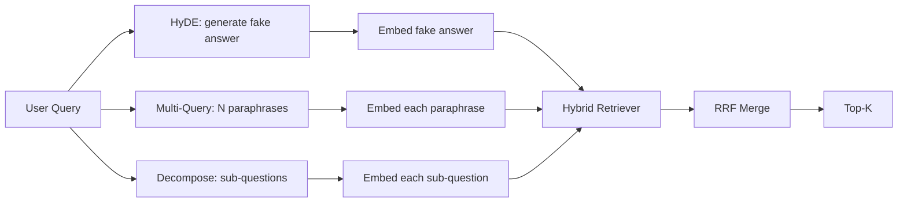

# Query Rewriting: HyDE, Multi-Query, and Decomposition

> The query the user types is not the query your retriever wants. Rewriting bridges the gap before retrieval, so the index sees something closer to what the answer looks like.

**Type:** Build
**Languages:** Python
**Prerequisites:** Phase 11 lessons 04 (embeddings), 06 (RAG); Phase 19 Track B foundations (lessons 20-29); Phase 19 lessons 64 and 65
**Time:** ~90 minutes

## Learning Objectives
- Implement Hypothetical Document Embeddings (HyDE): generate a fake answer, embed it, retrieve against that vector instead of the query vector.
- Implement multi-query expansion: rewrite one query into N paraphrases, retrieve with each, merge the union by reciprocal rank fusion.
- Implement query decomposition: split a complex question into sub-questions, retrieve per sub-question, merge.
- Compare the three rewriters head to head on a fixture and explain when each strategy wins.
- Wire a mock LLM that produces deterministic, on-fixture outputs so the rewriter loop runs offline.

## The Problem

A user types "what does our team do when uploads fail and the budget is gone?". The corpus contains a doc that says "AbortMultipartOnFail aborts an in-flight S3 multipart upload and decrements the per-bucket retry budget when the upload fails". The query and the document do not share a noun phrase. BM25 misses. The bi-encoder ranks the document third or fourth because the query vector lands in a region of the embedding space that prefers the doc about cancelled jobs, not the doc about aborted uploads. The two-stage rerank from lesson 66 can salvage the answer if it sits in the top-N, but if it does not even reach top-N, the reranker never sees it.

The fix is to rewrite the query before it touches the retriever. The 2023 paper "Precise Zero-Shot Dense Retrieval without Relevance Labels" (Gao et al.) introduced HyDE: ask an LLM to write the document that would answer the query, embed that hypothetical document, and use its embedding as the retrieval vector. The hypothetical document sits in the right region of the embedding space because it is written in the corpus's voice. The query vector did not.

Two cousin techniques pair with HyDE. Multi-query expansion (the term Microsoft's GraphRAG used) generates N paraphrases of the query and retrieves with each, then merges. Decomposition (popularized as "subquery decomposition" in the 2024 Stanford DSPy work) splits "what does our team do when uploads fail and the budget is gone" into two questions: "what happens when an upload fails" and "what happens when the retry budget is gone". Two retrievals, one merged result, both pieces of the answer reachable.

This lesson implements all three and runs them against the same fixture corpus.

## The Concept



### HyDE in detail

HyDE replaces the user's query vector with an LLM-written hypothetical document vector. The prompt is short:

```
You are a domain expert. Write a one-paragraph passage that answers the question
below. Use the same vocabulary and phrasing the documentation in this domain would
use. Do not refuse. Do not say you do not know.

Question: {user_query}

Passage:
```

The LLM's answer is wrong as a factual answer because the LLM does not know your corpus. That is fine. The retriever does not care about factual correctness, only about token distribution. The hypothetical passage contains the words "abort", "multipart", "bucket", "budget", because that is what a documentation passage on this topic would say. Embed that passage. The vector lands near the real passage.

In production you cap the hypothetical document to two or three sentences. Longer hypotheticals collect more noise. Shorter ones lose the lexical signal HyDE needs.

### Multi-query expansion in detail

Generate N paraphrases of the user's query. The simplest prompt:

```
Rewrite the following question in {N} different ways. Each rewrite must preserve
the original intent. Number them 1 to {N}. Do not add explanations.
```

Retrieve top-k for each paraphrase. Merge the N ranked lists with RRF (the same algorithm from lesson 65). Cheap, parallel, deterministic.

Multi-query wins when the user's phrasing is one of many equally valid ways to ask the question, and any of the rewrites would have asked it better. Loses when all rewrites are equally bad because the original was bad in the same way.

### Decomposition in detail

A single retrieval cannot satisfy a multi-faceted question. Decomposition asks the LLM to split the question into sub-questions and the system retrieves per sub-question. The prompt:

```
The following question may require information from multiple distinct topics.
Decompose it into a list of sub-questions. Each sub-question must be answerable
independently. If the question is already atomic, return it unchanged.

Question: {user_query}
```

Retrieve per sub-question. Merge. Decomposition is the right tool for questions that contain conjunctions, multi-clause comparisons, or two unrelated topics. Wrong tool for atomic questions; the decomposer's job there is to return the single question and not invent fake sub-questions.

### Why all three exist

The three are complementary. HyDE bridges the query-corpus token gap. Multi-query covers paraphrase variance. Decomposition covers multi-topic queries. A production system runs all three and picks the strategy per query (lesson 69's end-to-end system shows the selector).

## The Mock LLM

The lesson runs offline. The mock LLM is a small lookup table keyed on the user's query, plus a fallback for queries it has not seen. The lookup table contains:

- For each fixture query: a written hypothetical passage, three paraphrases, and a decomposition.
- For an unknown query: a deterministic transformation: take the query's content words, expand them through a synonym map, and return the result.

The shape of the mock is what matters, not the data. In production you swap the mock for a real model call. The retriever does not change.


## Build It

Reconstruct **Query Rewriting: HyDE, Multi-Query, and Decomposition** by following `tokenize` on tokens=["red","fox"]. Run `python3 main.py` and verify that the attention/embedding shape follows the token count and each valid attention row remains normalized.

## Use It

Call `tokenize` from a small caller with tokens=["red","fox"]. Compare its result with the demo output, and record the input contract and the one field a downstream user should rely on.

## Ship It

Hand off `outputs/artifact-card.md` with the command `python3 main.py`, the accepted input shape (tokens=["red","fox"]), the expected observable result, and a failure note for malformed inputs.

## Further Reading

- Gao, Ma, Lin, Callan, "Precise Zero-Shot Dense Retrieval without Relevance Labels" (HyDE), 2023
- Microsoft Research, "Multi-Query Expansion for Retrieval"
- Stanford DSPy, "Subquery Decomposition for Multi-Hop QA"
- [LlamaIndex query transformations documentation](https://docs.llamaindex.ai/en/stable/optimizing/advanced_retrieval/query_transformations/)
- Phase 11 lesson 07 - advanced RAG patterns
- Phase 19 lesson 65 - the retriever this rewriter feeds
- Phase 19 lesson 68 - the eval that measures the rewriter lift

## Exercises

Work from the smallest fixture that the Query Rewriting: HyDE, Multi-Query, and Decomposition demo already understands, then make one deliberate change and record what moved.

1. **Run the smallest fixture.** From `code/`, run `python3 main.py` using tokens=["red","fox"]. Follow `tokenize`, `mock_embed`, `cosine`. Expect the attention/embedding shape follows the token count and each valid attention row remains normalized; capture the first printed shape, metric, status, or summary field and state which part supports **Implement Hypothetical Document Embeddings (HyDE): generate a fake answer, embed it, retrieve against that vector instead of the query vector.**.
2. **Perturb one field.** Repeat the command after changing only the token sequence: use tokens=["red","fox","runs"]. Predict the direction of the change, then compare the two output values. Explain why **Implement multi-query expansion: rewrite one query into N paraphrases, retrieve with each, merge the union by reciprocal rank fusion.** says the other inputs should stay fixed.
3. **Check the failure boundary.** Feed the implementation tokens=[]. Before running it, write down whether the relevant function should return an empty value, a zero-sized result, or a validation error. Check the observed status against **Implement query decomposition: split a complex question into sub-questions, retrieve per sub-question, merge.** and record the exception text if the code rejects the case.
4. **Make the result repeatable.** Open `outputs/artifact-card.md` and add a worked example using tokens=["red","fox"]. Include the input contract, one expected output field, and a named acceptance check for **Compare the three rewriters head to head on a fixture and explain when each strategy wins.**; note what the demo cannot establish.

## Reference Solution

A checkable result for **Query Rewriting: HyDE, Multi-Query, and Decomposition** should contain:

- the `python3 main.py` output for tokens=["red","fox"], with `tokenize`, `mock_embed`, `cosine` traced to the value or shape that supports **Implement Hypothetical Document Embeddings (HyDE): generate a fake answer, embed it, retrieve against that vector instead of the query vector.**;
- a before/after comparison for the token sequence, where tokens=["red","fox","runs"] changes the observation in the direction predicted by **Implement multi-query expansion: rewrite one query into N paraphrases, retrieve with each, merge the union by reciprocal rank fusion.**;
- a recorded result for tokens=[] that matches the implementation’s validation or empty-result contract and explains the evidence for **Implement query decomposition: split a complex question into sub-questions, retrieve per sub-question, merge.**; and
- an updated `outputs/artifact-card.md` example with a concrete input, expected output field, and acceptance check tied to **Compare the three rewriters head to head on a fixture and explain when each strategy wins.**.

Run the lesson tests after the demo. If the boundary behaves differently from the prediction, keep the actual exception or output and explain the implementation path that produced it.
