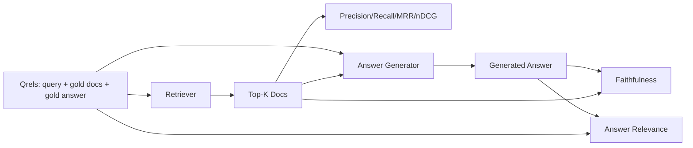

# RAG Evaluation: Precision, Recall, MRR, nDCG, Faithfulness, Answer Relevance

> If you cannot grade your retrieval and your answer at the same time, you cannot ship the system. The two are not the same metric and the same prompt fails on different axes.

**Type:** Build
**Languages:** Python
**Prerequisites:** Phase 11 lessons 06 (RAG), 10 (evaluation); Phase 19 Track B foundations (lessons 20-29); Phase 19 lessons 64, 65, 66, 67
**Time:** ~90 minutes

## Learning Objectives
- Compute four retrieval metrics from gold qrels: precision@k, recall@k, MRR (mean reciprocal rank), and nDCG@k.
- Compute two answer-grade metrics: faithfulness (every claim grounded in retrieved context) and answer relevance (the answer addresses the question).
- Build a fixture qrels file (queries, gold doc ids, gold answer text) that the eval reads end to end.
- Read the metric values to diagnose where a pipeline is failing: retrieval, ranking, generation, or grounding.

## The Problem

A RAG system has at least four moving parts: chunker, retriever, reranker, generator. Any of them can be the cause of a wrong answer. Without per-stage metrics you are flying blind.

A user reports a wrong answer. Is it because the chunker cut the answer span? Is it because the retriever did not include the chunk in top-k? Is it because the reranker pushed the right chunk past position one? Is it because the generator ignored the chunk and made something up? You cannot tell from the answer alone. You need:

- Retrieval metrics to grade what came out of the retriever.
- Ranking metrics to grade where the right chunk sat in the order.
- Faithfulness to grade whether the generator stayed inside the retrieved context.
- Answer relevance to grade whether the answer addresses the question at all.

This lesson builds all six on top of a fixture qrels file. The eval is offline and deterministic; in production you swap the mock LLM-as-judge for a real one.

## The Concept



### Precision@k

Of the top-k documents the retriever returned, what fraction are in the gold set? If gold has three documents and the top-3 returns two of them and one wrong one, precision@3 is 2 / 3. Use precision when the cost of an irrelevant retrieved chunk is high (the generator wastes tokens on it, or the chunk poisons the answer).

### Recall@k

Of the gold documents, what fraction are in the top-k? If gold has three documents and the top-5 contains all three, recall@5 is 1.0. Use recall when the cost of a missed answer is high (you would rather see one extra wrong chunk than miss the answer chunk entirely).

In production RAG the metric people usually quote is recall@k. Generation can drop irrelevant chunks easily; it cannot invent an answer from a chunk it never saw.

### MRR (Mean Reciprocal Rank)

For each query, find the position of the first relevant document in the ranked list. The reciprocal rank is 1 / position. Mean across the query set. MRR is a single-number summary of how well the retriever puts the best answer at the top.

MRR weights position-1 heavily. A query where the gold doc is at rank 1 contributes 1.0. Rank 2 contributes 0.5. Rank 10 contributes 0.1. The metric is dominated by the top of the list.

### nDCG@k

Normalized Discounted Cumulative Gain. The full formula assigns a gain to each retrieved document (often 1 for relevant, 0 for not), discounts by the log of the position, sums, and divides by the ideal DCG (the DCG you would have if you ranked perfectly). Range 0 to 1.

nDCG accommodates graded relevance: the gold can say "doc A is 3, doc B is 2, doc C is 1". MRR and recall@k flatten everything to binary. Use nDCG when the corpus has multiple partially-relevant documents per query.

### Faithfulness

For each claim in the generated answer, check whether the claim is supported by the retrieved context. The standard implementation uses an LLM-as-judge prompt that takes (claim, context) and returns yes or no. The metric is the fraction of claims that pass.

Faithfulness catches the generator failure mode where the model invents content. Even if the retriever returned the right chunks, a generator that hallucinates is broken. Faithfulness is also called groundedness, support, attribution.

This lesson implements faithfulness with a deterministic mock judge that checks whether each claim's tokens overlap the retrieved context by a threshold. In production you swap to a real model call. The shape of the metric is the same.

### Answer relevance

Does the answer actually address the question? Faithfulness asks "is the answer grounded in the context?". Answer relevance asks "is the answer grounded in the question?". A faithful but off-topic answer scores high on faithfulness and low on relevance. A short, on-topic answer that ignores the context scores high on relevance and low on faithfulness.

The standard implementation also uses LLM-as-judge: take (question, answer) and ask whether the answer addresses the question. This lesson implements a token-overlap-plus-judge stand-in.

## The fixture qrels

```python
{
  "qid": "q1",
  "query": "what is the abort threshold for multipart uploads",
  "gold_doc_ids": ["d1", "d3"],
  "gold_answer_substring": "three failed parts",
  "graded_relevance": {"d1": 3, "d3": 2},
}
```

Each query carries:
- the query string,
- a set of gold doc ids (for precision / recall / MRR),
- a graded relevance dict (for nDCG),
- the gold answer substring (kept as reference metadata on each qrel; faithfulness in this lesson is computed by judging extracted claims against the retrieved context, not against this substring).

In production you label these. This lesson ships a hand-built fixture so the eval runs out of the box.

## Use it

A metric that only asks "did the retriever find a gold doc anywhere?" cannot tell a great ranking from a barely-passing one. Fill in the four retrieval metrics below and watch them disagree with that naive check.

```python fillin
import math

gold_doc_ids = {"d1", "d3"}
ranked = ["d2", "d1", "d5", "d3", "d4"]  # a retriever's ranked top-5

def naive_found_any(ranked, gold):
    # naive: did the retriever return a gold doc ANYWHERE, at any rank?
    return 1.0 if any(d in gold for d in ranked) else 0.0

print("naive (rank-blind):", naive_found_any(ranked, gold_doc_ids))

def precision_at_k(ranked, gold, k):
    topk = ranked[:k]
    hits = sum(1 for d in topk if d in gold)
    return hits / {{blank:k}}

def recall_at_k(ranked, gold, k):
    topk = ranked[:k]
    hits = sum(1 for d in topk if d in gold)
    return hits / {{blank:len(gold)}}

def mrr(ranked, gold):
    for i, d in enumerate(ranked):
        if d in gold:
            return 1.0 / {{blank:(i + 1)}}
    return 0.0

def dcg_at_k(ranked, gold, k):
    total = 0.0
    for i, d in enumerate(ranked[:k]):
        if d in gold:
            total += 1.0 / math.log2(i + {{blank:2}})
    return total

def ndcg_at_k(ranked, gold, k):
    dcg = dcg_at_k(ranked, gold, k)
    ideal_order = list(gold) + [d for d in ranked if d not in gold]
    ideal = dcg_at_k(ideal_order, gold, k)
    return dcg / ideal if ideal > 0 else 0.0

p3 = precision_at_k(ranked, gold_doc_ids, 3)
r3 = recall_at_k(ranked, gold_doc_ids, 3)
m = mrr(ranked, gold_doc_ids)
n3 = ndcg_at_k(ranked, gold_doc_ids, 3)

expected = (1 / 3, 0.5, 0.5, 0.38685280723454163)
got = (p3, r3, m, n3)
if all(abs(a - b) < 1e-9 for a, b in zip(got, expected)):
    print("PASS")
else:
    print("WRONG:", got)
```

The naive check says 1.0 -- a gold doc showed up somewhere in the top-5, so it calls the retrieval a success. precision@3 (0.33), recall@3 (0.5), MRR (0.5), and nDCG@3 (0.39) all disagree: `d1` only reached rank 2 and `d3` fell outside the top-3 entirely, which is exactly the kind of ranking failure a rank-blind check can't see.


## Build It

Reconstruct **RAG Evaluation: Precision, Recall, MRR, nDCG, Faithfulness, Answer Relevance** by following `Qrel` on the text "red fox". Run `python3 main.py` and verify that the tokenizer/retriever reports zero or a clear empty-input result, rather than borrowing a result from the previous text.

## Use It

Call `Qrel` from a small caller with the text "red fox". Compare its result with the demo output, and record the input contract and the one field a downstream user should rely on.

## Ship It

Hand off `outputs/artifact-card.md` with the command `python3 main.py`, the accepted input shape (the text "red fox"), the expected observable result, and a failure note for malformed inputs.

## Further Reading

- Buckley, Voorhees, "Evaluating Evaluation Measure Stability", SIGIR 2000 - the canonical paper on ranking metrics
- Jarvelin, Kekalainen, "Cumulated Gain-based Evaluation of IR Techniques" - the nDCG paper
- [Ragas: Automated Evaluation of RAG Pipelines](https://docs.ragas.io)
- [Anthropic, Evaluating RAG](https://www.anthropic.com/news/evaluating-rag)
- Phase 11 lesson 10 - evaluation framework foundations
- Phase 19 lessons 64-67 - components evaluated here
- Phase 19 lesson 69 - the end-to-end pipeline this eval grades

## Exercises

Use `Qrel` as the trace: start from the text "red fox", keep the raw output, and tie each observation to a named objective.

1. **Reproduce the reference path.** From `code/`, run `python3 main.py` using the text "red fox". Follow `Qrel`, `precision_at_k`, `recall_at_k`. Expect the tokenizer/retriever reports zero or a clear empty-input result, rather than borrowing a result from the previous text; capture the first printed shape, metric, status, or summary field and state which part supports **Compute four retrieval metrics from gold qrels: precision@k, recall@k, MRR (mean reciprocal rank), and nDCG@k.**.
2. **Vary one named input.** Repeat the command after changing only the input text: use the text "red fox runs". Predict the direction of the change, then compare the two output values. Explain why **Compute two answer-grade metrics: faithfulness (every claim grounded in retrieved context) and answer relevance (the answer addresses the question).** says the other inputs should stay fixed.
3. **Probe the empty case.** Feed the implementation an empty string. Before running it, write down whether the relevant function should return an empty value, a zero-sized result, or a validation error. Check the observed status against **Build a fixture qrels file (queries, gold doc ids, gold answer text) that the eval reads end to end.** and record the exception text if the code rejects the case.
4. **Package a usable handoff.** Open `outputs/artifact-card.md` and add a worked example using the text "red fox". Include the input contract, one expected output field, and a named acceptance check for **Read the metric values to diagnose where a pipeline is failing: retrieval, ranking, generation, or grounding.**; note what the demo cannot establish.

## Reference Solution

A checkable result for **RAG Evaluation: Precision, Recall, MRR, nDCG, Faithfulness, Answer Relevance** should contain:

- the `python3 main.py` output for the text "red fox", with `Qrel`, `precision_at_k`, `recall_at_k` traced to the value or shape that supports **Compute four retrieval metrics from gold qrels: precision@k, recall@k, MRR (mean reciprocal rank), and nDCG@k.**;
- a before/after comparison for the input text, where the text "red fox runs" changes the observation in the direction predicted by **Compute two answer-grade metrics: faithfulness (every claim grounded in retrieved context) and answer relevance (the answer addresses the question).**;
- a recorded result for an empty string that matches the implementation’s validation or empty-result contract and explains the evidence for **Build a fixture qrels file (queries, gold doc ids, gold answer text) that the eval reads end to end.**; and
- an updated `outputs/artifact-card.md` example with a concrete input, expected output field, and acceptance check tied to **Read the metric values to diagnose where a pipeline is failing: retrieval, ranking, generation, or grounding.**.

Run the lesson tests after the demo. If the boundary behaves differently from the prediction, keep the actual exception or output and explain the implementation path that produced it.
