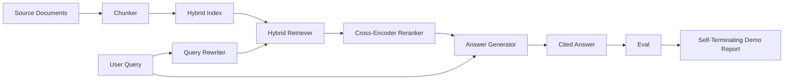

# End-to-End RAG System

> Six lessons of components. One pipeline. One eval loop. One self-terminating demo. This is the system you ship.

**Type:** Build
**Languages:** Python
**Prerequisites:** Phase 11 lessons 06 (RAG), 10 (evaluation); Phase 19 Track B foundations (lessons 20-29); Phase 19 lessons 64, 65, 66, 67, 68
**Time:** ~90 minutes

## Learning Objectives
- Compose the chunker, hybrid retriever, query rewriter, cross-encoder reranker, and answer generator into a single end-to-end pipeline.
- Implement an answer generator that cites its claims by chunk anchor, with refuse-on-low-confidence fallback.
- Run the lesson 68 eval against the assembled pipeline and prove the staged build wins on every metric over the same components in isolation.
- Build a self-terminating CLI demo that ingests a fixture corpus, runs a fixed query set, and exits zero with a summary report.

## The Problem

Six components in isolation prove nothing. The chunker can win on recall@5 against the corpus and lose on the system's recall@5 because the retriever cannot rank what the chunker emits. The reranker can lift MRR on a synthetic candidate pool and fail on real bi-encoder candidates because the bi-encoder's recall at the rerank budget is too low. The query rewriter can promote the gold doc on a single query and break on the next because the LLM mock returns a degenerate hypothetical.

The integration test is the whole pipeline run end to end against the same fixture qrels, with the same metric, with one orchestrator file that wires everything together. That is what this lesson builds. If the metrics on the integrated pipeline beat the metrics on each stage's isolated demo, you have proven the system.

## The Concept



### Wiring choices

The pipeline is a small graph. Each stage is a function with a clear signature.

| Stage | Input | Output |
|-------|-------|--------|
| Chunker | Document text | List of Chunk records |
| Retriever | Query string | Top-N Chunk records |
| Rewriter (optional) | Query string | List of rewrites + hypothetical |
| Reranker | Query, candidates | Top-K Chunk records with cross scores |
| Generator | Query, top-K Chunk records | Answer string with citations |

The composition is straightforward when each signature is stable. The lesson's `Pipeline` class holds the five stages and a `query` method that runs them in order. Every stage is swappable: pass a different chunker, retriever, rewriter, reranker, or generator and the pipeline still runs.

### Answer generator with citations

The generator is the last stage and the easiest to break. The lesson ships a deterministic mock generator that:

1. Takes the top-K reranked chunks.
2. Selects up to two chunks whose text contains the highest content-token overlap with the query.
3. Emits an answer that is a concatenation of one-sentence-from-each-selected-chunk, with each sentence followed by a `[doc_id:chunk_index]` anchor.
4. If no chunk has overlap above a refuse threshold, emits "I do not know" with no citation.

In production you swap the mock for a real LLM call with the prompt template:

```
You are answering a question using only the snippets below.
Cite every claim with the anchor in parentheses.
If the snippets do not answer the question, say "I do not know".

Question: {query}

Snippets:
{enumerated chunks with anchors}

Answer:
```

The refuse-on-low-confidence path is the whole reason the cross-encoder rank-1 score is logged. If it sits below the corpus threshold, the generator refuses. This is the safety valve against hallucinated answers.

### The self-terminating demo

The demo runs everything end to end. It prints a per-stage breakdown of one query, runs the eval over the four fixture qrels, prints a metrics table, and exits with status zero if all the lesson 68 metrics meet the thresholds set in the demo. If any metric is below threshold, the demo exits with a non-zero status and a message naming the failing metric.

This is the shape a CI smoke test takes. The pipeline runs offline, fast, deterministic. The thresholds are deliberately tight on the fixture so a regression in any of the six lessons fails the demo.


## Build It

Reconstruct **End-to-End RAG System** by following `tokenize` on the text "red fox". Run `python3 main.py` and verify that the tokenizer/retriever reports zero or a clear empty-input result, rather than borrowing a result from the previous text.

## Use It

Call `tokenize` from a small caller with the text "red fox". Compare its result with the demo output, and record the input contract and the one field a downstream user should rely on.

## Ship It

Hand off `outputs/artifact-card.md` with the command `python3 main.py`, the accepted input shape (the text "red fox"), the expected observable result, and a failure note for malformed inputs.

## Further Reading

- [Anthropic, Building search and retrieval](https://www.anthropic.com/news/contextual-retrieval)
- [Pinterest, MCP internal search](https://medium.com/pinterest-engineering) - reference production architecture
- [Ragas: Automated Evaluation of RAG Pipelines](https://docs.ragas.io)
- Phase 11 lesson 06 - RAG fundamentals
- Phase 19 lessons 64-68 - the components composed here

## Exercises

This lab follows `tokenize` and `mock_embed` on a controlled fixture; write down the value before changing the input.

1. **Trace the canonical fixture.** From `code/`, run `python3 main.py` using the text "red fox". Follow `tokenize`, `mock_embed`, `cosine`. Expect the tokenizer/retriever reports zero or a clear empty-input result, rather than borrowing a result from the previous text; capture the first printed shape, metric, status, or summary field and state which part supports **Compose the chunker, hybrid retriever, query rewriter, cross-encoder reranker, and answer generator into a single end-to-end pipeline.**.
2. **Change the controlled parameter.** Repeat the command after changing only the input text: use the text "red fox runs". Predict the direction of the change, then compare the two output values. Explain why **Implement an answer generator that cites its claims by chunk anchor, with refuse-on-low-confidence fallback.** says the other inputs should stay fixed.
3. **Exercise the guard.** Feed the implementation an empty string. Before running it, write down whether the relevant function should return an empty value, a zero-sized result, or a validation error. Check the observed status against **Run the lesson 68 eval against the assembled pipeline and prove the staged build wins on every metric over the same components in isolation.** and record the exception text if the code rejects the case.
4. **Prepare the artifact for reuse.** Open `outputs/artifact-card.md` and add a worked example using the text "red fox". Include the input contract, one expected output field, and a named acceptance check for **Build a self-terminating CLI demo that ingests a fixture corpus, runs a fixed query set, and exits zero with a summary report.**; note what the demo cannot establish.

## Reference Solution

A checkable result for **End-to-End RAG System** should contain:

- the `python3 main.py` output for the text "red fox", with `tokenize`, `mock_embed`, `cosine` traced to the value or shape that supports **Compose the chunker, hybrid retriever, query rewriter, cross-encoder reranker, and answer generator into a single end-to-end pipeline.**;
- a before/after comparison for the input text, where the text "red fox runs" changes the observation in the direction predicted by **Implement an answer generator that cites its claims by chunk anchor, with refuse-on-low-confidence fallback.**;
- a recorded result for an empty string that matches the implementation’s validation or empty-result contract and explains the evidence for **Run the lesson 68 eval against the assembled pipeline and prove the staged build wins on every metric over the same components in isolation.**; and
- an updated `outputs/artifact-card.md` example with a concrete input, expected output field, and acceptance check tied to **Build a self-terminating CLI demo that ingests a fixture corpus, runs a fixed query set, and exits zero with a summary report.**.

Run the lesson tests after the demo. If the boundary behaves differently from the prediction, keep the actual exception or output and explain the implementation path that produced it.
