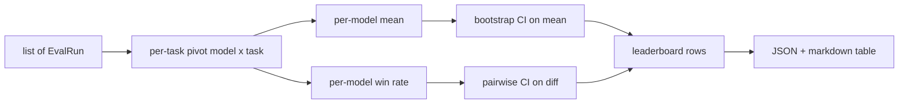
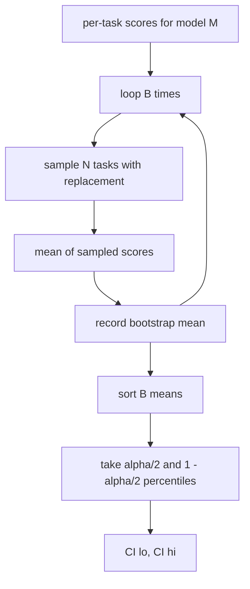

# Leaderboard Aggregation

> Per-task scores are easy. Per-model rankings across heterogeneous tasks are harder. Statistical significance on a thousand-prediction leaderboard is the part everyone skips. This lesson does not skip it.

**Type:** Build
**Languages:** Python
**Prerequisites:** Phase 19 Track B foundations, lessons 70, 71, 73
**Time:** ~90 min

## Learning Objectives

- Aggregate per-task scores across multiple models and multiple tasks into a tidy per-model row.
- Normalise heterogeneous scores so that pass rates and BLEU values do not over-influence the aggregate.
- Rank models by mean and by win-rate, and explain when each is the right summary.
- Compute bootstrap confidence intervals on the mean score per model and on pairwise differences.
- Output the leaderboard as a JSON report and as a markdown table the runner in lesson 75 can paste into a CI comment.

## The shape of input

The aggregator consumes a list of `EvalRun` records:

```python
@dataclass
class EvalRun:
    model_id: str
    task_id: str
    metric_name: str
    score: float          # in [0, 1]
    category: str
```

The runner in lesson 75 emits one record per `(model, task)` pair. The aggregator does not care how the score was produced. It expects normalisation to already have happened: every score is in `[0, 1]`.

## The output

Three tables come out:



The leaderboard row contains: `model_id`, `mean_score`, `mean_ci_lo`, `mean_ci_hi`, `win_rate`, `tasks_completed`, and an optional `categories` map for per-category mean.

## Normalisation

If one task scores in `[0, 1]` and another in `[0, 100]`, the second silently dominates the mean. The aggregator validates that every input score sits in `[0, 1]` and refuses the run otherwise. The fix lives upstream: the metric should already return a fraction. Lessons 71 to 73 enforce that contract.

## Mean and win-rate

The two ranking schemes serve different goals.

Mean score is the average of per-task scores for one model. It is the headline number leaderboards report. It is sensitive to outliers and to task imbalance.

Win-rate counts how often a model beats every other model on the same task. For each task, the model with the highest score wins (ties split). Win rate equals wins divided by the number of tasks where the model has a score. It is less sensitive to outliers and to scale differences but loses information.

```python
def win_rate(model_id, runs_by_task, all_models):
    wins, total = 0, 0
    for task_id, runs in runs_by_task.items():
        scores = {r.model_id: r.score for r in runs if r.model_id in all_models}
        if model_id not in scores:
            continue
        total += 1
        best = max(scores.values())
        if scores[model_id] >= best:
            wins += 1
    return wins / total if total else 0.0
```

The naive version below compares strictly greater than the max — which can never be true, since `best` is computed from the same scores. Fix the tie-handling.

```python fillin
def naive_win_rate(model_id, runs_by_task, all_models):
    wins, total = 0, 0
    for task_id, runs in runs_by_task.items():
        scores = {r["model_id"]: r["score"] for r in runs if r["model_id"] in all_models}
        if model_id not in scores:
            continue
        total += 1
        best = max(scores.values())
        if scores[model_id] > best:  # never true, best IS the max
            wins += 1
    return wins / total if total else 0.0

runs_by_task = {
    "task1": [{"model_id": "gpt", "score": 0.9}, {"model_id": "claude", "score": 0.8}, {"model_id": "random", "score": 0.1}],
    "task2": [{"model_id": "gpt", "score": 0.5}, {"model_id": "claude", "score": 0.5}, {"model_id": "random", "score": 0.1}],
    "task3": [{"model_id": "gpt", "score": 0.3}, {"model_id": "claude", "score": 0.6}, {"model_id": "random", "score": 0.1}],
}
all_models = {"gpt", "claude", "random"}

print("naive:", naive_win_rate("gpt", runs_by_task, all_models))

def win_rate_fixed(model_id, runs_by_task, all_models):
    wins, total = 0, 0
    for task_id, runs in runs_by_task.items():
        scores = {r["model_id"]: r["score"] for r in runs if r["model_id"] in all_models}
        if model_id not in scores:
            continue
        total += 1
        best = max(scores.values())
        if scores[model_id] {{blank:>=}} best:
            wins += 1
    return wins / {{blank:total}} if total else 0.0

result = win_rate_fixed("gpt", runs_by_task, all_models)
expected = 2 / 3
if abs(result - expected) < 1e-9:
    print("PASS")
else:
    print("WRONG:", result)
```

The harness reports both. The runner in lesson 75 ranks by mean by default; the markdown column for win-rate is right there in case the user prefers it.

## Bootstrap confidence intervals

Per-model means come with a confidence interval estimated by bootstrap resampling over tasks. We resample task ids with replacement, compute the mean over the resampled set, repeat `B` times, and take the percentile interval at level `alpha`.



For pairwise comparisons we bootstrap the per-task difference `score_A - score_B`, take the percentile interval, and report it. The user reads off whether the interval excludes zero. If it does, the difference is significant at level alpha. If it does not, the leaderboard treats the models as tied.

The low-level helpers (`bootstrap_mean_ci`, `bootstrap_pairwise_diff`) default to `B=1000`; the public aggregators (`aggregate`, `pairwise_diffs`) default to `b=500` so the demo and tests stay quick. The default alpha is 0.05. The lesson keeps the bootstrap pure numpy, no scipy.

## Categories

If `EvalRun.category` is set, the aggregator also reports per-category mean. This is the column on every leaderboard that says `math`, `reasoning`, `code`, `safety`. It lets the runner spot whether a model is good overall but weak in code, which is information the headline mean hides.

## Markdown rendering

The leaderboard is rendered as a markdown table:

```text
| Rank | Model | Mean | 95% CI | Win rate | Tasks |
|------|-------|------|--------|----------|-------|
| 1    | gpt   | 0.78 | 0.74-0.82 | 0.62 | 50 |
| 2    | claude| 0.75 | 0.71-0.79 | 0.34 | 50 |
| 3    | random| 0.10 | 0.07-0.13 | 0.04 | 50 |
```

The table is sorted by mean score. The CI is rendered to two decimals. Long model ids are truncated to twenty characters.

## What this lesson does not do

It does not run models. It does not call the metric layer. It does not implement adaptive ECE or other calibration variants; those are lesson 73. It does not implement task weighting. Every task counts the same here. Production leaderboards weight tasks; we leave that hook open through the `weight` field but ignore it in the aggregator. Add weighting in a follow-up lesson if you need it.

## How to read the code

`main.py` defines `EvalRun`, `LeaderboardRow`, `aggregate`, `bootstrap_mean_ci`, `bootstrap_pairwise_diff`, and `render_markdown`. The demo builds a synthetic suite of three models and twelve tasks, aggregates, and prints the leaderboard plus the pairwise diff table. The tests in `code/tests/test_leaderboard.py` pin the bootstrap, the markdown rendering, the win-rate edge cases, and the empty-input behaviour.

Read `main.py` top to bottom. The data shape (EvalRun, LeaderboardRow) comes first, the aggregator next, the bootstrap third, the rendering last. Each function has a focused contract.

## Going further

The natural next step is paired-task significance instead of unpaired bootstrap. If model A and B both ran the same hundred tasks, the appropriate test is the paired bootstrap on task-by-task differences, which we implement. Beyond that, you want a hierarchical bootstrap that respects task families (math problems are not independent from each other; an arithmetic error pattern affects ten of them). That is a follow-up. The point of this lesson is to get the floor right so the eval reports a number you can defend.

## Build It

Reconstruct **Leaderboard Aggregation** by following `EvalRun` on the two-element input [1.0, 2.0]. Run `python3 main.py` and verify that the printed shape/value follows the stated formula, and the zero case does not produce an unexplained finite substitute for an undefined quantity.

## Use It

Call `EvalRun` from a small caller with the two-element input [1.0, 2.0]. Compare its result with the demo output, and record the input contract and the one field a downstream user should rely on.

## Ship It

Hand off `outputs/artifact-card.md` with the command `python3 main.py`, the accepted input shape (the two-element input [1.0, 2.0]), the expected observable result, and a failure note for malformed inputs.

## Exercises

Keep two runs side by side for **Leaderboard Aggregation**. The important evidence is the named field, shape, or status—not a polished paragraph about the run.

1. **Read the first result.** From `code/`, run `python3 main.py` using the two-element input [1.0, 2.0]. Follow `EvalRun`, `LeaderboardRow`, `to_dict`. Expect the printed shape/value follows the stated formula, and the zero case does not produce an unexplained finite substitute for an undefined quantity; capture the first printed shape, metric, status, or summary field and state which part supports **Aggregate per-task scores across multiple models and multiple tasks into a tidy per-model row.**.
2. **Run a two-value comparison.** Repeat the command after changing only the second input value: use the same input with the second value changed to 3.0. Predict the direction of the change, then compare the two output values. Explain why **Normalise heterogeneous scores so that pass rates and BLEU values do not over-influence the aggregate.** says the other inputs should stay fixed.
3. **Try an adversarial fixture.** Feed the implementation the zero vector [0.0, 0.0]. Before running it, write down whether the relevant function should return an empty value, a zero-sized result, or a validation error. Check the observed status against **Rank models by mean and by win-rate, and explain when each is the right summary.** and record the exception text if the code rejects the case.
4. **Write the operator note.** Open `outputs/artifact-card.md` and add a worked example using the two-element input [1.0, 2.0]. Include the input contract, one expected output field, and a named acceptance check for **Compute bootstrap confidence intervals on the mean score per model and on pairwise differences.**; note what the demo cannot establish.

## Reference Solution

A checkable result for **Leaderboard Aggregation** should contain:

- the `python3 main.py` output for the two-element input [1.0, 2.0], with `EvalRun`, `LeaderboardRow`, `to_dict` traced to the value or shape that supports **Aggregate per-task scores across multiple models and multiple tasks into a tidy per-model row.**;
- a before/after comparison for the second input value, where the same input with the second value changed to 3.0 changes the observation in the direction predicted by **Normalise heterogeneous scores so that pass rates and BLEU values do not over-influence the aggregate.**;
- a recorded result for the zero vector [0.0, 0.0] that matches the implementation’s validation or empty-result contract and explains the evidence for **Rank models by mean and by win-rate, and explain when each is the right summary.**; and
- an updated `outputs/artifact-card.md` example with a concrete input, expected output field, and acceptance check tied to **Compute bootstrap confidence intervals on the mean score per model and on pairwise differences.**.

Run the lesson tests after the demo. If the boundary behaves differently from the prediction, keep the actual exception or output and explain the implementation path that produced it.
