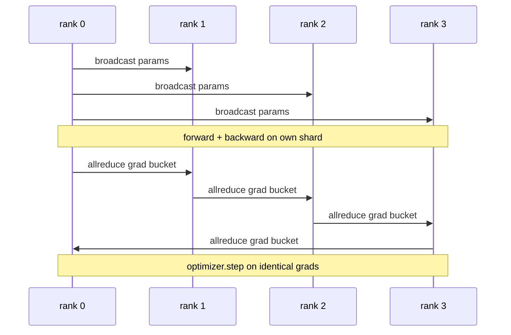

# Data Parallel DDP From Scratch

> DistributedDataParallel is a hook on top of allreduce. Wrap a model, broadcast the initial parameters from rank 0 so every rank starts identical, install a backward hook on every parameter that issues an allreduce of the gradient, and the rest is gradient descent. The whole pattern is 200 lines.

**Type:** Build
**Languages:** Python
**Prerequisites:** Phase 19 Track C lessons 42-49
**Time:** ~90 min

## Learning Objectives

- Wire a `DistributedDataParallel`-shaped wrapper that broadcasts initial parameters and allreduces gradients after backward.
- Spawn N CPU ranks with `torch.multiprocessing.spawn` over the gloo backend with file-based rendezvous.
- Prove gradient-sync correctness by training the same model on the same data sequentially and showing per-step parameter equivalence.
- Defend the use of buckets (gradient fusion) and overlap (comm during backward) as the two changes that turn a working DDP into a production DDP.

## The Problem

A 1-billion-parameter model with 12 GB of activations does not fit on one consumer GPU. Even when it fits, training takes weeks. Data parallel splits the batch across N ranks, each rank computes the forward and backward on its shard, and at every step every rank's gradients are summed so all N copies stay identical. The summed gradient is what the optimiser steps on.

Without gradient sync, the N replicas diverge by step 2. The model is not "one model trained on more data" anymore, it is N separate models that happen to share initial weights. With gradient sync done badly (one allreduce per parameter, no overlap, no bucketing) the network is the bottleneck and the GPUs idle waiting for the wire. The craft of DDP is making the gradient sync nearly free relative to compute. The canonical PyTorch DDP achieves that by bucketing gradients, overlapping allreduce with the next layer's backward, and using NCCL on NVLink. We can do all three on CPU with gloo and learn the same lessons.

## The Concept

### The three operations DDP needs

| Stage | Collective | Why |
|-------|-----------|-----|
| Init | broadcast from rank 0 | Every rank starts with the same parameters |
| After backward | allreduce of each grad | The mean gradient is what the optimiser steps on |
| Sometimes | broadcast of buffers | Batchnorm running stats stay synchronised |

### Why mean and not sum

Allreduce-SUM divided by world_size gives the mean gradient. The mean is invariant to world_size: a learning rate tuned at one rank works at four ranks because the per-step gradient magnitude does not change. Allreduce-SUM without the division forces you to retune the learning rate every time you change cluster size. DDP wraps the SUM and divides; do the same in the lesson.

### Why bucket gradients

A transformer has thousands of parameter tensors. One allreduce per tensor pays the gloo latency floor thousands of times. DDP groups gradients into ~25 MB buckets and issues one allreduce per bucket. The same total bytes move across the wire but the latency is amortised over the bucket. For the lesson's tiny model we group everything into one bucket; the structure is what carries across.

### Why pin the seed

Every rank must call `torch.manual_seed(seed + rank)` for shuffling but `torch.manual_seed(seed)` for parameter init. A single shared seed means every rank sees the same batch order (defeating data parallel); a rank-specific seed for params means initial parameters disagree by float epsilon and gradient sync no longer makes the replicas identical. Get the seed pattern right or the test for parameter equivalence fails on step 1.

## Build It

Reconstruct **Data Parallel DDP From Scratch** by following `MiniMLP` on x=0.5 with the demo defaults. Run `python3 main.py` and verify that the update or loss change agrees with the gradient sign; a zero gradient produces no accidental jump.

## Use It

Call `MiniMLP` from a small caller with x=0.5 with the demo defaults. Compare its result with the demo output, and record the input contract and the one field a downstream user should rely on.

## Ship It

Hand off `outputs/artifact-card.md` with the command `python3 main.py`, the accepted input shape (x=0.5 with the demo defaults), the expected observable result, and a failure note for malformed inputs.

## Further Reading

- [PyTorch DistributedDataParallel docs](https://pytorch.org/docs/stable/generated/torch.nn.parallel.DistributedDataParallel.html)
- [PyTorch DDP internals tutorial](https://pytorch.org/tutorials/intermediate/ddp_tutorial.html)
- [Li et al, PyTorch Distributed: Experiences on Accelerating Data Parallel Training](https://arxiv.org/abs/2006.15704)
- Phase 19 Lesson 76 - the collectives DDP is built on
- Phase 19 Lesson 78 - ZeRO sharding replaces the per-param allreduce with reduce_scatter

## Exercises

This lab follows `MiniMLP` and `forward` on a controlled fixture; write down the value before changing the input.

1. **Trace the canonical fixture.** From `code/`, run `python3 main.py` using x=0.5 with the demo defaults. Follow `MiniMLP`, `forward`, `DistributedDataParallel`. Expect the update or loss change agrees with the gradient sign; a zero gradient produces no accidental jump; capture the first printed shape, metric, status, or summary field and state which part supports **Wire a `DistributedDataParallel`-shaped wrapper that broadcasts initial parameters and allreduces gradients after backward.**.
2. **Change the controlled parameter.** Repeat the command after changing only the learning rate: use the same run with learning rate 0.1 instead of 0.01. Predict the direction of the change, then compare the two output values. Explain why **Spawn N CPU ranks with `torch.multiprocessing.spawn` over the gloo backend with file-based rendezvous.** says the other inputs should stay fixed.
3. **Exercise the guard.** Feed the implementation a zero gradient or an already-minimized point. Before running it, write down whether the relevant function should return an empty value, a zero-sized result, or a validation error. Check the observed status against **Prove gradient-sync correctness by training the same model on the same data sequentially and showing per-step parameter equivalence.** and record the exception text if the code rejects the case.
4. **Prepare the artifact for reuse.** Open `outputs/artifact-card.md` and add a worked example using x=0.5 with the demo defaults. Include the input contract, one expected output field, and a named acceptance check for **Defend the use of buckets (gradient fusion) and overlap (comm during backward) as the two changes that turn a working DDP into a production DDP.**; note what the demo cannot establish.

## Reference Solution

A checkable result for **Data Parallel DDP From Scratch** should contain:

- the `python3 main.py` output for x=0.5 with the demo defaults, with `MiniMLP`, `forward`, `DistributedDataParallel` traced to the value or shape that supports **Wire a `DistributedDataParallel`-shaped wrapper that broadcasts initial parameters and allreduces gradients after backward.**;
- a before/after comparison for the learning rate, where the same run with learning rate 0.1 instead of 0.01 changes the observation in the direction predicted by **Spawn N CPU ranks with `torch.multiprocessing.spawn` over the gloo backend with file-based rendezvous.**;
- a recorded result for a zero gradient or an already-minimized point that matches the implementation’s validation or empty-result contract and explains the evidence for **Prove gradient-sync correctness by training the same model on the same data sequentially and showing per-step parameter equivalence.**; and
- an updated `outputs/artifact-card.md` example with a concrete input, expected output field, and acceptance check tied to **Defend the use of buckets (gradient fusion) and overlap (comm during backward) as the two changes that turn a working DDP into a production DDP.**.

Run the lesson tests after the demo. If the boundary behaves differently from the prediction, keep the actual exception or output and explain the implementation path that produced it.
