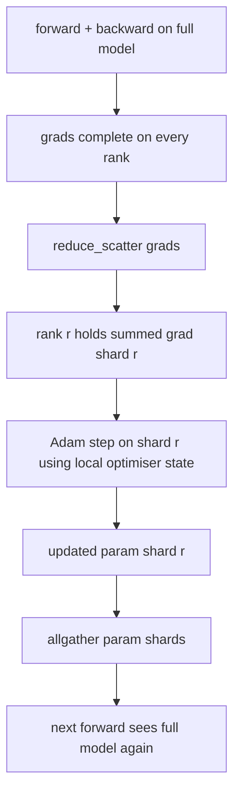

# ZeRO Optimizer State Sharding

> Adam stores two moment estimates per parameter, both in float32. A 7B-parameter model carries 56 GB of optimiser state. ZeRO stage 1 shards that across N ranks; each rank owns 1/N of the optimiser. After the local step the updated parameter shards broadcast back, every rank reconstructs the full model, and the next step begins. The win is a linear memory drop on the largest single allocation in the training stack.

**Type:** Build
**Languages:** Python
**Prerequisites:** Phase 19 Track C lessons 42-49
**Time:** ~90 min

## Learning Objectives

- Shard optimiser state (first moment, second moment, fp32 master copy) across N ranks so each rank owns 1/N.
- Use reduce_scatter to deliver each rank only its shard's gradient sum, then allgather to broadcast the updated parameter shards back.
- Compute the memory savings table for stage 1, stage 2, stage 3 against vanilla DDP.
- Defend the choice of stage 1 vs stage 2 vs stage 3 on model size and bandwidth budget.

## The Problem

Vanilla DDP replicates everything: parameters, gradients, and optimiser state are present in full on every rank. For a 7B-parameter model in fp16 that means 14 GB of parameters, 14 GB of gradients, and 28 GB of optimiser state per rank. The optimiser state is the largest term and the easiest to shard because it is only touched during the step, not during forward or backward.

ZeRO stage 1 shards the optimiser state. Each rank holds 1/N of the Adam moments. After backward, instead of allreducing the full gradient and stepping locally, ZeRO reduce_scatters so each rank receives only its shard's summed gradient. The rank applies the optimiser step to its shard of the master parameters. The updated parameter shards then allgather back so every rank has the full model for the next forward. The optimiser memory drops by N. The wire traffic per step is the same as DDP: one reduce_scatter plus one allgather equals one allreduce by bandwidth. Memory wins, throughput holds.

## The Concept

### Stages of ZeRO

| Stage | What is sharded | Memory per rank | Comm per step |
|-------|----------------|------------------|---------------|
| DDP | nothing | params + grads + optim | 1x allreduce |
| ZeRO-1 | optimiser state | params + grads + optim/N | 1x reduce_scatter + 1x allgather |
| ZeRO-2 | optim + grads | params + grads/N + optim/N | 1x reduce_scatter + 1x allgather |
| ZeRO-3 | optim + grads + params | params/N + grads/N + optim/N | 1x allgather per layer + 1x reduce_scatter per layer |

Stage 1 is the cheapest win because optimiser state dominates the budget. Stage 2 needs gradient-shard accumulation logic but the bandwidth is the same. Stage 3 (FSDP) pays per-layer comm for every forward and backward, gaining the parameter-shard memory drop. The lesson implements stage 1 in full.

### The memory math, real numbers

For a model with P parameters trained with Adam in mixed precision:

| Term | Vanilla | ZeRO-1 | Why |
|------|---------|--------|-----|
| fp16 params | 2P bytes | 2P bytes | needed for forward |
| fp16 grads | 2P bytes | 2P bytes | needed for backward |
| fp32 master copy | 4P bytes | 4P/N bytes | only the optim uses it |
| fp32 first moment | 4P bytes | 4P/N bytes | only the optim uses it |
| fp32 second moment | 4P bytes | 4P/N bytes | only the optim uses it |
| Total | 16P bytes | 4P + 12P/N bytes |   |

At N=8: vanilla 16P, ZeRO-1 5.5P, a 65% drop. At N=64: vanilla 16P, ZeRO-1 4.19P, a 74% drop.

### Why reduce_scatter beats allreduce-then-shard

Allreduce gives every rank the full summed gradient. If you only need shard r, the (N-1)/N of the gradient that was reduced is wasted on rank r. Reduce_scatter delivers exactly the shard each rank owns; the per-rank bytes are the same as allreduce (since allreduce is reduce_scatter + allgather) but the second half is replaced by the parameter-shard allgather later. Net wire is identical to DDP, memory is divided.

## Further Reading

- [Rajbhandari et al, ZeRO: Memory Optimizations Toward Training Trillion Parameter Models](https://arxiv.org/abs/1910.02054)
- [DeepSpeed ZeRO documentation](https://www.deepspeed.ai/tutorials/zero/)
- [PyTorch FSDP documentation](https://pytorch.org/docs/stable/fsdp.html)
- Phase 19 Lesson 76 - the reduce_scatter and allgather this lesson stands on
- Phase 19 Lesson 80 - sharded checkpointing the ZeRO state must use
