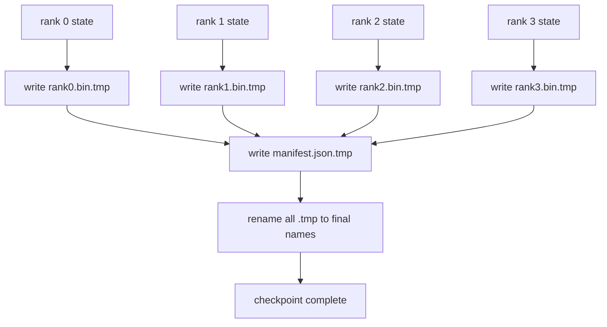

# Sharded Checkpoint and Atomic Resume

> A 70B-parameter training job is paused by a node failure every few hours. The checkpoint format decides whether you lose 30 minutes or 30 hours. A sharded checkpoint writes every rank's shard in parallel and records ownership in a manifest. Resume loads each rank's shard from its own file, reconstructs the state on the same world size, and the optimiser steps as if nothing happened. Atomic write keeps a half-finished checkpoint from poisoning the next resume.

**Type:** Build
**Languages:** Python
**Prerequisites:** Phase 19 Track C lessons 42-49
**Time:** ~90 min

## Learning Objectives

- Save a multi-rank checkpoint as a per-rank shard file plus a manifest that records which rank owns what.
- Use the atomic write pattern (write to a temp path then rename) so a crash mid-write never produces a half-finished checkpoint.
- Resume from the manifest, verifying byte-equal state for both fp16 parameters and the ZeRO optimiser state on every rank.
- Defend the manifest schema against the three failure modes: world-size change, shard count mismatch, and partial write.

## The Problem

A vanilla checkpoint reads all parameters and optimiser state into rank 0, gathers, and writes a single file. For a 70B model that is 1.1 TB of state through one rank's network port. The write blocks every other rank because they idle waiting for the gather. The IO bandwidth is the slowest single GPU's network link, not the aggregate. On a real cluster the gather-then-write step can take longer than the previous training hour, which means the job ships less than one checkpoint per training day.

Sharded checkpoints flip the pattern: every rank writes its own shard to its own file in parallel. The manifest records which rank owned which shard so resume can put each shard back where it came from. The aggregate write bandwidth scales with the cluster. A 1 TB checkpoint that took 4 hours through one rank takes 4 minutes through 64 ranks. Plus the manifest gives you a contract for incompatible resumes: world-size change is detectable, partial writes are detectable, and the load path can fail loudly rather than silently using stale data.

## The Concept



### Manifest schema

```json
{
  "world_size": 4,
  "step": 1234,
  "wall_clock_seconds": 4521,
  "shards": [
    {"rank": 0, "path": "rank0.bin", "sha256": "...", "param_shard_offset": 0, "param_shard_numel": 65536},
    {"rank": 1, "path": "rank1.bin", "sha256": "...", "param_shard_offset": 65536, "param_shard_numel": 65536}
  ],
  "schema_version": 1
}
```

Three fields are load-bearing. `world_size` makes a resume on a different size loudly fail rather than silently corrupt. `sha256` per shard catches partial or corrupted writes. `param_shard_offset` and `param_shard_numel` per shard let the loader reconstruct the flat parameter tensor at the correct position.

### Atomic write

The standard pattern: write every shard to `<name>.tmp`, write the manifest to `manifest.json.tmp`, fsync each, then rename. POSIX rename within the same filesystem is atomic; either the new file is fully present or the old one is. A crash before the final rename leaves the previous checkpoint as the live one. Without atomic write a crash can leave a partial shard with a present manifest that points at it, and the load corrupts the optimiser state on resume.

### Three failure modes the schema must defend against

| Failure | Symptom | Defence |
|---------|---------|---------|
| World-size change | resume on N=8 with manifest from N=4 | world_size mismatch in manifest, fail loudly |
| Shard count mismatch | resume sees fewer rank*.bin files than shards in manifest | enumerate shards, verify every one exists |
| Partial write | shard file truncated mid-flush | sha256 verification on load |

Each defence rejects the bad load early; the alternative is silent corruption that surfaces 100 steps later when loss goes to NaN.

### Why per-rank files, not one big file

Concurrent write to one file via `O_APPEND` works on POSIX for byte-aligned writes, but in practice the offsets within one shard span MB-sized regions and the locking dominates. Per-rank files have no contention and benefit from striping when the underlying filesystem is parallel (Lustre, GPFS). Production stacks (DeepSpeed, FSDP, NeMo) all use per-rank files for that reason.


## Further Reading

- [DeepSpeed checkpointing](https://www.deepspeed.ai/tutorials/checkpointing/)
- [PyTorch torch.distributed.checkpoint](https://pytorch.org/docs/stable/distributed.checkpoint.html)
- [POSIX rename atomicity](https://pubs.opengroup.org/onlinepubs/9699919799/functions/rename.html)
- Phase 19 Lesson 78 - the ZeRO state this checkpoint is shaped to save
- Phase 19 Lesson 81 - the end-to-end demo round-trips the saved state
