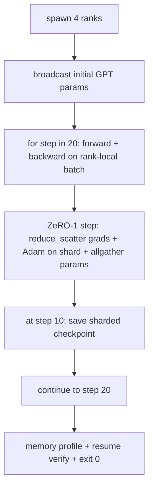

# End-to-End Distributed Training

> Lessons 76 through 80 each built one piece. This is the assembly: a tiny GPT trained across 4 simulated ranks with DDP for gradient sync, ZeRO-1 for optimiser-state sharding, and a sharded checkpoint at the halfway mark. The demo runs 20 steps, self-terminates, prints a loss curve plus a memory profile, and writes a resumable checkpoint.

**Type:** Build
**Languages:** Python
**Prerequisites:** Phase 19 Track C lessons 42-49
**Time:** ~90 min

## Learning Objectives

- Compose DDP (lesson 77) plus ZeRO-1 (lesson 78) plus sharded checkpoints (lesson 80) into one training loop.
- Train a 2-layer transformer language model on a small synthetic corpus for 20 steps across 4 simulated ranks.
- Print a per-step loss table, a per-rank memory profile, and a checkpoint manifest that resumes byte-equal on the same world size.
- Defend the composition: each piece is independently testable in earlier lessons and this lesson proves they compose.

## The Problem

A capstone is the proof that the pieces fit together. Lesson 76 implemented collectives. Lesson 77 wrapped them into DDP. Lesson 78 sharded optimiser state with reduce_scatter. Lesson 79 analysed pipeline. Lesson 80 saved a sharded checkpoint. Each lesson stood alone with its own test. A real training run uses every primitive at once; if the composition is wrong, the loss diverges, the checkpoint refuses to resume, or the per-rank memory grows when it should shrink.

This lesson runs the end-to-end demo and verifies four invariants: (a) the loss decreases monotonically across the 20 steps within float noise, (b) every rank holds the same parameter norm at every step, (c) the per-rank optimiser memory equals the ZeRO-1 formula 12P/N bytes, and (d) the checkpoint at step 10 reloads byte-equal at restart. The demo self-terminates: 20 steps, single command, exit 0.

## The Concept

### The mini GPT

The model is small on purpose: 2 transformer blocks, embed dim 32, 4 attention heads, vocab 64, sequence length 16, batch 4. A few thousand parameters. Big enough to exercise every wiring decision (multi-head attention runs the standard masked path; LayerNorm has weights to sync; the LM head is a separate linear projection back to the vocab). Small enough that 20 steps on 4 CPU ranks finish in seconds.

### The composition rules

| Lesson piece | What it owns | What it leaves to the loop |
|--------------|--------------|----------------------------|
| DDP broadcast | Initial parameter sync | One call at construct time |
| ZeRO-1 step | Gradient sync, master copy update, parameter broadcast | One call per step replacing optimiser.step |
| Sharded checkpoint | Persist per-rank state, manifest with sha256 | Called on rank 0 with state collected via allgather |
| Training loop | Forward, backward, loss logging | Calls the three above in order |

The loop does not know about reduce_scatter or rendezvous files. The ZeRO and checkpoint modules expose narrow interfaces that the loop composes.

### Why a tiny GPT and not just an MLP

The MLP from lesson 77 was sufficient to verify gradient sync. A tiny GPT adds three things: a separate LM head over the vocab (in this lesson, untied for clarity; full GPT typically ties the head to the token embedding), softmax+cross-entropy as the loss (more numerical edge cases than MSE), and an asymmetric forward (embeddings then attention then MLP per layer). Sticking with an MLP for the capstone would hide whether the composition handles LayerNorm or the embedding layer's grad shape correctly.

### Self-terminating means exit 0

The loop runs a fixed 20 steps and exits. No `while True`, no human intervention, no resume from external state. A capstone you can leave running unattended and find a complete log when it finishes is a capstone that proves the system is wired correctly. If any piece deadlocks the demo never returns and the test rig catches it.

## Further Reading

- [DeepSpeed end-to-end training tutorial](https://www.deepspeed.ai/getting-started/)
- [PyTorch FSDP advanced tutorial](https://pytorch.org/tutorials/intermediate/FSDP_advanced_tutorial.html)
- [Megatron-LM training script reference](https://github.com/NVIDIA/Megatron-LM)
- Phase 19 Lessons 76-80 - each piece this lesson composes
- Phase 17 - moving the composition to a real cluster

## Exercises

1. **Establish a baseline.** Run the lesson demo, then capture the inputs, outputs, and one invariant that demonstrates this objective: Compose DDP (lesson 77) plus ZeRO-1 (lesson 78) plus sharded checkpoints (lesson 80) into one training loop.
2. **Change one variable.** Modify a single input or parameter and use the resulting evidence to investigate this objective: Train a 2-layer transformer language model on a small synthetic corpus for 20 steps across 4 simulated ranks.
3. **Probe an edge case.** Predict the result before running it, compare prediction with observation, and explain the discrepancy while applying this objective: Print a per-step loss table, a per-rank memory profile, and a checkpoint manifest that resumes byte-equal on the same world size.

## Reference Solution

Use the canonical [main.py](../code/main.py) as the executable baseline. A complete solution records a successful run, identifies the invariant tied to “Compose DDP (lesson 77) plus ZeRO-1 (lesson 78) plus sharded checkpoints (lesson 80) into one training loop,” and changes only one variable for the comparison. The edge-case result must distinguish the prediction from the observation, explain the cause using “Print a per-step loss table, a per-rank memory profile, and a checkpoint manifest that resumes byte-equal on the same world size,” and cite a repeatable check rather than relying on visual inspection alone.
