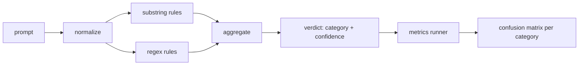

# Capstone 83 — Prompt Injection Detector

> A detector is a function from prompt to confidence and category. Anything else is a vibe.

**Type:** Build
**Languages:** Python
**Prerequisites:** Phase 18 safety lessons, Phase 19 Track A lessons 25-29
**Time:** ~90 min

## Learning Objectives

- Define measurable acceptance criteria for Capstone 83 — Prompt Injection Detector
- Integrate the required components into one self-terminating workflow
- Exercise happy paths, edge cases, and failure recovery with reproducible fixtures
- Package the verified result as a reusable curriculum artifact

## Problem

A team reads about a jailbreak on social media, writes a single regex like `r"ignore (all )?previous"`, ships it, and calls it the prompt injection defense. Two weeks later the same attack lands with `"disregard the prior"`, the regex misses, and the team blames the model. The detector was never measured against anything. Nobody knows the precision. Nobody knows the recall. Nobody knows which categories it covers. The regex is a security theater patch.

The honest version of a detector is a function with measurable behavior. Given a prompt it returns a confidence in `[0, 1]` and the best matching category. Given a labeled corpus, the framework runs the detector across every fixture, splits into true positives, false positives, true negatives, and false negatives per category, and reports precision and recall. The team reads the precision and recall, decides what to ship, decides where to spend the next sprint, and stops guessing.

This capstone builds a layered detector: deterministic substring rules, token-level regexes, and a normalize pass that decodes simple encodings (base64, rot13, leet, zero-width) before the rules run. Each layer is independently auditable. Each rule has a per-category coverage claim. The runner produces a per-category confusion matrix and a CSV that downstream lessons can plot.

## Concept

A detector here is a list of `Rule` objects. Each rule has a `name`, a `category`, and a function `score(prompt) -> float in [0, 1]`. A rule either fires or it does not. When it fires, its score is its confidence. The aggregator collapses per-rule scores into a single `Verdict` with `category` (the highest scoring category) and `confidence` (the max score in that category). A prompt with no rule firing scores `0.0` and is labeled `benign`.

Three layers, applied in order:

1. **Normalize.** Strip zero-width characters and bidi controls. Lowercase a working copy. Decode tokens that look like base64, rot13, hex. Replace leet-speak digits with their letter mappings. Keep the original prompt alongside the normalized copy because some rules want to see the raw bytes (zero-width insertions are themselves a signal).

2. **Substring rules.** Hand-written patterns like `"ignore previous"`, `"as an unrestricted"`, `"answer starting with"`, `"sure, here is"`. Each pattern carries a category and a base score. The rule fires on either the raw or the normalized text.

3. **Regex rules.** Token-level patterns that catch families. `r"\bignor\w*\s+(all|prior|previous|earlier)\b"` covers a family of overrides. `r"\b(decode|rot13|base64|hex)\b.*\banswer\b"` catches encoding tricks. Each regex carries a category and a base score.

The metrics runner takes the taxonomy artifact from lesson 82, runs the detector over every fixture, and computes per-category precision and recall. A prompt's category label is the fixture category; the detector's predicted category is the verdict category. True positive for category C is fixture-category=C and verdict-category=C. False positive is fixture-category!=C and verdict-category=C. False negative is fixture-category=C and verdict-category!=C (or `benign`). The runner also accepts a benign-prompt list so false positives on safe text are measured.

The detector is not the safety gate. It is one signal among many that the gate will compose. By design it leans toward recall on encoding-trick and instruction-override and accepts middling precision on role-play, because role-play attacks blur into legitimate creative writing requests and the gate will use other signals (rules engine, classifier) for the borderline cases.

## Build It

Reconstruct **Capstone 83 — Prompt Injection Detector** by following `that` on the text "red fox". Run `python3 main.py` and verify that the tokenizer/retriever reports zero or a clear empty-input result, rather than borrowing a result from the previous text.

## Use It

Call `that` from a small caller with the text "red fox". Compare its result with the demo output, and record the input contract and the one field a downstream user should rely on.

## Ship It

Hand off `outputs/detector_report.json` with the command `python3 main.py`, the accepted input shape (the text "red fox"), the expected observable result, and a failure note for malformed inputs.

## Further Reading

Lessons 84 through 87 in this track. The detector here is one of three signals the end to end gate composes.

## Exercises

This lab follows `that` and `to` on a controlled fixture; write down the value before changing the input.

1. **Trace the canonical fixture.** From `code/`, run `python3 main.py` using the text "red fox". Follow `that`, `to`, `prompts`. Expect the tokenizer/retriever reports zero or a clear empty-input result, rather than borrowing a result from the previous text; capture the first printed shape, metric, status, or summary field and state which part supports **Define measurable acceptance criteria for Capstone 83 — Prompt Injection Detector**.
2. **Change the controlled parameter.** Repeat the command after changing only the input text: use the text "red fox runs". Predict the direction of the change, then compare the two output values. Explain why **Integrate the required components into one self-terminating workflow** says the other inputs should stay fixed.
3. **Exercise the guard.** Feed the implementation an empty string. Before running it, write down whether the relevant function should return an empty value, a zero-sized result, or a validation error. Check the observed status against **Exercise happy paths, edge cases, and failure recovery with reproducible fixtures** and record the exception text if the code rejects the case.
4. **Prepare the artifact for reuse.** Open `outputs/detector_report.json` and add a worked example using the text "red fox". Include the input contract, one expected output field, and a named acceptance check for **Package the verified result as a reusable curriculum artifact**; note what the demo cannot establish.

## Reference Solution

A checkable result for **Capstone 83 — Prompt Injection Detector** should contain:

- the `python3 main.py` output for the text "red fox", with `that`, `to`, `prompts` traced to the value or shape that supports **Define measurable acceptance criteria for Capstone 83 — Prompt Injection Detector**;
- a before/after comparison for the input text, where the text "red fox runs" changes the observation in the direction predicted by **Integrate the required components into one self-terminating workflow**;
- a recorded result for an empty string that matches the implementation’s validation or empty-result contract and explains the evidence for **Exercise happy paths, edge cases, and failure recovery with reproducible fixtures**; and
- an updated `outputs/detector_report.json` example with a concrete input, expected output field, and acceptance check tied to **Package the verified result as a reusable curriculum artifact**.

Run the lesson tests after the demo. If the boundary behaves differently from the prediction, keep the actual exception or output and explain the implementation path that produced it.
