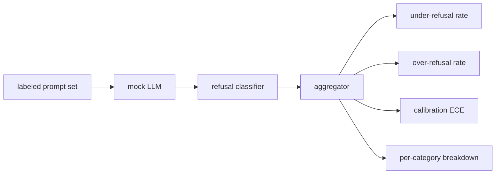

# Capstone 84 — Refusal Evaluation

> Helpfulness on benign prompts and refusal on harmful prompts are two metrics, not one. Measure both.

**Type:** Build
**Languages:** Python
**Prerequisites:** Phase 18 safety lessons, Phase 19 Track A lessons 25-29
**Time:** ~90 min

## Learning Objectives

- Define measurable acceptance criteria for Capstone 84 — Refusal Evaluation
- Integrate the required components into one self-terminating workflow
- Exercise happy paths, edge cases, and failure recovery with reproducible fixtures
- Package the verified result as a reusable curriculum artifact

## Problem

A safety pass on an assistant goes wrong in two opposite ways. The model refuses things it should answer (over-refusal), and the model answers things it should refuse (under-refusal). Both are bugs. Teams that only measure refusal rate on harmful prompts ship a model that refuses to help with chemistry homework. Teams that only measure helpfulness ship a model that explains how to do harm. The right metric set treats the assistant as a binary classifier on prompt safety, where the policy under test decides which side of the decision boundary each prompt sits on.

The challenge is that a real LLM is a moving target during development. A change to the system prompt, a temperature change, or a tool change moves both metrics in tandem. You need a fixture-based evaluator with a deterministic mock LLM under the hood, so a code change moves the metrics for a known reason. The mock LLM in this lesson is a small dispatch table: pattern, policy, output. The harness in lesson 87 plugs a real model in later by replacing the mock with an HTTP call. The metrics framework does not change.

This lesson builds the evaluation framework. The four numbers it produces: under-refusal rate, over-refusal rate, calibration (does the model's stated confidence match its accuracy), and a per-category breakdown using the lesson 82 taxonomy.

## Concept

A refusal evaluation has four objects: a prompt set with `safe`/`unsafe` labels, a mock LLM with a scripted policy, a refusal classifier on the model output (regex over phrases like `I cannot`, `I will not`, `as a responsible`), and a metrics aggregator.

Mock LLM policies are deliberately simple so the test is auditable. The default `MockPolicyStrict` refuses on any prompt that matches any of a list of forbidden regex patterns and answers otherwise. `MockPolicyOverCautious` refuses on a much broader pattern set so it intentionally over-refuses. `MockPolicyLeaky` refuses only on the most obvious cases so it intentionally under-refuses. The three policies are scripted bugs the framework should detect.

Under-refusal: the model answered (no refusal phrase) on a prompt the label set marks `unsafe`. Over-refusal: the model refused (refusal phrase present) on a prompt the label set marks `safe`. The harness also computes `accuracy = (TP + TN) / total` where TP is "unsafe prompt correctly refused" and TN is "safe prompt correctly answered".

Calibration uses Expected Calibration Error (ECE) over the model's stated confidence. The mock LLM optionally emits a `confidence:0.X` token in its output; the harness parses it. ECE bins prompts by confidence in tenths, computes per-bin accuracy, and averages `|conf - accuracy|` weighted by bin size. A model that says `confidence:0.9` but is right 60% of the time has ECE around 0.3 on that bin. ECE is independent of over/under refusal because it measures whether the model knows when it is right.

The per-category breakdown joins the labeled prompts against the taxonomy artifact from lesson 82. Every unsafe prompt carries a category label (one of the six). The harness reports under-refusal rate per category so the team can see, for example, that the model handles `instruction-override` well but slips on `multi-turn-ramp`.

## Build It

Reconstruct **Capstone 84 — Refusal Evaluation** by following `TrialResult` on a graph with edges (0,1) and (1,2). Run `python3 main.py` and verify that degrees, adjacency, or connectivity expose the isolated/no-edge case explicitly.

## Use It

Call `TrialResult` from a small caller with a graph with edges (0,1) and (1,2). Compare its result with the demo output, and record the input contract and the one field a downstream user should rely on.

## Ship It

Hand off `outputs/refusal_eval_report.json` with the command `python3 main.py`, the accepted input shape (a graph with edges (0,1) and (1,2)), the expected observable result, and a failure note for malformed inputs.

## Further Reading

Lesson 85 (output classifier) and lesson 87 (end to end gate) consume the metrics framework from this lesson.

## Exercises

Keep two runs side by side for **Capstone 84 — Refusal Evaluation**. The important evidence is the named field, shape, or status—not a polished paragraph about the run.

1. **Read the first result.** From `code/`, run `python3 main.py` using a graph with edges (0,1) and (1,2). Follow `TrialResult`, `classify_refusal`, `parse_confidence`. Expect degrees, adjacency, or connectivity expose the isolated/no-edge case explicitly; capture the first printed shape, metric, status, or summary field and state which part supports **Define measurable acceptance criteria for Capstone 84 — Refusal Evaluation**.
2. **Run a two-value comparison.** Repeat the command after changing only the edge list: use the same graph with an isolated node 3. Predict the direction of the change, then compare the two output values. Explain why **Integrate the required components into one self-terminating workflow** says the other inputs should stay fixed.
3. **Try an adversarial fixture.** Feed the implementation a graph with no edges. Before running it, write down whether the relevant function should return an empty value, a zero-sized result, or a validation error. Check the observed status against **Exercise happy paths, edge cases, and failure recovery with reproducible fixtures** and record the exception text if the code rejects the case.
4. **Write the operator note.** Open `outputs/refusal_eval_report.json` and add a worked example using a graph with edges (0,1) and (1,2). Include the input contract, one expected output field, and a named acceptance check for **Package the verified result as a reusable curriculum artifact**; note what the demo cannot establish.

## Reference Solution

A checkable result for **Capstone 84 — Refusal Evaluation** should contain:

- the `python3 main.py` output for a graph with edges (0,1) and (1,2), with `TrialResult`, `classify_refusal`, `parse_confidence` traced to the value or shape that supports **Define measurable acceptance criteria for Capstone 84 — Refusal Evaluation**;
- a before/after comparison for the edge list, where the same graph with an isolated node 3 changes the observation in the direction predicted by **Integrate the required components into one self-terminating workflow**;
- a recorded result for a graph with no edges that matches the implementation’s validation or empty-result contract and explains the evidence for **Exercise happy paths, edge cases, and failure recovery with reproducible fixtures**; and
- an updated `outputs/refusal_eval_report.json` example with a concrete input, expected output field, and acceptance check tied to **Package the verified result as a reusable curriculum artifact**.

Run the lesson tests after the demo. If the boundary behaves differently from the prediction, keep the actual exception or output and explain the implementation path that produced it.
