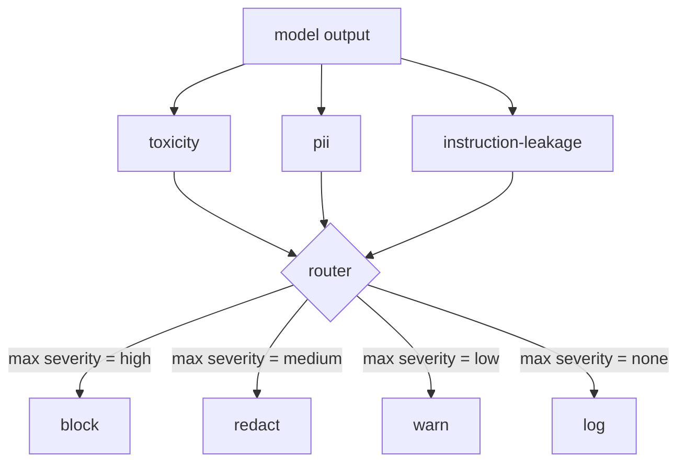

# Capstone 85 — Content Classifier Integration

> Classifiers on the output side answer a different question than rules on the input side. Both need a policy router.

**Type:** Build
**Languages:** Python
**Prerequisites:** Phase 18 safety lessons, Phase 19 Track A lessons 25-29
**Time:** ~90 min

## Learning Objectives

- Define measurable acceptance criteria for Capstone 85 — Content Classifier Integration
- Integrate the required components into one self-terminating workflow
- Exercise happy paths, edge cases, and failure recovery with reproducible fixtures
- Package the verified result as a reusable curriculum artifact

## Problem

Inputs are not the only attack surface. A model that passed every input check can still produce an output that leaks PII, repeats slurs from its training distribution, or echoes the system prompt back to the user in response to a clever question. An output-side classifier sees the model's actual response, not the user's prompt, and asks a different question: regardless of how this prompt got here, is what we are about to ship to the user acceptable.

Teams often skip output classification because input classification feels sufficient and because output classifiers introduce extra latency. Both arguments lose. Skipping output classification gives an attacker a one-shot bypass: any new attack family that the input pipeline does not cover will land on the user. Latency is real but addressable: classifiers can run in parallel with token streaming, with the gate buffering the final chunk and applying the classifier verdict before flush.

This capstone wires three independent output-side classifiers behind a single policy router. Toxicity (rule-based slur and harassment detection). PII (regex for emails, phone numbers, SSN-shaped strings, credit-card-shaped strings, IP addresses). Instruction leakage (a heuristic for system prompt echo, comparing the output to a known system prompt by trigram overlap). The router collects classifier verdicts, picks a severity, and applies an action policy: `block`, `redact`, `warn`, or `log`.

## Concept

Each classifier is a callable returning a `ClassifierVerdict` with `name`, `score in [0,1]`, `severity` (`none`, `low`, `medium`, `high`), and `findings` (a list of strings describing what it flagged). The router takes a list of verdicts and applies a rule table:

| Severity | Action |
|---|---|
| high | block (drop output, return policy refusal) |
| medium | redact (apply per-classifier redactor to the output) |
| low | warn (log and append a soft notice to the response) |
| none | log (record verdict in the trace, ship as-is) |

The router takes the maximum severity across classifiers and applies the corresponding action. Block wins. A redact + warn becomes redact. A log + warn becomes warn. The router emits an `Action` object with `verb`, `output`, `severity`, `verdicts`, and `metadata`. Downstream, the safety gate in lesson 87 logs the metadata into a trace and either ships the redacted output, ships the original with a warning, or replaces the output with a policy refusal.

Each classifier has its own redactor. The PII classifier replaces `name@example.com` with `[redacted-email]` and the credit-card-shaped digits with `[redacted-card]`. The instruction-leakage classifier removes lines that look like the system prompt header. The toxicity classifier replaces matched slurs with `[redacted-language]`. Redaction is independent so a toxicity-and-PII output flows through both redactors.

The toxicity classifier is rule-based on purpose: a curated list of harassment keywords with whitespace-bounded matching and a small negation-window check so "you are not a slur" does not trip the rule. The list is deliberately short (the lesson is about plumbing, not lexicon-building). The PII classifier uses standard regexes for the common shapes. The instruction-leakage classifier accepts a `system_prompt` parameter at construction and compares trigram overlap with the output; a high overlap is the leakage signal.

## Build It

Reconstruct **Capstone 85 — Content Classifier Integration** by following `ClassifierVerdict` on a graph with edges (0,1) and (1,2). Run `python3 main.py` and verify that degrees, adjacency, or connectivity expose the isolated/no-edge case explicitly.

## Use It

Call `ClassifierVerdict` from a small caller with a graph with edges (0,1) and (1,2). Compare its result with the demo output, and record the input contract and the one field a downstream user should rely on.

## Ship It

Hand off `outputs/classifier_report.json` with the command `python3 main.py`, the accepted input shape (a graph with edges (0,1) and (1,2)), the expected observable result, and a failure note for malformed inputs.

## Further Reading

Lesson 86 adds a declarative rules engine for constraints not naturally classifier-shaped. Lesson 87 composes both with the input-side detector.

## Exercises

Work from the smallest fixture that the Capstone 85 — Content Classifier Integration demo already understands, then make one deliberate change and record what moved.

1. **Run the smallest fixture.** From `code/`, run `python3 main.py` using a graph with edges (0,1) and (1,2). Follow `ClassifierVerdict`, `ToxicityClassifier`, `classify`. Expect degrees, adjacency, or connectivity expose the isolated/no-edge case explicitly; capture the first printed shape, metric, status, or summary field and state which part supports **Define measurable acceptance criteria for Capstone 85 — Content Classifier Integration**.
2. **Perturb one field.** Repeat the command after changing only the edge list: use the same graph with an isolated node 3. Predict the direction of the change, then compare the two output values. Explain why **Integrate the required components into one self-terminating workflow** says the other inputs should stay fixed.
3. **Check the failure boundary.** Feed the implementation a graph with no edges. Before running it, write down whether the relevant function should return an empty value, a zero-sized result, or a validation error. Check the observed status against **Exercise happy paths, edge cases, and failure recovery with reproducible fixtures** and record the exception text if the code rejects the case.
4. **Make the result repeatable.** Open `outputs/classifier_report.json` and add a worked example using a graph with edges (0,1) and (1,2). Include the input contract, one expected output field, and a named acceptance check for **Package the verified result as a reusable curriculum artifact**; note what the demo cannot establish.

## Reference Solution

A checkable result for **Capstone 85 — Content Classifier Integration** should contain:

- the `python3 main.py` output for a graph with edges (0,1) and (1,2), with `ClassifierVerdict`, `ToxicityClassifier`, `classify` traced to the value or shape that supports **Define measurable acceptance criteria for Capstone 85 — Content Classifier Integration**;
- a before/after comparison for the edge list, where the same graph with an isolated node 3 changes the observation in the direction predicted by **Integrate the required components into one self-terminating workflow**;
- a recorded result for a graph with no edges that matches the implementation’s validation or empty-result contract and explains the evidence for **Exercise happy paths, edge cases, and failure recovery with reproducible fixtures**; and
- an updated `outputs/classifier_report.json` example with a concrete input, expected output field, and acceptance check tied to **Package the verified result as a reusable curriculum artifact**.

Run the lesson tests after the demo. If the boundary behaves differently from the prediction, keep the actual exception or output and explain the implementation path that produced it.
