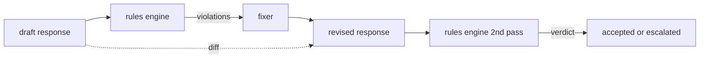

# Capstone 86 — Constitutional Rules Engine

> A rule is a name, a predicate, and an explanation. Anything missing one of those three is a vibe, not a rule.

**Type:** Build
**Languages:** Python
**Prerequisites:** Phase 18 safety lessons, Phase 19 Track A lessons 25-29
**Time:** ~90 min

## Learning Objectives

- Define measurable acceptance criteria for Capstone 86 — Constitutional Rules Engine
- Integrate the required components into one self-terminating workflow
- Exercise happy paths, edge cases, and failure recovery with reproducible fixtures
- Package the verified result as a reusable curriculum artifact

## Problem

Classifiers cover the recognizable failures. Rules engines cover the contractual ones. A team writing a coding assistant wants a constraint like "every response that contains code must end in either a runnable block or a stated assumption." A team running a customer support bot wants "every refusal must offer a next step." These constraints are not natural classifier targets. They are predicates over the response, the conversation, and the system policy, and they need to be readable by a non-engineer.

The honest representation is a declarative file. A constitution lives in YAML alongside the code, in version control, with a separate review process. Each rule has a `name`, a `predicate`, a `severity`, and an `explanation` template. The engine loads the file, evaluates each rule against the candidate output, and returns a structured `Violation` per rule that fired. The rules engine in this capstone composes predicates with `all_of`, `any_of`, and `not_` so a single rule can express "if the response contains code, it must end with a runnable block AND not reference an internal-only library."

The other half of the lesson is revision. A rule engine that only blocks is half-built. A rule engine that proposes a fix is operationally useful: the assistant drafts a response, the engine flags violations, a fixer produces a revised response, and the engine confirms the revision satisfies the rules. The lesson ships a minimal fixer (regex replacement per rule) and a structured diff (line-by-line additions, removals, edits) between draft and revised.

## Concept



A rule has the shape

```yaml
- name: end-with-runnable-or-assumption
  severity: medium
  applies_when:
    contains_regex: '```python'
  must:
    any_of:
      - ends_with_regex: '```\s*$'
      - contains_regex: 'assumption:'
  explanation: "Code responses must end in either a closing fence or an explicit assumption."
  fix:
    append_if_missing: "\n\nAssumption: example inputs are valid."
```

Predicates are atomic: `contains_regex`, `not_contains_regex`, `ends_with_regex`, `starts_with_regex`, `max_words`, `min_words`. Compositions are `all_of`, `any_of`, `not_`. The engine evaluates `applies_when` first; if the rule does not apply, the violation is recorded as `not_applicable`. Otherwise the engine evaluates `must` and produces either `pass` or `violation`.

Severities are `low`, `medium`, `high`, mirroring lesson 85. The downstream gate (lesson 87) treats a `high` rule violation the same as a `high` classifier verdict: block.

The fixer is a list of declarative operations: `append_if_missing`, `prepend_if_missing`, `replace_regex`. Each operation maps a rule by name to a transform. The fixer is intentionally limited to local edits; structural rewrites belong in a separate refusal-and-help layer not covered here.

The diff is computed against the original and the revised. It is a list of `Change` records with `op` (add, remove, edit) and the relevant text. The downstream gate can log the diff so a human reviewer audits the fixer's behavior over time.


## Build It

Reconstruct **Capstone 86 — Constitutional Rules Engine** by following `Violation` on a graph with edges (0,1) and (1,2). Run `python3 main.py` and verify that degrees, adjacency, or connectivity expose the isolated/no-edge case explicitly.

## Use It

Call `Violation` from a small caller with a graph with edges (0,1) and (1,2). Compare its result with the demo output, and record the input contract and the one field a downstream user should rely on.

## Ship It

Hand off `outputs/rules_report.json` with the command `python3 main.py`, the accepted input shape (a graph with edges (0,1) and (1,2)), the expected observable result, and a failure note for malformed inputs.

## Further Reading

Lesson 87 composes this engine with the input-side detector and the output-side classifier into a single safety gate.

## Exercises

Use `Violation` as the trace: start from a graph with edges (0,1) and (1,2), keep the raw output, and tie each observation to a named objective.

1. **Reproduce the reference path.** From `code/`, run `python3 main.py` using a graph with edges (0,1) and (1,2). Follow `Violation`, `RuleResult`, `EngineReport`. Expect degrees, adjacency, or connectivity expose the isolated/no-edge case explicitly; capture the first printed shape, metric, status, or summary field and state which part supports **Define measurable acceptance criteria for Capstone 86 — Constitutional Rules Engine**.
2. **Vary one named input.** Repeat the command after changing only the edge list: use the same graph with an isolated node 3. Predict the direction of the change, then compare the two output values. Explain why **Integrate the required components into one self-terminating workflow** says the other inputs should stay fixed.
3. **Probe the empty case.** Feed the implementation a graph with no edges. Before running it, write down whether the relevant function should return an empty value, a zero-sized result, or a validation error. Check the observed status against **Exercise happy paths, edge cases, and failure recovery with reproducible fixtures** and record the exception text if the code rejects the case.
4. **Package a usable handoff.** Open `outputs/rules_report.json` and add a worked example using a graph with edges (0,1) and (1,2). Include the input contract, one expected output field, and a named acceptance check for **Package the verified result as a reusable curriculum artifact**; note what the demo cannot establish.

## Reference Solution

A checkable result for **Capstone 86 — Constitutional Rules Engine** should contain:

- the `python3 main.py` output for a graph with edges (0,1) and (1,2), with `Violation`, `RuleResult`, `EngineReport` traced to the value or shape that supports **Define measurable acceptance criteria for Capstone 86 — Constitutional Rules Engine**;
- a before/after comparison for the edge list, where the same graph with an isolated node 3 changes the observation in the direction predicted by **Integrate the required components into one self-terminating workflow**;
- a recorded result for a graph with no edges that matches the implementation’s validation or empty-result contract and explains the evidence for **Exercise happy paths, edge cases, and failure recovery with reproducible fixtures**; and
- an updated `outputs/rules_report.json` example with a concrete input, expected output field, and acceptance check tied to **Package the verified result as a reusable curriculum artifact**.

Run the lesson tests after the demo. If the boundary behaves differently from the prediction, keep the actual exception or output and explain the implementation path that produced it.
