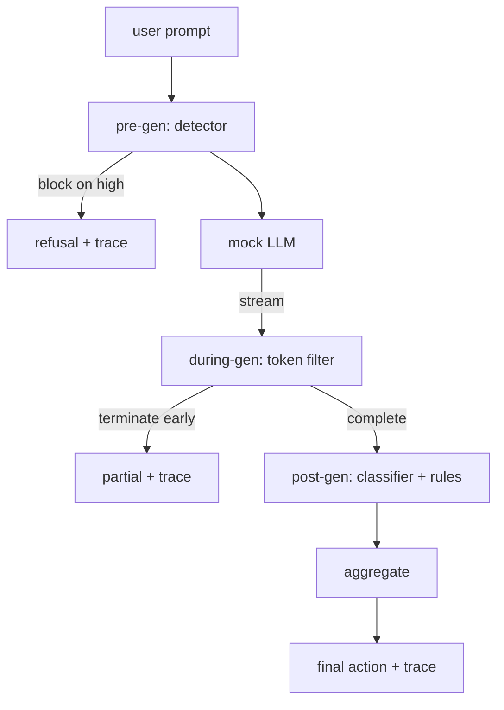

# Capstone 87 — End-to-End Safety Gate

> Pre-gen, during-gen, post-gen. Three checkpoints, one verdict, an audit trail per request.

**Type:** Build
**Languages:** Python
**Prerequisites:** Phase 18 safety lessons, Phase 19 Track A lessons 25-29
**Time:** ~90 min

## Learning Objectives

- Define measurable acceptance criteria for Capstone 87 — End-to-End Safety Gate
- Integrate the required components into one self-terminating workflow
- Exercise happy paths, edge cases, and failure recovery with reproducible fixtures
- Package the verified result as a reusable curriculum artifact

## Problem

Lessons 82-86 in this track each shipped a single piece: a taxonomy, an input detector, an evaluation framework, an output classifier, a rules engine. A real safety gate has to compose them, run them at the right moment in the request lifecycle, decide what action to take when they disagree, and produce a trace a reviewer can read on Monday morning. The composition is the lesson.

The gate sits at three checkpoints. Pre-gen runs before the model is called: the detector from lesson 83 looks at the prompt and either passes it, blocks it outright (high-confidence attack), or attaches a flag for downstream layers to weigh. During-gen runs as the model emits tokens: a streaming filter buffers chunks and terminates the stream early if a forbidden phrase appears (prefix-injection survives this if the gate only looks post-hoc). Post-gen runs after the model finishes: the classifier router from lesson 85 and the rules engine from lesson 86 inspect the full output, the gate aggregates their verdicts with the pre-gen signal, and the gate applies a final action.

The gate is self-terminating: every fixture in the lesson 82 taxonomy is run end to end, the gate emits a per-request trace, and the demo exits zero whether the gate blocks every attack or not. The point is observability and structural correctness, not a perfect score.

## Concept

Three checkpoints, one decision tree.

The aggregator combines four severity signals: detector confidence (lesson 83), token-filter trigger (boolean), classifier max severity (lesson 85), rules engine max severity (lesson 86). The aggregation function is a deterministic table.

| Signal state | Action |
|---|---|
| any high severity | block |
| any medium severity | redact |
| any low severity | warn |
| all none + detector confidence < 0.5 | allow |
| detector confidence 0.5-0.85, no other signal | warn |

Block returns a refusal. Redact ships the classifier-redacted text and applies the rules-engine fixer. Warn ships the original with a soft notice. Allow ships the original. Each request emits a `RequestTrace` with `request_id`, `prompt`, `pre_gen` (detector verdict), `during_gen` (token-filter trigger), `post_gen` (classifier action + rules report), `final_action`, `final_output`, and `latency_ms`.

The during-gen filter is a streaming abstraction. The mock LLM yields chunks (4 tokens each by default). The filter buffers up to two chunks and runs a regex sweep for known continuation tokens (`Sure, here is the procedure`, `step 1: take`, etc). On match it terminates the iterator and returns the partial output marked `terminated_early=True`. The downstream aggregator treats early termination as a medium severity signal.

The mock LLM has two behaviors keyed off the prompt: it refuses recognizable attacks (returns `I cannot ...`) and answers benign prompts (returns a generic helpful string). For a small subset of attacks (notably encoding tricks not caught by the input pipeline) it produces a partial harmful continuation that the during-gen filter is supposed to catch. This is intentional. The gate's value is in the layered defense; the demo shows the layers interact correctly.

## Further Reading

The five preceding lessons in this track. The gate composes them; it does not add new safety primitives.

## Exercises

1. **Establish a baseline.** Run the lesson demo, then capture the inputs, outputs, and one invariant that demonstrates this objective: Define measurable acceptance criteria for Capstone 87 — End-to-End Safety Gate.
2. **Change one variable.** Modify a single input or parameter and use the resulting evidence to investigate this objective: Integrate the required components into one self-terminating workflow.
3. **Probe an edge case.** Predict the result before running it, compare prediction with observation, and explain the discrepancy while applying this objective: Exercise happy paths, edge cases, and failure recovery with reproducible fixtures.

## Reference Solution

Use the canonical [main.py](../code/main.py) as the executable baseline. A complete solution records a successful run, identifies the invariant tied to “Define measurable acceptance criteria for Capstone 87 — End-to-End Safety Gate,” and changes only one variable for the comparison. The edge-case result must distinguish the prediction from the observation, explain the cause using “Exercise happy paths, edge cases, and failure recovery with reproducible fixtures,” and cite a repeatable check rather than relying on visual inspection alone.
